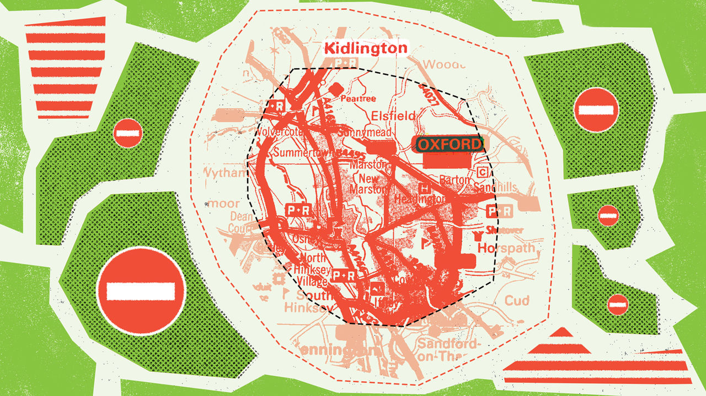
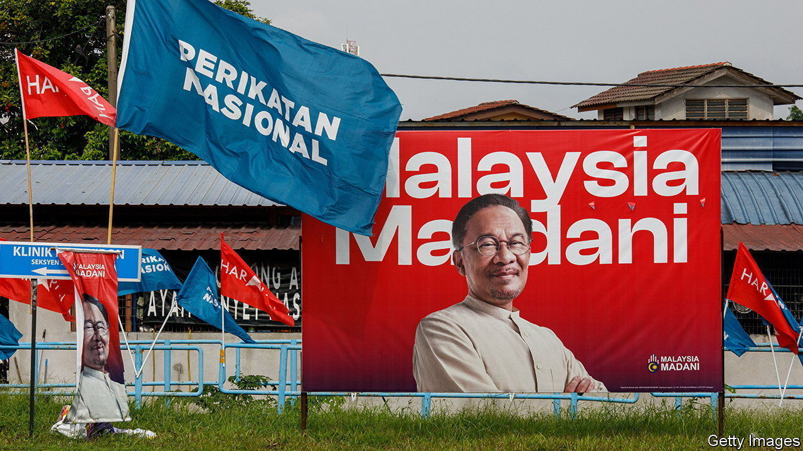

###### On the Asian Infrastructure Investment Bank, Britain’s green belts, Germany, Malaysia, Saudi customs

# Letters to the editor 

##### A selection of correspondence 

 

> Sep 7th 2023 


In defence of the AIIB

The personal and wild accusations that Bob Pickard shared about the Asian Infrastructure Investment Bank are far from the reality of its conduct of business as I know it (, August 19th). In my involvement with the AIIB as a member of the International Advisory Panel for the past few years and my interactions with its president, Jin Liqun, and other senior officers and staff, I have observed a professional, transparent, open, well-governed and forward-thinking organisation with a very diverse and international group of managers. 

In comparison with other multilateral banks I find the AIIB to be less bureaucratic and more nimble, but equally adhering to Western-style governance protocols. In my experience, President Jin and the AIIB management were always receptive to the advice and recommendations of the advisory panel. President Jin is very well regarded and respected in the international financial community. He is a professional and a strong advocate of good governance. 

Moreover, as someone who frequently engages with the AIIB’s management I have never observed any instance of interference by the Chinese government or the Chinese Communist Party. AIIB staff comprise around 50 nationalities from around the globe.

The AIIB plays an important and effective role in the financing and development of much-needed infrastructure in the region, supporting sustainable economic development and poverty reduction. In many instances, it has done so in collaboration with the other multilateral development institutions. It has also initiated innovative solutions, especially in green and ESG (environmental, social, governance) financing.

I am very concerned that the wild allegations of Mr Pickard may undermine the good work of the AIIB. I urge your readers and other stakeholders of the AIIB to consider the valuable contributions that it has achieved to date measured against these claims. 

Jose Isidro N. Camacho

Former secretary of finance in the Philippines


Bob Pickard’s column showed little understanding of the purpose and workings of multilateral development banks and of the achievements of the AIIB. I have worked closely with the board, in each case as chief economist, at the World Bank and the European Bank for Reconstruction and Development and recognise the importance of careful attention to, and management of, relations with the major shareholders and with the country of location. 

That does not mean, however, that the senior management is dictated to. And in my six years on the Independent Advisory Panel of the AIIB I never encountered what could be described as undue influence of China or the Chinese Communist Party. Indeed, the leadership of the AIIB has been clear to emphasise its responsibility to all shareholders and to its mandate, and not to just one shareholder.

Mr Pickard’s assertions focus on issues such as which lock is on which door. For him, a “big thing” appears to be a “multi-media studio”. This perspective fails to focus on the core purpose of the AIIB, to foster and support sound infrastructure investment and to make substantial contributions to the lives of millions across Asia and beyond. In less than eight years the AIIB has emerged as a significant player in the development-finance landscape. With 106 members and financing for over 200 infrastructure projects amounting to almost $44bn, its impact is undeniable. Its independence, efficiency, collaboration across multilateral development banks and commitment to sustainability are evident in its operations and outcomes. The AIIB is the largest co-financing partner of both the World Bank and the Asian Development Bank. 

Mr Pickard’s allegations fail to capture the true essence of the AIIB. Let us hope that we can all engage in a more informed and constructive dialogue about its role in shaping a more prosperous and sustainable future for the region and the world.

Nicholas Stern

Professor of economics and government

London School of Economics

 


Tighten our green belts

I have to say my heart sank when I saw yet another anti-green-belt rant in your publication (“”, August 19th). You never miss an opportunity to express your distaste for this  of yours. But you’re right. We Britons love our green belts, and so do the many animals, birds and plants that live there. Our green belts help ensure that our tiny island still retains grassy areas and that urban areas do not sprawl everywhere, as they do in Italy or Spain, for example. 

The main causes of our housing crisis are not green belts but other issues, which include buying property as an investment rather than a place to live, “buy to let”, demographic changes, holiday homes, historically low interest rates, mass immigration, multiple home ownership and so on.

Rosalind Sudlow


You advocate scrapping England’s green belt to secure high levels of growth around places with economic potential. Yet a brief glance at the map that accompanied your article shows that much, if not most, of England’s green belt is beyond the golden triangle of London, Oxford and Cambridge. It surrounds cities like Liverpool, Newcastle and Stoke-on-Trent, where low house prices often reflect their low economic potential. Here the green belt plays a crucial role in regeneration by focusing redevelopment on recycled land and older communities.

The risk with your laissez-faire perspective is that a policy which might suit part of the south is applied to the whole of England. A better approach would be to allow green-belt reviews on the basis of county level and regional plans. That system was dismantled in England by the reforms of David Cameron’s government, which foolishly gave all planning powers to parochial district councils.

Professor Ian Wray

Heseltine Institute for Public Policy, Practice and Place

University of Liverpool

The overwhelming problem of housing shortages is caused by Britain’s brain-dead approach to density and design. My home town, Ashford in Kent, serves as a perfect example. Single-storey supermarkets and retail already abound, with further land wasted for parking above ground and excessive road space that car-dependent development produces. A new residential development contains 192 dwellings on ten hectares of land. A just-finished development on my street in Berlin, on half a hectare, combines underground parking, a supermarket and four retail units all accessible by lift from the 187 high-quality apartments on the six storeys above. 

If towns were to build new streets using this type of design most of the green belt could be left untouched. Such vibrant areas then become attractions themselves, like my street in Berlin. 

Justin Silk


Azerbaijan responds

“” (September 4th, digital editions) correctly notes that humanitarian issues are being politicised by Armenian separatists in Azerbaijan’s Karabakh region. This is vividly illustrated by their rejection, on purely ethnic grounds, of supplies provided by Azerbaijan and currently waiting to be delivered, as well as by blocking the Aghdam road, while complaining about “blockade” and a humanitarian “catastrophe.” You are also correct that within the Armenian political discourse, the opponents of peace with Azerbaijan use humanitarian concerns to preclude any potential agreement.

However, you failed to mention that the area, where separatists are staging their political theatrics, is under temporary control of the Russian peacekeepers. Moreover, even after the 2020 war ended and despite pronouncements by Armenia’s prime minister, Nikol Pashinyan, Armenia continued using the Lachin road to send troops and landmines into Azerbaijani territories it previously occupied and ethnically cleansed for three decades.

Azerbaijan’s offer to integrate the local Armenians with equal rights and protection as all other citizens within its diverse society and to sign a peace treaty with Armenia soon remains the only option for a lasting peace and prosperity in the region. An alternative of permanent insecurity, a constant presence of foreign peacekeepers and lack of any development would benefit only war-profiteers and separatist warlords at the expense of their own people.

Elin Suleymanov

Ambassador of Azerbaijan


 


Fill out the form

You unfavourably compare the 120 days to obtain a business licence in Germany through a paper-based process with an OECD average of half that (“”, August 19th). By global standards this is still awfully slow. You would have done better to compare Germany with Burundi, where it takes two or three days, Benin (two hours with tax and social-security registration bundled in) and Bhutan (less than a minute).

What distinguishes these developing countries from Germany is their embrace of digital government, which allow business licences to be obtained from a mobile phone and with a number of automated processes running in the background to help civil servants speed up delivery. In Benin company-creation has surged as a result, with the biggest increase in business owners being women and young people. Germany could follow suit.

Ian Richards

UN Digital Government Programme

UNCTAD


 


Malaysia’s malaise

The problems arising from the ethnic and religious divide in Malaysia have been growing for some time (“”, August 19th). Lee Kuan Yew saw this coming nearly 60 years ago when he took Singapore out of the then Malaysian federation. The sad part is that the ethnic mix could be such a powerful resource in a country that is blessed in many other ways. The east Malaysian states of Sabah and Sarawak are much more diverse than west Malaysia. Resistance to further Islamisation there may well be much stronger. 

Peter Bristow


Smuggling alcohol

The letter about avoiding Saudi import customs () reminded me of my wedding in Saudi Arabia in the 1970s. Following the ceremony at the British consulate, I was amazed and delighted to see the quantity and variety of wines and spirits available at the consul’s bar. 

Amusingly, I was told that these had been imported as “spare parts for the commercial-attaché’s car”. 

Michael Brooks


