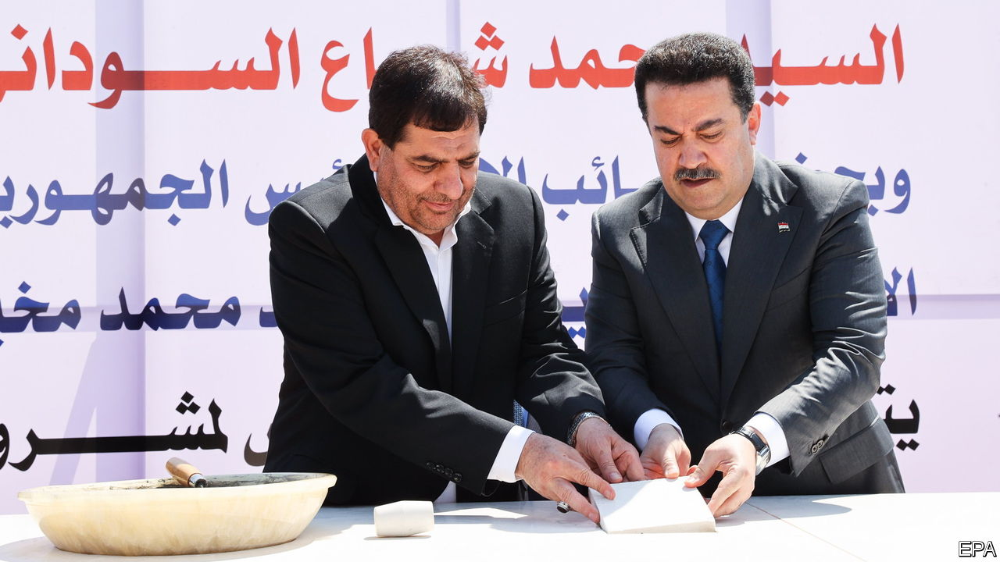
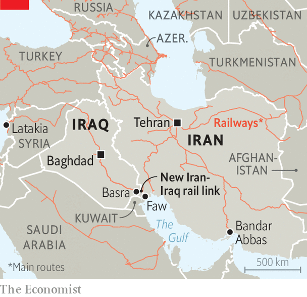

###### Only connect

# A new railway will at last link Iran and Iraq 

##### The connection could shunt Iraq further into Iran’s embrace 

 

> Sep 7th 2023 

For more than a century the geographical and political obstacles to a direct rail connection between Iraq and Iran have looked insurmountable. The Shatt al-Arab, the waterway formed by the convergence of the Tigris and Euphrates rivers, divides their southern border. The frontier also marks a cultural fault line, between the Arab and Persian worlds, which has been a source of conflict for millennia. Little wonder that when the great powers built railways to Iraq in the early 20th century they preferred to cut through the Taurus mountains in Turkey, cross the Nile in Egypt and traverse Syria’s deserts rather than brave any routes via Iran (see map).

 


No longer. Such is the pull of its eastern neighbour that Iraq has promised to fill the gap of 32km that separates their railways, by 2025. On September 2nd Iraq’s prime minister, Muhammad al-Sudani, joined Iran’s vice-president, Muhammad Mokhber, to lay the foundation stone at Basra in Iraq for the new stretch. Within 18 months, say his officials, the network will serve 3m people. By straddling the border it will provide a fast track to Iraq’s premier tourist sites, the Shia holy shrines of Karbala and Najaf. It should also facilitate trade into Central Asia and on into China by reconnecting Iraq to the silk route from which Baathist rule severed it.

Iranians are cheering, too. Their government has been extending transport links to its seven neighbours in order to bypass Western sanctions and isolation. In July it reopened a railway to Afghanistan. Another line already connects Iran to China via Turkmenistan, Uzbekistan and Kazakhstan. Iran is also working on a 164km line to the border with Azerbaijan. Once that is complete, Iran could serve as Russia’s bridge to the Indian Ocean via the port of Bandar Abbas. The new stretch to Iraq will boost bilateral trade, which Iranian officials reckon will reach $12bn this year, and provide a link to Latakia, the port on Syria’s Mediterranean coast where Iran has a leasing arrangement.

But not all are thrilled. Arabs fear the railway will shunt Iraq further into Iran’s embrace. Kuwait, which has long proposed a rail link from Iraq to its own ports, feels rebuffed. The Saudis opened a line close to Iraq’s border last year and are waiting for the Iraqis to build their section. 

Iraqi traders fret that their government will stop developing the country’s own port, at Faw, and use Iranian ones instead. “We should be reopening our railways from Basra, to Turkey and Europe,” says Amer Abdul-Jabber Ismail, an Iraqi ex-transport minister. “We’re just serving an Iranian and Syrian agenda instead.” ■

