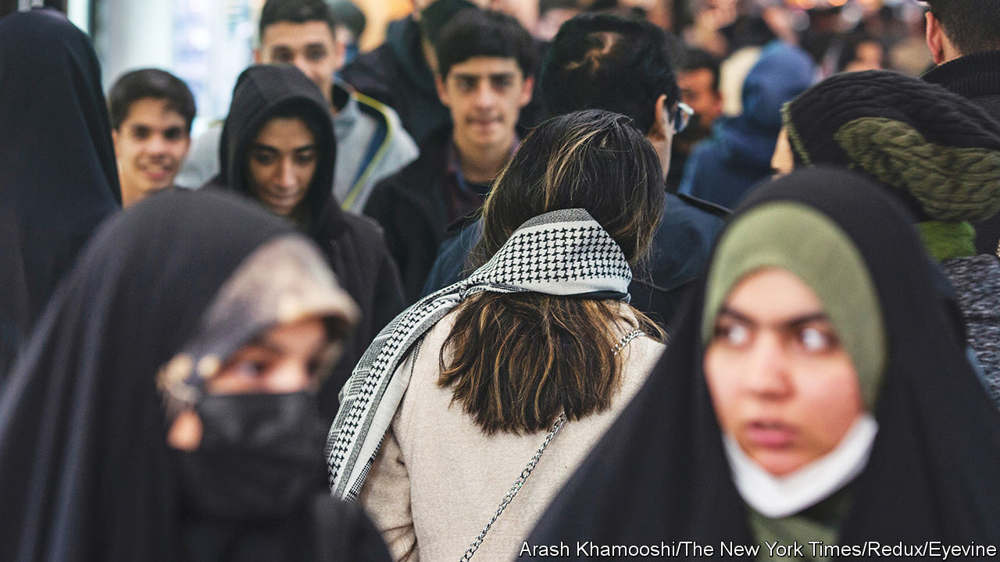

###### A brittle victory

# A year after Iran was shaken by protests, zealots have tightened their grip 

##### But dissidents await their next opportunity, unbowed 

 

> Sep 7th 2023 

Iran’s ayatollahs should, by rights, be triumphant. Their bully-boys have muzzled the cries of “woman, life, freedom” that reverberated around the country a year ago after a young Kurdish-Iranian woman, Mahsa Amini, died in custody for showing her hair. They have purged universities of critics, silenced disapproving media outlets and rounded up activists along with their family and friends. A new bill going through parliament will revive the morality police (who were disbanded in the wake of the protests) and introduce new punishments for those who violate their dress codes. The regime is cutting deals with friends and foes alike to help it tighten its political and financial grip. Oil exports are back to levels not seen since the Trump administration reimposed sanctions in 2018. And yet, unlike during previous crackdowns, the mullahs still sound nervous. “They know the genie is out of the bottle,” says a teacher in Tehran.

The commitment of many Iranians to regime change is unwavering. The authorities have not fully regained control of public space. Women must wear a headscarf to get treatment in state hospitals or service in banks. But on the streets many forsake the mandatory coverings, some defiantly sporting shorts and tank-tops. Such is their disdain for a theocracy that shot women for discarding the veil, even conservative fathers let their daughters dress as they choose. In July many Iranians boycotted the once popular religious processions that Iran’s leaders organise for Ashura, a big Shia commemoration. And growing numbers are using cash instead of credit cards to avoid paying tax to a regime they consider illegitimate. The next uprising, says a young professional in a café in the capital, is only a matter of time.

The regime has given up hope of regaining popular support. Instead it is relying on a narrowing base of ever more extreme loyalists. “We’re moving ever further from democracy to dictatorship,” says one Iranian academic. The supreme leader, Ayatollah Ali Khamenei, no longer aspires to lead an Islamic Republic, says another; he merely hopes to run an Islamic government. Meanwhile the government has alienated and radicalised reformists by closing their media outlets and booting out university professors, appointing religious singers in their stead.

As the regime’s base continues to shrink, so does its capacity to run the country. More cabinet members of the previous president, Hassan Rouhani, had PhDs from American universities than their counterparts in the United States. The ministers of his successor, Ebrahim Raisi, mostly come from Imam Sadiq University, a private Islamic college in Tehran.

The repression has extended beyond ordinary Iranians. The age and ill-health of Mr Khamenei have strengthened the president’s determination to secure his position. He treats his predecessors and their followers—both reformists and conservatives—as outcasts. The presidential candidates who campaigned for reform in 2008 remain under house arrest. The release of sex tapes—allegedly involving various senior officials, though their identities and the authenticity of the videos have not been verified—has helped Mr Raisi make the case for a clean-up. Others are shoring up their position, too, including Mojtaba Khamenei, the supreme leader’s powerful son. The Central Office, the nebulous government department which he is said to run, has replaced thousands of officials with his supporters, says a close observer. 

Meanwhile, Iran’s economy is drooping. Officials put annual inflation, which in 2017 Mr Rouhani had brought below 10%, at 47%. Mr Raisi has quickened the shift from subsidies for basics, such as bread, to cash handouts, but inflation has reduced their value. A third of Iranians now live on about $2 a day, according to official figures, up from a fifth ten years ago. Ministers have already raided the National Development Fund, the sovereign-wealth fund, to cover current spending and service loans. In 2018 it had about $150bn worth of financial firepower. Now it has just $10bn-20bn worth of ready money. 

To make ends meet, the government is raising taxes. It is also imposing new fines. Police confiscate cars containing unveiled women and only release them on payment of not just a fine for that offence but also of all previous parking tickets. Professionals are fleeing abroad; 6,000 doctors are thought to have left this year alone. Tensions between the clerics and Islamic Revolutionary Guards, which flared during the protests, seemed to have eased, in part because senior commanders are rewarded with a share of the proceeds from sanctions-evasion and smuggling, particularly of huge quantities of subsidised petrol and oil exports. But some in the regime increasingly worry whether they can depend on the loyalty of lower ranks who struggle to feed their families.

Still, whatever its weaknesses, say the government’s boosters, the population is weaker. Calls for a national strike last year threatened to tip the protests into a revolution. It stalled. Today few workers could afford to down tools. Iranians abroad noisily denounce the republic but they are largely powerless. Their fractious rivalries mean they hardly seem a credible alternative. 

And Mr Khamenei has had some success finding help from abroad. His ministers have signed a strategic alliance with China and are now bidding for one with Russia. Iran has been invited to join the brics, the bloc of big emerging economies. Even erstwhile foes have boosted the regime. This month Iran exchanged ambassadors with Saudi Arabia, its historic rival for leadership of the Islamic world. And it is also making headway with an American administration consumed by Ukraine and loth to grapple with another global crisis, which the mullahs would surely unleash were their end nigh. After balking at a new deal, Mr Raisi’s officials speak of negotiating a new agreement with America on curbing Iran’s nuclear programme. This month the UN’s International Atomic Energy Agency reported that Iran had slowed its enrichment of uranium. Despite continued American sanctions, Iran’s oil exports are back to near maximum capacity. The regime, explains a former American official, has a lifeline “to recuperate for the next year or two”. 

But even that will provide only a brief respite. The theocrats’ prospects look ever shakier as domestic support for them ebbs away and the gulf between Iran’s leaders and its population of non-believers widens into a chasm. ■

