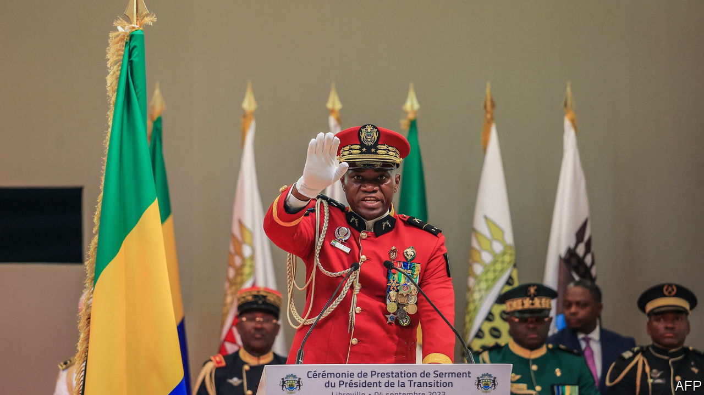

###### Bluster and bluff

# Deterring would-be putschists in Africa is getting harder 

##### Russia, hypocrisy and pragmatism are all to blame 

 

> Sep 7th 2023 

Africa’s young democrats often employ only black humour at the frequent sight on TV of uniformed men announcing that they have overthrown the government. Some find levity in discussing the sartorial dilemmas they must face (dress uniform or camouflage, beret or bare head?). Others mock state television stations for running interminable wildlife documentaries to avoid screening the unfolding chaos. 

Jokers would once have had little to work with. In 2000 the African Union (AU) set out a “no coup policy” based on the threat of swift suspension from African institutions, isolation and sanctions. Regional blocs like the Economic Community of West African States (ECOWAS) held a firm line, too. It seemed to work. In the 1990s Africa suffered 16 successful coups. In the 2000s that fell to eight, a figure that was repeated in the 2010s. Yet since the start of 2020 there have been nine successful coups, including one in Gabon on August 30th. What happened to deterrence?

In the early 2000s, if the AU suspended a country, it would be shunned by everyone who mattered (at the time, mainly Western countries and financial institutions), according to Liesl Louw-Vaudran, who is based in South Africa for International Crisis Group, a think-tank. That would leave it diplomatically and financially isolated. Yet since Russia and China have become more influential in Africa over the past decade, juntas have been able to look to them for diplomatic cover. Imposing sanctions has become patchier.

Great-power rivalry is also influencing how Western countries are responding. Since the coup in Niger in July, America seems more preoccupied with holding on to its drone bases and keeping Russian mercenaries out of the country than in reinstating Mohamed Bazoum, the ousted president. That puts it at odds with ECOWAS and France, which have pushed strongly for his restoration. 

As military governments proliferate, aspiring coup-mongers know they can rely on the support of other juntas, weakening sanctions still more. They also learn from each other. The single biggest lesson is simple: impunity reigns. Since the latest spate of coups began in Mali in 2020, not one country has returned to civilian rule. 

They also learn how to ride out international pressure. ECOWAS has tried border closures, freezing assets in the regional central bank, and cutting off electricity supplies. These make life harder for the general population. So juntas have grown skilled at shifting the blame to ECOWAS or former colonial powers, such as France. Sanctions that target junta members and their families with asset freezes and travel bans are more potent, but not enough. The shopping is better in Paris than St Petersburg, but not by much. 

Another problem is hypocrisy. Less than a fifth of AU members are rated as free by Freedom House, an American watchdog. Ivory Coast and Nigeria are leading the ECOWAS charge to overturn the coup in Niger, by force if necessary. Yet the Ivorian president, Alassane Ouattara, twisted the constitution to run for a third term and Bola Tinubu’s election as Nigeria’s president was marred by irregularities. This week the Economic Community of Central African States (ECCAS) suspended Gabon at a meeting chaired by Teodoro Obiang, Equatorial Guinea’s dictator for 44 years.

Expediency is another factor. In Chad the constitution was clearly breached when Mahamat Idriss Déby took power with the support of the army after his father was killed by rebels in 2021. Yet the AU declined to call it a coup, in part because Chad is seen as a bastion of stability in a volatile region. 

The converse is also true. In some cases, where the toppled government was particularly vile or ineffective, African and Western leaders have muted their criticism in the face of a seemingly “good coup”. In Mali the elected president, Ibrahim Boubacar Keita, was overthrown in August 2020 after street protests against his failure to make progress in the fight against jihadists. The change in government offered “a window of opportunity for military, civilian and political breakthroughs”, gushed Emmanuel Macron, France’s president.

He was wrong. A few months after his glowing words the junta staged a second coup, ridding itself of the pesky civilian figureheads it had installed under pressure from ECOWAS.  Before long it had invited Russian mercenaries into the country.

For African institutions, regaining the credibility to deter coups looks fiendishly hard. A threat by ECOWAS to intervene militarily in Niger was a rash attempt to do so. But it now looks like nothing more than bluster, which has further damaged the bloc’s credibility. 

Even if ECOWAS decides to send in troops, it would be a risky operation, particularly if the population and the army in Niger come out to defend the junta. As the taboo against coups weakens and the AU and Africa’s regional blocs have too few tools to roll them back, expect more broadcasts by the men in fancy uniforms. ■

