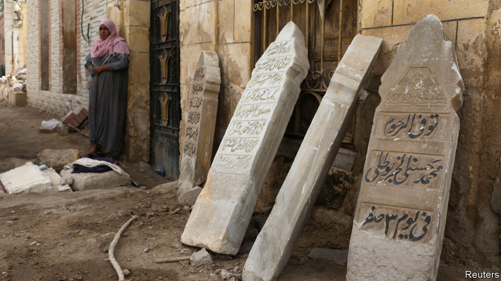

###### Bulldoze the buried

# Egypt’s government wants to erase a historic cemetery 

##### Ancient beauty may give way to ugly modernisation 

 

> Sep 7th 2023 

In the City of the Dead the living dwell beside the departed. Cairo’s vast necropolis, which dates back to the seventh century, sprawls over a thousand hectares, its narrow, winding streets lined with the ornate mausoleums of Mamluk sultans and 20th-century revolutionaries. But it houses a breathing community, too: it is home to perhaps as many as half a million Egyptians.

Both the living and the dead are under threat. An Egyptian court is soon to decide whether the government can demolish parts of the necropolis to make way for a motorway bridge that it says will reduce congestion in a busy area. Tombs and houses began to be bulldozed in 2020, exhuming the dead and evicting the living. The government argued that the unesco world heritage site was in fact an unsafe slum. It seems determined to push ahead. In the City of the Dead, officials have been spraying the word (“demolish”) with garish paint on tombs slated for destruction.

At first the outcry was mostly confined to residents and relatives of the interred. But opposition is growing. Critics point out that the demolitions will clear far more than is needed to build a motorway bridge, and worry that undisclosed property developments are also in the offing. 

Their concerns are not far-fetched. In 2017 the government evicted residents from al-Warraq, an island on the Nile which it labelled a slum, and later said it would spend almost $900m to build a cluster of skyscrapers there. Ambitious plans published in 2017 by an engineering firm with links to Dubai sparked rumours that the project was backed by investors from the Gulf. In 2018 contractors razed dozens of buildings in Cairo’s Maspero triangle, some dating back to the 13th century, to make way for a swanky development.

Like the Pharaohs, President Abdel-Fattah al-Sisi may want to leave his own monumental legacy, albeit one that may blot out chunks of Egypt’s more ancient past. He has form. After the Arab spring, his government erased murals extolling the protests in Cairo’s Tahrir Square. In their place Mr Sisi erected a large Pharaonic obelisk. ■

