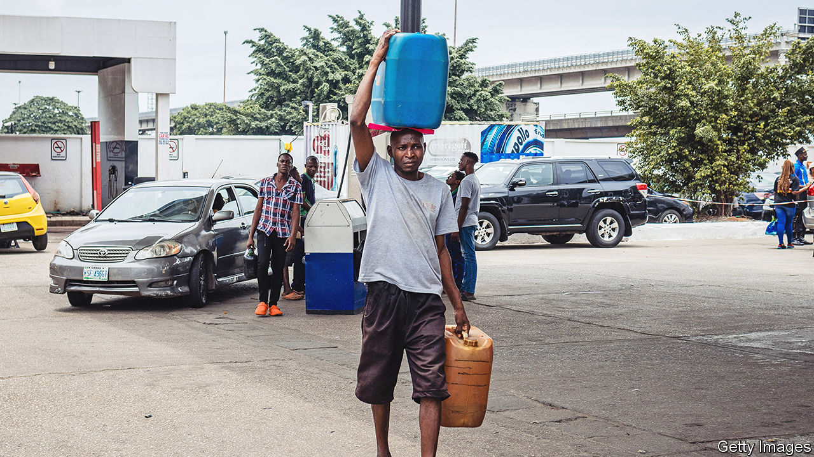

###### The perilous path of change

# In just 100 days Nigeria’s new president has made bold reforms 

##### But not everyone is pleased with Mr Tinubu’s liberal economics 

 

> Sep 7th 2023 

In a hair salon in Lagos, Nigeria’s commercial capital, an argument breaks out over the new president’s performance. “He’s just starting,” says a young man. His barber is less forgiving. “Is that not what they told us about [former president Muhammad] Buhari? The next thing, eight years have passed.” Soon other staff and customers have joined the argument, pointing to the rising price of , (cassava flour) and soaring transport costs.

After hotly contested elections Bola Tinubu was inaugurated as Nigeria’s president just over 100 days ago. He was determined to hit the ground running, and for a while, it looked as if he had. As promised in his inaugural speech, he removed an unaffordable fuel subsidy and ended a system of multiple fixed exchange rates. He also suspended the central-bank governor, Godwin Emefiele, who had played a big part in Nigeria’s economic slide. 

Ordinary folk may be grumbling about Mr Tinubu’s reforms, but investors are delighted. The main index of stocks on the Nigerian exchange has risen by almost 30% since his inauguration. A lawyer at an investment bank whispers that if Mr Tinubu walked into her offices, everyone there would bow at his feet. Yet the president’s initial clear-headed resolve appears to be giving way to indecision, poor preparation and in-fighting among his team. And it has not begun to deal seriously with Nigeria’s daunting security challenges, which include a jihadist insurgency in the north.

Nigeria’s fuel subsidy cost the state almost $10bn last year, the equivalent of 2.1% of GDP. Previous governments have renamed it, adjusted it and tried removing it, but Mr Tinubu’s effort has been by far the boldest. Although the reform will free up cash that would be better spent on hospitals and schools, it is also causing pain. Petrol prices almost tripled overnight in some places, and transport fares followed. 

To ease the pain the government is mulling a monthly cash transfer of 8,000 naira ($11) to the poor. But political squabbles over who will receive the assistance, and how, have delayed the programme’s launch. Trade unions want the subsidy back. The president’s spokesperson has ruled that out but, in a seeming contradiction, also promised to keep prices down. 

Changes in the foreign-exchange regime have also proved controversial. The previous administration tried to keep the naira artificially strong through currency controls, which resulted in shortages of dollars and a vibrant black market. Mr Tinubu’s government scrapped this system and allowed the currency to float. Overnight the naira slumped by 34% against the dollar and it has continued to slide by a total of 63%. The move came so abruptly that it caused chaos in half-completed transactions. The timing also stoked anger, since the devaluation was just before the start of the new school term in America and Britain, when there is a surge in demand for hard currency to pay the fees of the more than 100,000 Nigerians who study abroad. 

Mr Tinubu appears to have been less reform-minded when it came to belatedly filling his cabinet seats. Although he has a reputation for having built strong teams during his tenure as governor of Lagos state from 1999 to 2007, his new administration is remarkably thin on technocrats. Instead he seems to be repaying political favours and shoring up support. No fewer than nine former state governors now have cabinet posts. 

This lack of technical expertise is a shame, because Mr Tinubu’s policies are facing unexpected headwinds. In August, when the central bank published its first audited accounts since 2015, these revealed a huge hole in the country’s foreign reserves. More than 40% of the $34bn in foreign reserves the bank held at the end of 2022 were encumbered, either as collateral for loans from foreign banks or by being tied up in forward contracts. Nigeria officially claims to have enough foreign currency to cover almost eight months of imports, but, after subtracting these obligations, that falls to little more than four months, leaving it vulnerable to external shocks. “[The central bank] still does not have any firepower to anchor the market... and calm things down,” says Feyi Fawehinmi, a political commentator. 

The combined impact of the currency devaluation and the removal of the fuel subsidy is reflected in consumer prices. In July the annual rate of inflation hit 24%, its highest since 2005. Some reckon it may reach 28% this year. This is raising questions over whether Mr Tinubu will be able to hold his nerve or be forced to reverse course, particularly in the face of rising fuel prices. Yet turning back would certainly deepen Nigeria’s economic malaise. ■

