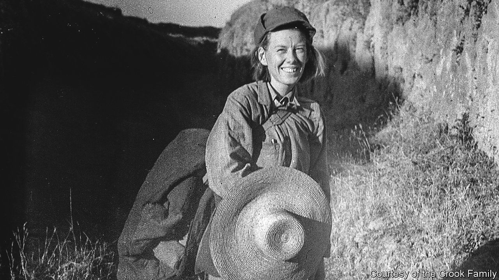

###### Building revolution

# Isabel Crook devoted her long life to making a new China 

##### The Canadian anthropologist and teacher died on August 20th, aged 107 

 

> Sep 7th 2023 

From the start, Isabel Crook was at the heart of things. In October 1949, riding in an army truck, she celebrated the founding of the Chinese Communist Party in Tiananmen Square in newly liberated Beijing. She and her husband David were almost the only Westerners; it was the most joyful moment she had ever watched. The processions of soldiers and civilians went on for six hours. Every two hours or so she had to dart through the marchers to feed her new baby, Carl, and dart back, eager not to miss too much. 

China was her home, and Communism was her cause. From her late teens she had needed to find one, even asking her mother to send religious books in case they would help. No cause came that way. Friends lent her books on Marxism; she began to get her ideas sorted. Then she met David, ardently Communist, a spy for the Soviets and a fighter for the Republicans in the Spanish civil war. And that was that. She was “Comrade Isabel” from then on. 

She had meant to return to the West, to her native Canada or to Britain, but neither she nor David could keep away from China. As an anthropologist, minutely studying daily life in remote villages in Sichuan, she slipped naturally into Chinese ways: sleeping on a  or heated brick bed, wearing homespun clothes, devouring buckwheat noodles and travelling by mule cart, foot or bicycle. When she taught English from 1949 to 1981 at Beijing Foreign Studies University, schooling generations of Chinese diplomats, she and David had a small peasant’s house on campus with paper in the windows, rather than glass, and helped with outdoor labour. With revolution always in the air, they could not leave. From 1947 her long life was spent in China.

It had also begun there, in 1915. Her parents were Canadian missionaries in Chengdu when the last emperor, though forced to abdicate, still lived in the Forbidden City. Within a few years, though, in her local church hall, young Communists were beginning to meet. By the time she returned from her studies in Toronto, in 1938, Japan had invaded China and the Nationalist government was weakening. Two years later she went with a team to her first village, Prosperity, to take notes on the progress of the Nationalists’ agrarian reforms. After the second world war had deflected her she studied a second village, Ten Mile Inn, in 1947, to see how it was managing under new, Communist, rule. 

Her first sight of Prosperity was breathtaking: curved terraces of shimmering rice paddies set among steep mountains. The main street, however, was repulsive, a pig-pen and a garbage dump. Every few days this street became a market where farmers sold whatever they could scrape from their tiny pockets of land, to get salt or oil, or a haircut. Most of the villagers, 55% by her team’s reckoning, were destitute or poor. Another 35%, middle peasants or shopkeepers, were “getting by”. The remaining 10%, rich estate-owners, controlled everything, renting out land in exchange for 60-70% of the crop and running the lucrative opium trade in opium. The village was plagued in spring by “bandits” who, she discovered, were just farmers desperate with hunger. Meanwhile the Nationalist government was press-ganging men to fight the Japanese, raising swingeing taxes and appointing unknown outsiders as officials. Nothing was working. 

At Ten Mile Inn, seven years later, she found a quite different picture. Although this too was a place of grinding poverty, with lean corn-cobs piled in its muddy streets, the atmosphere was charged with enthusiasm. This village had been one of the first to be freed from Nationalist rule. A slogan on the main gate proclaimed Mao Zedong the saviour of the people, and red posters on gateways proudly marked the homes of willing volunteers for the PLA. Fully 70% of the villagers no longer paid tax; only the rich paid. These “objects of struggle” also had to give back any land or goods they had taken, or their fathers or grandfathers had taken, for non-payment of debts or rents. Thus feudalism was destroyed and wealth shared. Peasants now had a union, and middle-peasants ran the village. The PLA helped to “purify the Party” by conducting tough, though not lethal, public shaming. 

She recorded some missteps. The new cadres liked perks as much as the old, wanting the first pick of potential wives and feasting on meat dumplings. Innocent people were accused and humiliated, and these proceedings divided the village, turning neighbours against each other. In general, though, she was happy to report that Ten Mile Inn had become—as Mao had wanted all villages to become—”a revolutionary bastion”. People naturally asked whether her work was sound when she was so committed to one side, even helping with harvest and hoeing. She was sure she could be. Life, for most, was simply better under Communism. It showed clearly in the data she and her team had gathered, interviewing all day and typing most of the night, tirelessly. 

If she ever doubted, David soon set her straight. The Great Leap Forward in 1958-60, in which perhaps 15m people died, was like surgery, he said, for some acute disease. Wouldn’t she rather have that, than go on suffering? And any revolution had its mistakes. David did not complain, so she did not, when he was jailed during the Cultural Revolution from 1967 to 1973, and she was put under house arrest. She spent the time studying Mao’s works, enjoying his sense of humour. The most difficult point came in 1989, when she and David took water and plastic sheets to the student protesters in Tiananmen Square and wrote to the , appealing to the government not to use force. The government used it mercilessly. Still, they stayed in China, because they belonged. 

The country she watched now was increasingly market-driven, consumerist and prosperous, unleashed by Deng Xiaoping’s reforms in the late 1970s. She had no love for capitalism, but to her Deng’s choice was valid. In the early days, to quote Bertolt Brecht, “The house was built with the stones that were there.” Perhaps, now, it could be built differently. She was too old now to heave stones herself; but not too old to hope, fervently, for whatever China’s people needed most. If the Party called, she was there. ■

