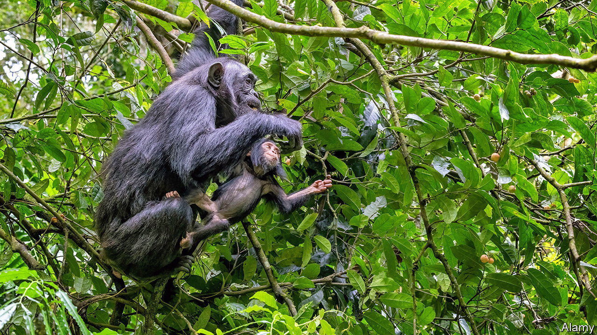

###### Easy fieldwork

# Animals can be tracked by simply swabbing leaves 

##### DNA gets everywhere. Now it is possible to harvest it 

 

> Sep 6th 2023 

Biological fieldwork can mean trips to exotic places. But the work itself can be tedious, especially when you are trying to track down elusive subjects. The most common method is to send a few eager graduate students armed with camera traps and several weeks of spare time. But perhaps not for much longer. A paper published in , whose lead authors are Christina Lynggaard at the University of Copenhagen and Jan Gogarten at the Helmholtz Institute for One Health in Germany, suggests an easier method: simply swabbing nearby leaves for DNA.

The DNA in question is called “environmental DNA” (eDNA for short). It refers to all the genetic information that animals shed as they go about their daily business: breathing, urinating, moving around, or interacting with their environment in any way. In recent years gene-sequencing technology has become quick and sensitive enough to pick out genetic sequences from particular animals—including humans—from this ubiquitous eDNA. 

One way of doing so is simply to blow air through filters, then analyse them to see which critters live in the vicinity. Aware of that technique, Drs Gogarten and Lynggaard wondered if there might be a simpler approach. Air-sampling systems can take days to do their work. Maintenance must be done, and filters must be changed. But given that eDNA is literally blowing around ecosystems, the researchers wondered if it might be collecting on leaves.

The leaves of many plants are waxy and somewhat sticky. The researchers theorised that eDNA might end up stuck to leaves and that it could subsequently be collected by swabbing them. They tested their theory in the dense rainforests of Kibale National Park, in Uganda. Using simple cotton swabs, and wearing masks and gloves to prevent contaminating the samples with their own DNA, they visited three areas of the park and collected eight swabs at each site, then took them back to Copenhagen for analysis.

The swabs revealed the presence of 26 birds, 24 mammals, one amphibian and one fish, with each swab containing DNA from eight animals on average. More than half the samples were good enough to work out the precise species they came from. The smallest (weighing just 19 grams) was the reclusive Stella wood mouse. The largest was the 3.8-tonne African elephant. The fish turned out to be a catfish that the researchers suspect was eaten by a bird, which then defecated some fishy DNA onto the leaves. 

Swabbing for animals, then, seems to work. Moreover it is cheap, easy and fast. Graduate students will have to be content spending less time specimen-hunting in far-flung parts of the world.■


