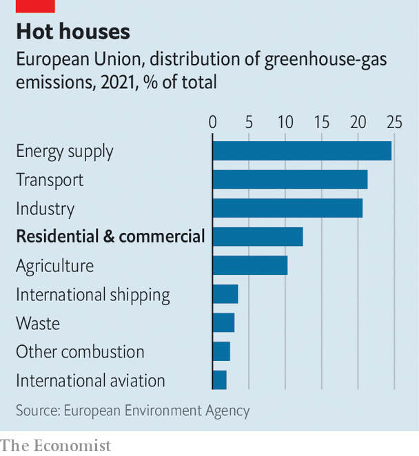
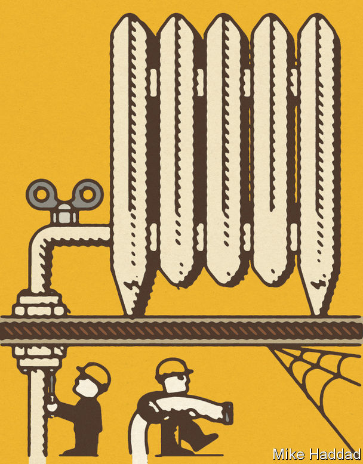

###### All that gas

# Propane-powered heat pumps are greener 

##### And easier to install in leaky old buildings 

 

> Sep 6th 2023 

ELECTRICITY CAN be made from the sun, the wind or the atom rather than by burning fossil fuels. Cars, buses and perhaps even lorries can be powered by batteries rather than petrol or diesel. But other parts of the economy are trickier to decarbonise. One such awkward chunk is the heating, in homes and business, of air and water. In the EU, where much of this is done by burning oil or natural gas, commercial and residential heating accounts for about 12% of the bloc’s greenhouse-gas emissions (see chart).

 


In principle there is a solution, in the form of heat pumps. These work like a refrigerator in reverse, gathering heat from the outside, concentrating it, and piping it into a building. The EU hopes to replace a third of the 68m gas and 18m oil boilers in residential buildings with heat pumps by 2030. That could mean a 28% fall in the total residential emissions generated by oil and gas—and that number should rise as more of the electricity powering those pumps comes from low-carbon sources. 

But there are problems with ambitious targets. Compared with boilers, heat pumps are expensive, often costing twice or three times as much as a fossil-fired boiler. Another is that, since they pump cooler water to radiators, they work best in new, well-insulated buildings. Around 60% of Europe’s housing stock is estimated to fall short of the required standards, and will need extensive—and expensive—renovation work to make them suitable. 

And there is another drawback, too. Although heat pumps powered by low-carbon electricity are undoubtedly better, from an environmental point of view, than fossil-fuelled boilers, their credentials are not entirely green. Most residential models contain environmentally damaging gases which European legislators are poised to outlaw. Redesigning the machines to work without them could mean delays in installing them. 

In some places, the politics of heat pumps have become bad-tempered. A German law had planned to forbid the installation of new gas-fired boilers in homes from next year. A backlash from cross voters sparked a row in the country’s coalition government before the rules were scrapped in June. On September 8th, after we published this article, German lawmakers were expected to pass a watered-down version of the rules. 

Warming up

A heat pump works by warming a refrigerant in a network of pipes using the ambient heat present in the air, or from an array of pipes that are buried in the ground or under water. This turns the refrigerant from a liquid into a gas. The gas is then compressed, which raises its temperature. The resulting hot gas is pumped through a heat exchanger, where it warms the water or air that is used to heat the building. As the gas cools it returns to its liquid state, ready to repeat the process. 

Because heat pumps merely move existing heat around, rather than generating it themselves, they can be extremely efficient. Some models boast efficiencies of 400% or more, which means that four kilowatts of heat can be piped into a house for every one kilowatt of electricity consumed by the pump. Modern gas boilers, which generate heat from combustion, can reach about 90% efficiency, and are prevented by the laws of physics from exceeding 100%. 

A heat pump’s efficiency is lower in winter, when there is less heat to be gathered from the air, although they work at temperatures as low as -25°C. But heat pumps tend to produce water heated to around 55°C. This is lower than most gas boilers, which might manage 75°C or so. That means that fitting heat pumps to older buildings often needs extra insulation, bigger radiators or even underfloor heating, all of which is disruptive and pricey. 

Most modern heat pumps use hydrofluorocarbons (HFCs) as their refrigerants. These transform from liquid to gas at the right sort of temperature, and can carry a good deal of heat. But HFCs are also potent greenhouse gases, with climate-changing power that can be several thousand times higher than carbon dioxide, the main man-made greenhouse gas. Leaks of HFCs from heat pumps and other equipment, such as certain types of refrigeration and air-conditioning systems, account for around 2.5% of the EU’s total greenhouse-gas emissions—not far off the amount caused by air travel in the region. 

Propane, and propane accessories

With that in mind, the EU had planned this summer to put the finishing touches to new rules that would have required HFCs to be replaced with cleaner alternatives by 2027. But discussions have broken down. One side, backed by Germany and the Netherlands, is keen to get on with the phase-out. The other, supported by a number of eastern European countries and some heat-pump manufacturers, wants the deadline moved into the 2030s. 

Other refrigerants exist. The chemical industry has developed a class of chemicals called hydrofluoroolefins (HFOs). These are less powerful greenhouse gases than HFCs, although still more potent than carbon dioxide. But some countries, including Denmark, Germany, the Netherlands, Norway and Sweden, want to restrict HFOs, too, because studies show they could pollute rainwater. Many heat-pump manufacturers are therefore turning to so-called natural refrigerants, which have the lowest global warming potentials of all. Some of these were employed in refrigeration long before synthetic substances were developed. They include ammonia and even carbon dioxide itself. But the front-runner to replace HFCs in residential heat pumps is propane.

The global-warming effect of propane is only a little stronger than that of carbon dioxide. The problem with using it in a heat pump is that, unlike HFCs, it is flammable. It is also odourless, which is why when propane is used as a fuel it is given a “rotten egg” smell so that it can be easily detected if it leaks. That is not possible in a heat pump, since the chemicals that produce the smell interfere with the refrigeration process. 

For that reason, extra rules apply to propane-powered pumps. If propane is pumped inside a building, as in “split systems” which mount the heat-exchanging equipment indoors, then the volume of gas in the system is limited to 150 grams, about a fifth of the amount of refrigerant typically used in an HFC model. If more gas is used, extra safety features, such as leak sensors and automatic venting systems, have to be fitted. This raises the cost still higher, and makes installation even more fiddly—especially in the older buildings less well-suited to the technology.

According to the European Heat Pump Association (although not all its members seem to agree), the rapid phasing out of HFCs would “slam on the brakes for heat pump deployment”. It argues that a laxer schedule would give the industry more time to develop propane-based systems that could be installed more easily in a greater variety of homes. 

Delaying things is unnecessary, according to a paper presented to European legislators by a group of more than 40 scientists. They point out that it took the refrigerator industry between three and five years to switch to cleaner gases, like isobutane, in the 1990s. (Chlorofluorocarbons, that industry’s refrigerants of choice, were phased out in that decade because of the damage they do to the ozone layer.) What heat-pump makers have failed to do, the paper argues, is to reduce the amount of refrigerants which heat pumps contain because this was not considered to be important with non-flammable HFCs. 

Despite what their trade body says, a number of producers, including Viessman and Robert Bosch, two German firms, along with Mitsubishi Electric, a Japanese one, have already launched propane-filled heat-pumps. They tend to be large “monoblock” systems that are mounted outdoors, where any escaping gas can disperse quickly and harmlessly into the air. Viessman says that, besides its eco-friendly credentials, propane also makes it easier to produce heat pumps that can supply water at 70°C—the sorts of temperatures that gas boilers produce. That could remove the need to replace radiators or install underfloor heating in many cases, saving a considerable amount of money. 

 


Many properties, and especially flats, may lack enough outside space for a monoblock. Firms are therefore working on split systems that can get by on modest quantities of propane. They are being helped by Lena Schnabel and her colleagues at the Fraunhofer Institute for Solar Energy Systems in Freiburg, Germany. Dr Schnabel’s group have tested a number of designs, including one that can make do with just 146 grams of propane. That was achieved by redesigning and optimising most of the pump’s important components, such as the compressor, heat-exchanger and pipework, and the use of prototype parts. 

Dr Schnabel is optimistic that new designs containing a small charge of propane will, in the next few years, mean it is possible to directly replace a gas boiler inside a flat with a heat pump that will be safe, eco-friendly and produce similar temperatures. The heat source could be a communal one, on the roof of a building or buried in a basement, powering dozens of individual indoor units. There is even talk of raising the 150-gram limit, though, says Dr Schnabel, “for safety it really makes sense to use as little refrigerant as possible”. 

If such devices can be perfected, then many of the downsides of heat pumps could be eliminated. Not only would they become greener machines in their own right, they would become easier and cheaper to fit in old properties, too. And that would help take some of the heat out of the arguments that surround them. ■


