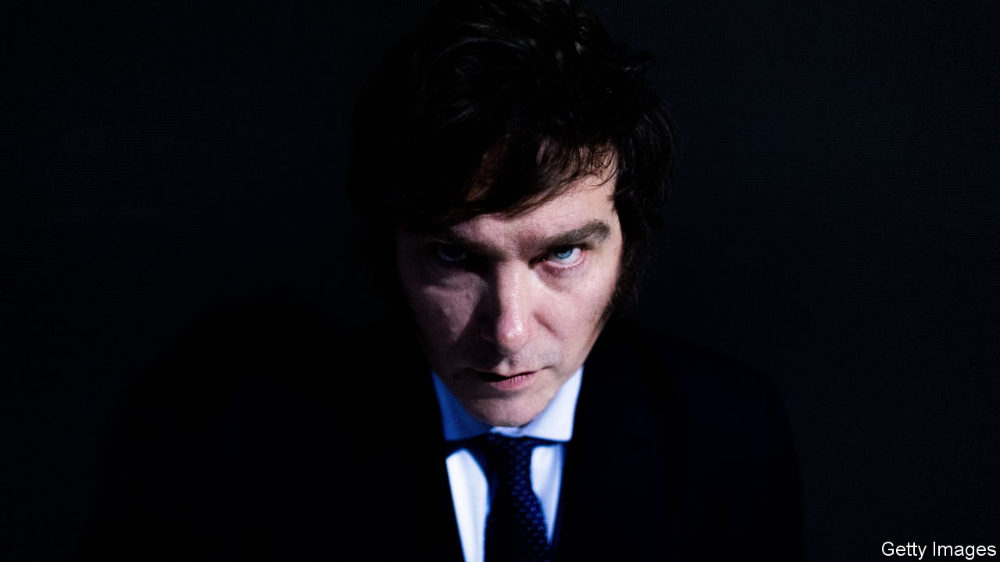
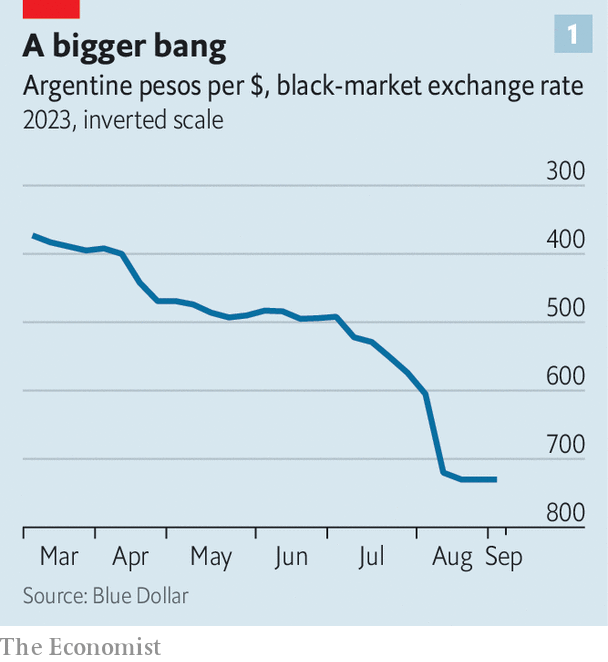
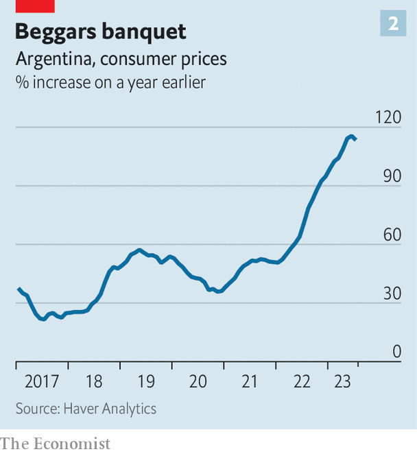
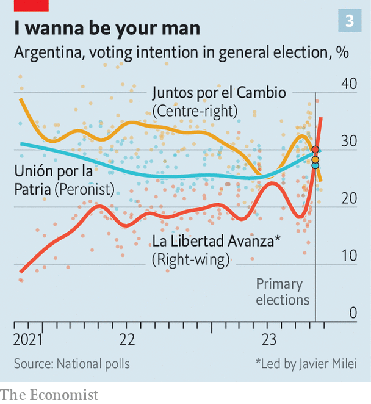

###### Argentina’s next president?

# Meet Javier Milei, the front-runner to be Argentina’s next president 

##### The radical libertarian gives an interview to The Economist 

 

> Sep 7th 2023 

Javier Milei arrives five minutes early to his interview with  and cuts to the chase. “My goal is to get the country back on its feet,” he says, “so that within 35 to 45 years Argentina can once again be a world power.” Thus begins a discussion which lasts for three hours. Over black coffee with five spoonfuls of sugar, Mr Milei outlines his libertarian beliefs and explains how he would make Argentina, one of the world’s most economically vexed nations, “great again”. 

When speaking about his political philosophy, Mr Milei has the air of an eccentric academic rather than an aspiring president. He becomes particularly animated as he explains how the 2008 financial crisis turned him from a “recalcitrant neoclassicist” into an “anarcho-capitalist”.

This philosophy, first propounded in the 1950s by Murray Rothbard, an American economist, posits that voluntary contracts between individuals should govern the provision of all goods and services in society, including education, environmental protection, road-building and law enforcement. Extending this logic, Mr Milei describes the state as “a criminal organisation”. “Because you don’t pay taxes voluntarily,” he says, “you pay them at gunpoint.” He thinks the welfare state must be dismantled because it transfers the costs of decisions to others, rather than making individuals responsible for their actions. Traditional libertarian principles, such as unfettered immigration and the legalisation of illegal drugs are “marvellous” only in the absence of a welfare state. 

Yet as someone who hopes to be the next head of state, Mr Milei says he accepts “the restrictions of real life”. Whereas Mr Milei says he subscribes to anarcho-capitalism philosophically, in practice he is a “minarchist”, a softer strand of libertarian anarchism in which the state’s only function is to provide citizens with the army, the police, and the courts in order to enforce property rights. He says that creating such a limited state would take decades.


First, pro-market reforms would whittle down the size of the state. Mr Milei proposes cutting public spending by at least 15% of GDP and reaching zero primary deficit (ie, before interest payments) within his first year of government. He would do this by eliminating electricity and gas subsidies, cutting the number of government ministries from 18 to eight, replacing state spending on public works with a private bidding system, reducing federal transfers to Argentina’s 24 provinces, and scrapping privileged pensions paid to Supreme Court justices, diplomats and presidents. He promises to renounce his presidential pension. He will try to privatise all of Argentina’s 34 state companies, and to reduce or scrap most of Argentina’s taxes. 

Next, services that are usually provided by the state, such as education and health care, would see increasing doses of competition. A voucher system would be introduced in education, in which parents are given resources to decide where to send their children rather than the state transferring funds to schools. Proposals on health care are thin, but Mr Milei says public provision would move towards an insurance-based model. Both education and health care are governed by Argentina’s provinces, so in practice the extent of changes the federal government could make is limited. Surprisingly, Mr Milei says he would leave welfare payments untouched until fiscal and labour reforms have made Argentina more competitive. Trade unions are also “not a problem”.

Mr Milei’s grandest proposal is to . Emilio Ocampo, Mr Milei’s chief dollarisation strategist, acknowledges that the country needs to have access to a pool of greenbacks in order to dollarise. He argues some of these would come from Argentines repatriating the hundreds of millions of dollars they hold abroad or pumping dollars held under the mattress back into the system. Mr Ocampo has also proposed creating a special-purpose fund in an OECD jurisdiction which would include treasury bonds, debt from the public pension fund and shares in the state oil firm. Using this as collateral to borrow against the fund is one option for raising cash. But Mr Milei says his team is looking at five alternatives that will depend on the state of the market come December, when the new government takes power. 

Paint it, libertarian

All these proposals, says Mr Milei, would be sent to Congress rather than implemented by presidential decree. He says he will turn to referendums only if Congress rejects his proposal of eliminating the central bank and cutting down the size of other parts of the state. As pro-market models for Argentina to follow, Mr Milei lists Australia, Ireland and New Zealand.

 


Sceptics argue that dollarisation is unfeasible: few people want to buy Argentine debt or anything associated with it. Since 2018, when Argentina agreed a mammoth $44bn loan with the IMF, it has struggled to pay back regular instalments. It is difficult to see how it will be able to attract the $40bn Mr Milei says are needed to dollarise, especially given that he wants to do so within two years. Mr Milei is banking on the markets responding favourably to a potential victory. But after he won Argentina’s primaries on August 13th, the peso lost almost a fifth of its value, partly because of fears that it would be hard for him to govern with a minority in Congress (see chart 1). He dismisses talk of ungovernability as claptrap invented by the opposition. 

 


It is also not entirely clear how Mr Milei came up with the target for public-spending cuts of 15% of GDP. According to the latest official data, from 2021, public spending in Argentina represented 38% of GDP, of which two-thirds went on social expenditure such as education and health. Given the long transition that will be required to change the education and health-care systems, and the relatively small share of spending taken up by privileged pensions, some economists believe that Mr Milei will struggle to cut public spending by more than 5% of GDP during his four-year term, if he were to win. It may also be difficult to eliminate subsidies, which cost around 2% of GDP, without some form of backlash. Annual inflation is currently 113% (see chart 2). Scrapping subsidies would push up prices further, at least temporarily, and could hurt the poor. 

Mr Milei is most comfortable when talking about libertarian theory and his economic proposals. His understanding of international politics and trade is woolly at best and conspiratorial at worst. “All those who want to fight against socialism at the international level are my allies,” he says in summary of his foreign policy. He does not explicitly admit to admiring Donald Trump, but he is an unabashed fan of Jair Bolsonaro, Brazil’s former right-wing president, who copied much of Mr Trump’s anti-democratic playbook. 

He appears to believe conspiracy theories that Mr Bolsonaro was the true winner of the presidential election last year. He also appears to think that Luiz Inácio Lula da Silva, Mr Bolsonaro’s left-wing successor, was behind protests in which thousands of  stormed government buildings in Brasília, the capital, demanding a coup. In a similar vein, Mr Milei claims that he was “robbed” of 5% of the vote in the primaries in August (in which he came first). 

Mr Milei is a climate-change sceptic. His liberalism does not extend to pro-choice sentiment: were he to be elected, he would try to ban abortions. He would relax gun laws. He seems unaware that bashing the leaders of Argentina’s top trading partners, Brazil and China, may hurt the country’s trade and foreign investment. Although he says he wants to open Argentina up to free trade, he suggests pulling out of Mercosur, a trade bloc composed of Brazil, Argentina, Paraguay and Uruguay, which may soon get a free-trade agreement with the European Union.

 


His ideological Manichaeism means that, in the fight against whomever he deems “collectivist”, almost anything goes, including setting aside liberal principles. “First we have to focus on the enemy, which is socialism.” When prompted to describe what occurred in Argentina between 1976 and 1983, during which a military junta killed thousands of left-wing guerrillas, he responds: “There was a war between a group of subversives who wanted to impose a communist dictatorship, and on the other side there were security forces who exceeded in their actions.” Most Argentines would consider this a false equivalence. Mr Milei’s running-mate is Victoria Villaruel, a former lawyer for soldiers accused of atrocities during the dictatorship.

Gimme dog shelter

Mr Milei’s inclination to divide the world into socialist enemies and everyone else suggests that he will find it difficult to negotiate with Congress, in which the left-leaning Peronist movement will continue to hold much power. He has used inflammatory language against opponents. In previous interviews he has called the centrist mayor of Buenos Aires “a leftist piece of shit” and suggested that a former cabinet chief of a centre-right government should be beheaded with a samurai sword. He recently dismissed the pope, who is Argentine, as “the representative of the Evil One” because “he encourages communism.” In our interview, he labelled detractors of his dollarisation plan as “brutes”. 

Mr Milei is close to his sister, who manages his presidential campaign. Little is known about her other than that she studied public relations, ran a pastry business and enjoys throwing tarot cards. He describes her as “a superlative human being” who is “difficult to fit into the normal categories” because of her spiritual purity. Mr Milei says that his sister and his mastiff, Conan, which he had cloned into five puppies after he died in 2017, are “the only ones who never betrayed me”. He neither denies nor confirms rumours that his dogs advise him. “​​If so,” he says, “they are the best political analysts in the world.” ■

To read the transcript of Mr Milei’s meeting with our journalist, click . 

