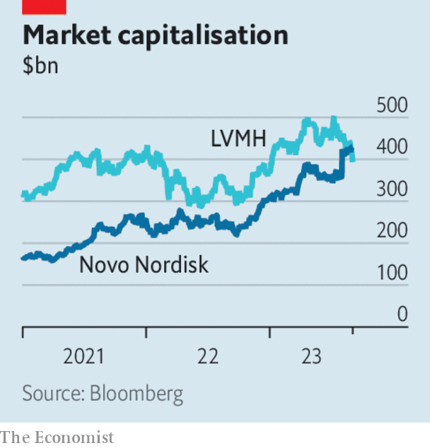

###### The world this week

# Business 

#####  

 

> Sep 7th 2023 

, a big Chinese property developer, managed to make two interest payments to bondholders just before the end of a 30-day grace period, thus avoiding a technical default. The company had only recently warned that it might default on its debt after reporting a huge quarterly loss. With around $187bn in total liabilities, its struggles have rattled investors. However, Chinese markets rallied (albeit briefly) in response to the latest news, and to announcements from Beijing, Shanghai and other cities about easing mortgage requirements for homebuyers. 

The problems afflicting China’s economy are best illustrated by the slump in its once-mighty trade prowess. The country’s  fell by 8.8% in August, year on year, the fourth month in a row of decline (in July they plunged by 14.5%). Outbound shipments from China to Japan dropped by 20%.

Saudi Arabia and  surprised markets by extending their voluntary cuts in  until the end of 2023, rather than October, as had been expected. Prices jumped in response; a barrel of Brent crude traded at $90 for the first time since November last year. Some analysts think that Russia will try to maintain higher oil prices, and thus higher fuel prices, to put pressure on the Biden administration ahead of next year’s presidential election in America. 

The notion that   is still below its pre-pandemic level was overturned by a revision to official statistics. It turns out that GDP had grown by 0.6% between the end of 2019 and the end of 2021, rather than shrinking by 1.2%. As more complete data emerged, the Office for National Statistics found that companies had been adding to their stock of goods, rather than depleting them, and that the wholesale trade and health-care sectors expanded at a much faster pace than had been thought. 

 grew by 3.4% in the second quarter, year on year, a better showing than had been forecast and powered by higher household and government consumption. The news was welcomed by Luiz Inácio Lula da Silva, the country’s left-wing president, who again called on the central bank to lower interest rates in order to encourage growth.

A weaker Arm

 hopes to price its forthcoming IPO on the Nasdaq exchange at between $47 and $51 a share, according to a new filing. That would give the chip designer a market value of up to $52bn, considerably less than the $64bn implied in a transaction by SoftBank, its owner, a month ago. Some analysts now wonder if Arm will even reach a valuation of $52bn, given its latest drop in quarterly revenue. 

Alan Joyce stepped down with immediate effect as chief executive of . He was supposed to retire in November, but growing public anger over a series of scandals, including claims that the Australian airline sold thousands of tickets for cancelled flights, has forced him into an early departure. 

, which is controlled by the Saudi government, acquired a 9.9% stake in , Spain’s leading telecoms provider. The news was a surprise for the company, and for the Spanish government, which made rumblings about defending its strategic interests. 

 


 became Europe’s most valuable listed company, after its treatment for weight loss, Wegovy, was made available in Britain. The Danish pharmaceutical group’s market capitalisation stood at $428bn at the close of business on September 4th, putting it ahead of LVMH, the world’s biggest luxury-goods firm. 

After coping with the pandemic and a supply-chain crisis, —Ford, General Motors and Stellantis—are now confronted with a more traditional problem: a workers’ strike. Contracts with the United Auto Workers must be renewed by September 14th and the bosses and unions remain far apart on reaching a deal. The most recent UAW strike was in 2019.

 began enforcing new curbs on renting properties through platforms such as . Homeowners who want to rent now have to register with the city, and the platforms must verify that registration. Hosts who repeatedly violate the rules could face fines of up to $5,000. Many have simply pulled their property from the listings. Airbnb says it has in effect been banned from the Big Apple. 

Football crazy

 debut for Inter Miami in July led to a surge in subscriptions for Major League Soccer Season Pass, Apple’s streaming package of games, according to Antenna, a data-analytics firm. More than 110,000 people signed up on the day the Argentine player took to the pitch for Miami against Cruz Azul, a Mexican team, and scored the winning goal. The “Messi effect” is also proving to be a winner for AppleTV+, as it has gained new subscribers as a result. 

