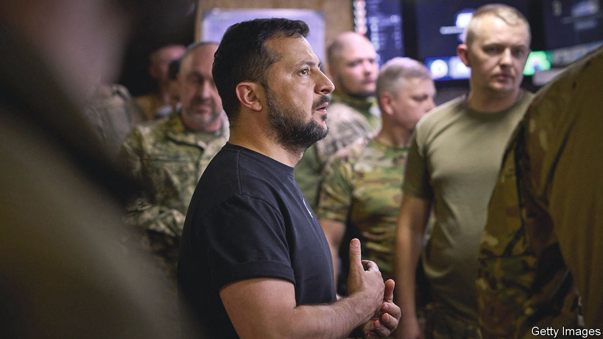
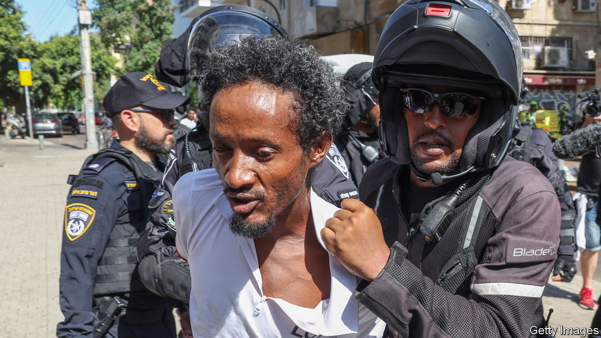

###### The world this week

# Politics 

#####  

 

> Sep 7th 2023 

Volodymyr Zelensky  as  defence minister. The president said the defence ministry needed a new approach, not least in tackling the corruption that has plagued military contracts (Mr Reznikov is not implicated in any of the allegations). Rustem Umerov was named as the new minister. As head of the State Property Fund Mr Umerov has a record of rooting out graft. He is also a Tatar from Crimea. Meanwhile Antony Blinken, America’s secretary of state, went to Kyiv to offer more American support to Ukraine. 

The war grinds on

Mr Zelensky visited  in the battle against Russia. The deputy defence minister claimed Ukraine had retaken 47 square kilometres of land around Bakhmut since launching its counter-attack in early June. At least 17 people were killed in a Russian missile attack on Kostiantynivka, a city near the front line. 

 president, Recep Tayyip Erdogan, met Vladimir Putin in  southern city of Sochi to try to forge a new deal that would allow for the safe passage of Ukrainian  across the Black Sea. Turkey was crucial in negotiating the previous agreement. Russia attacked the Ukrainian side of the  again. The ports there are an alternative shipping route for Ukrainian exports amid the Russian blockade.

Britain is to designate the  of Russian-backed mercenaries a terrorist organisation, alongside the likes of Islamic State. As well as fighting in Ukraine, Wagner troops have been active in several African countries, where they have been accused of war crimes. 

Carles Puigdemont, the exiled former leader of Catalonia, said that any support from his Catalan independence party to keep  Socialist government in power would depend on granting an amnesty for separatists who had carried out illegal acts. Spain has been in political limbo since an election in July, which was won by the opposition People’s Party but without a majority in parliament. The PP will try to form a government this month. If it fails, as is likely, the Socialists may be asked to try, or a new election could be called. 

Supreme Court decriminalised abortion across the country. The procedure had been previously legalised in certain states. The ruling makes abortion available in all federal hospitals and ensures that health-care workers who provide abortions are protected from prosecution. 

American officials claimed that Kim Jong Un,  dictator, was preparing to travel to Russia to meet Vladimir Putin. They said the purpose of the meeting was to seal an arms deal that would send North Korean artillery shells and anti-tank missiles to Russian troops fighting in Ukraine. It would be the dictator’s first trip abroad in more than four years. 

 told the World Trade Organisation that China’s ban on its seafood was unacceptable. China, the biggest market for Japanese fish and shellfish, imposed the ban after Japan released water from the damaged Fukushima nuclear plant into the sea. Several international studies had concluded the release was safe.

Thousands of people took to the streets in to protest against the rising cost of electricity, which has doubled over the past three months. The protests, which turned violent in some places, have put pressure on the country’s caretaker government. Yet any relief for suffering Pakistanis could derail Pakistan’s deal with the IMF, which helped the country narrowly avoid a default in June. 

 


Around 170 people were injured when rival groups of  fought with each other and with police in Tel Aviv. Pro- and anti-government Eritrean factions have also clashed recently in Canada, Germany and Sweden. Binyamin Netanyahu, Israel’s prime minister, said he wanted the illegal migrants to be deported immediately. 

Jihadists in  killed more than 50 members of the security forces as the country’s safety continues to deteriorate. The insurgents have besieged more than two dozen towns and a million people and are inching closer to the capital, Ouagadougou.

General Brice Oligui Nguema was sworn in as the president of  after leading a coup that deposed Ali Bongo. The Economic Community of Central African States suspended Gabon’s membership and called on the junta to guarantee the safety of Mr Bongo and his family.

Abdel Fattah al-Sisi, the president of , said the country needs to sharply reduce its birth rate, from around 2m births a year to 400,000 in order to prevent a “catastrophe”. He said people should not have the freedom to decide how many children to have, pointing to China.

 and  exchanged ambassadors, ending a seven-year break in diplomatic relations after a rapprochement brokered by China. Separately, the European Union said that Iran has been holding an employee of its diplomatic service since April 2022. Johan Floderus, a Swede, was arrested on charges of espionage while on holiday in Tehran. 

 council, a local authority serving over 1m people, in effect declared bankruptcy. Britain’s second-largest city is not alone in its financial struggles; nearly half of England’s councils will have to cut spending on services. Birmingham’s immediate woes are blamed on equal-pay claims (brought by female workers who were underpaid) that are estimated to cost between £650m and £760m ($817m to $954m), which the council does not have. 

Britain is rejoining the European Union’s  research programme as an associate member. Talks about allowing Britain to rejoin after Brexit had become bogged down in haggling over trading arrangements for Northern Ireland. British scientists say they missed out on research collaboration and funding by being excluded from the programme. 

Enrique Tarrio, the former leader of the , a far-right militant group in America, was sentenced to 22 years in prison for his part in organising the attack on the Capitol on January 6th 2021. It is the stiffest penalty handed down to any of the 1,100 people who have been convicted for their part in the assault. 

Party pooper

Xi Jinping’s decision not to attend the  in Delhi on September 9th and 10th was met with disappointment. America warned China not to “play the role of a spoiler” by sniping from the summit’s sidelines. 

