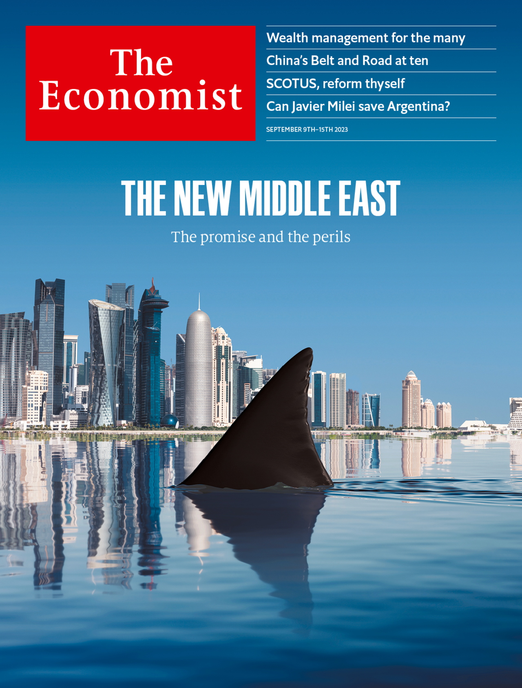
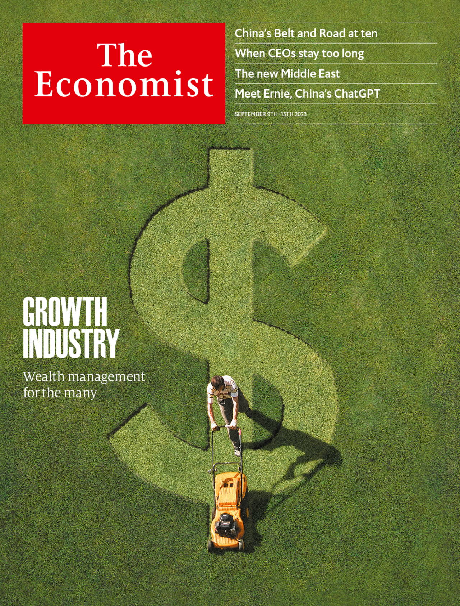

###### The Economist

# This week’s covers 

##### How we saw the world 

> Sep 7th 2023 

The cover that appears in most of the world highlights a story that considers the promise and the perils of the new Middle East, which the Gulf countries want to reshape in their image. Economies are booming and wars are fading—but climate change is looming.

 


: 

: 


Meanwhile, on our cover in Asia we look at how more competition in the wealth-management industry could change global finance.

 


: 

: 


