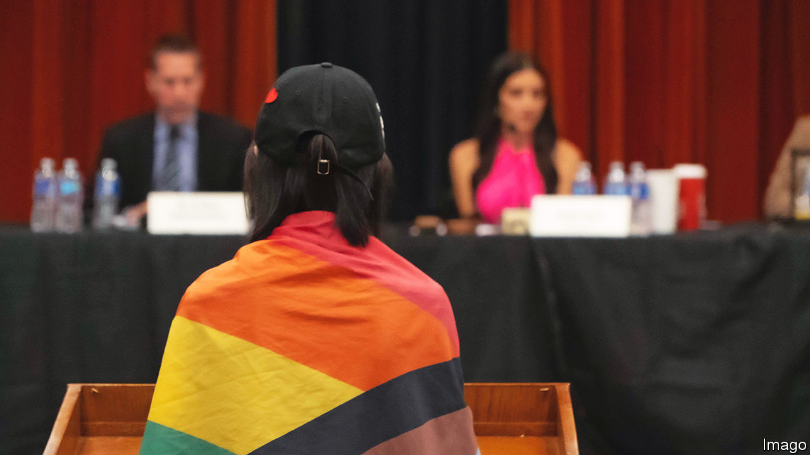

###### The counter-revolutionaries

# An unusual coalition is emerging in California’s school-board fights 

##### Democrats in Sacramento might want to pay attention to it 

 

> Sep 7th 2023 

Republicans promoting policies that might seem more at home in Florida have won victories on school boards in California. They are part of a pushback by parents, especially on issues around sex and gender, that makes for an unusual coalition, including some Democrats, immigrants, evangelicals and gay people. What unites them is a shared view that schools should not be allowed to keep a child’s declared gender identity secret from their parents. Hundreds of districts already have policies saying schools must do so. 

School boards began taking issues into their own hands after a bill proposed by Bill Essayli, a Republican state legislator, that would have ordered schools to inform parents in such cases, did not even achieve a hearing in Sacramento in April. On July 20th, Chino Valley, a small school district 35 miles east of Los Angeles, became the first in California to pass a motion mandating that parents must be notified in such cases. On August 10th Murrieta Valley school board passed a similar motion, followed by the Anderson Unified school board. Others may follow.

Chino’s new president, Sonja Shaw, was already angry about the state’s handling of lockdown for schools, but only stood for the board last year when she was told that boys who identify as girls were allowed into her daughters’ locker room. When she objected, she says, she was shocked to learn this was permitted by law in California. Ms Shaw says she is typical of many soccer moms who were not politically engaged (“I didn’t even know what a school board was,” she adds). Republican leaders in California, sniffing an opportunity, recruited her into the party’s “Trailblazers” programme, which helps train-up newcomers. California’s superintendent of education, Tony Thurmond, attended the chaotic July board meeting in Chino to argue against the parental pushback. When he tried to speak for more than his permitted one minute, Ms Shaw had him ejected. 

Some supporters of parental notification are hard-line traditionalists who do not want any mention of gay or trans issues in public schools. But plenty see the trans issue as separate from gay rights. “I voted for gay marriage,” says Ani Torosyan of GUSD Parents’ Voices, a parental-rights group in Glendale that includes many Armenian immigrants. “This is not about intolerance or hatred or bigotry. It’s about not pushing a gender ideology which is not rooted in science.” She also voices a widespread frustration about priorities, and why, when her own child’s high school has just 24% of students meeting state maths proficiency levels, it is spending time and money on a “gender-ideology curriculum”. 

Mustafa Umar of the Islamic Centre in Irvine says Islamic schools are now full of students who have left public ones, and that many Muslim parents, long angry at the Republicans, are considering voting for them solely because of this issue. He says activists and politicians have moved away from the “live and let live approach” of the previous generation. “Now they’re saying, we are going to insist that you must accept our ideology as being normative.”

Yelling: “Stop!”

A smattering of Democrats are also crossing their party’s position. In 2020 Erin Friday, a San Francisco lawyer and former self-described “diehard liberal”, overheard teachers on Zoom referring to her 13-year-old daughter with a male name and pronouns. A few days after she complained to the school, she says Child Protective Services turned up at her house, followed the next day by the police. Ms Friday now runs the West Coast chapter of a non-partisan, non-religious group of parents called Our Duty (she estimates that three-quarters of the 1,500 members were originally Democrats). On August 28th she and a colleague launched a campaign to get three ballot initiatives on parental notification, female sports and medical treatment for minors to be put directly to voters in 2024.

Some gay people, too, are quietly voicing their concerns. Julie Lane, a lesbian from San Francisco who fought for gay rights in the 1980s, is part of a group called womenarereal.org. “Many of the kids being told they are trans are actually just gay,” she says. She adds that it is much harder coming out against gender ideology today than it was coming out as a lesbian in the 1980s.

Meanwhile in Sacramento, a number of bills on the issue are in their final stages in the state legislature. One makes “affirmation of gender identity” legally part of a child’s “health, safety and welfare”, causing critics to worry that a non-affirming parent may be considered dangerous to a child in custody battles. Another removes the requirement that a child must present a danger to themselves or others or be the victim of abuse before being placed in a residential shelter. A third bill, proposed in response to rowdy school-board meetings, would criminalise any parent who harasses a school official or disrupts a board meeting. To the campaigners, this looks like an attempt to silence dissenters. 

Democratic politicians and supporters are starting their own pushback against the pushback. Kristi Hirst, a parent and former teacher, says the new school-board policies in places like Chino are a fearmongering tactic. “Teachers do not have nefarious intentions to keep secrets,” she said. “Nobody is doing that.” In February she set up Our Schools USA, a parents’ group looking to counter the influence of conservative groups such as Moms for Liberty. California’s attorney general, Rob Bonta, filed a lawsuit against the Chino board saying that its policy would cause the “forced outing” of trans students, thereby violating their civil rights. On September 6th a court granted his request for a temporary restraining order stopping the district from enforcing its parental notification policy until October 13th, when the case will be decided in a full hearing.

For Republicans, this looks like a gift. A group aligned with the House speaker, Kevin McCarthy, recently launched a “Blue State Project” to help Republicans compete in traditionally Democratic places. A parental revolt in California could prove helpful to their cause. Mr Essayli, the Republican assemblyman, told Democrats on August 14th: “we want the public to know what your agenda is, and we want to run on this in the next election.”

Americans are conflicted on trans rights. Almost all oppose discrimination. Yet a majority (and rising share) think gender is determined by sex at birth (a view also held by 40% of Democrats). California’s Democrats should be mindful of this before dismissing their critics as bigots. ■


