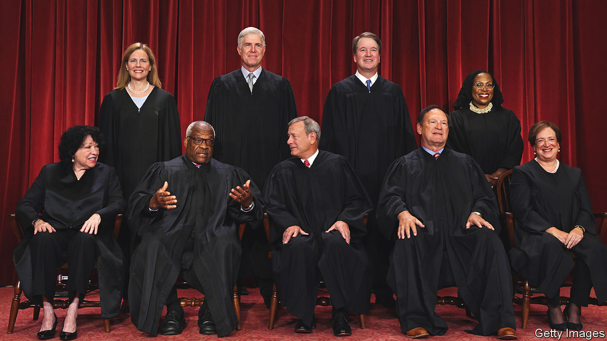

###### Coming cleaner

# Can America’s Supreme Court police itself? 

##### Few ethical rules apply to the nine justices—and some take liberties even with those 

 

> Sep 7th 2023 

OTHER THAN receiving the occasional desk ornament or “coffee and doughnuts”, federal employees in America are barred from accepting gifts worth more than $20 from anyone but friends and family. They must refuse all gifts that “would not have been given had the employee not held the status, authority or duties” of his position. They are advised to consider declining even gifts valued at less than $20 that might prompt a reasonable person to “question the employee’s integrity or impartiality”. Similar strictures to promote public confidence apply to employees of the judicial branch, including all district and circuit-court judges. 

But they do not constrain the nine justices of the Supreme Court. The only ethical requirements that apply to America’s nine most powerful jurists are found in the Ethics in Government Act of 1978, an anti-corruption law passed in the wake of the Watergate scandal. The law requires public officials to disclose in an annual report certain information about their investments, outside income (currently capped at $30,000 a year for teaching, but unlimited when it comes to books) and gifts. It also requires some financial data related to the justices’ immediate family.

In June , an investigative outlet, reported that in 2008 Justice Samuel Alito omitted to log a trip on a private jet to Alaska that was paid for by a billionaire Republican donor who would later bring cases to the Supreme Court. In April  published details that Harlan Crow, a billionaire property developer, collector of memorabilia and noted donor to conservative causes, had been hosting Justice Clarence Thomas on his plane and yacht for decades. The website later reported that Mr Crow bought a home Justice Thomas owned in Georgia and paid private-school tuition for his great-nephew. 

The  found that in 1999 another friend gave Justice Thomas a loan to finance his purchase of a $267,230 RV, which he affectionately calls his land yacht. The court’s longest-serving and most conservative justice reported none of this in years of financial disclosures—though on five occasions earlier in his tenure he had reported travel on private jets. 

On August 31st, in a belated disclosure report for 2022, Justice Thomas declared some of these gifts. He reported flying on Mr Crow’s private jet three times last year—in February, because of an “unexpected ice storm” in Texas; in May, due to the “increased security risk following the  opinion leak” that erased the federal right to abortion; and in July for a holiday at Mr Crow’s getaway in the Adirondacks. 

Justice Thomas also acknowledged inadvertently omitting other financial information from previous disclosures. He has now put on record his sale to Mr Crow in 2014 of the home where his 94-year-old mother continues to live. And he has noted his wife Ginni’s life insurance, which he left off reports covering 2017 through 2021. In 2011 Justice Thomas filed similar corrections following his failure to report $686,589 that Mrs Thomas, a conservative activist, received from work at the Heritage Foundation, a like-minded think-tank.

Justice Thomas has generally ignored raised eyebrows about his wife’s activism. He did not recuse himself from a case involving the riot of January 6th 2021 at the Capitol, despite Mrs Thomas’s active involvement in attempts to overturn Donald Trump’s loss. Among the pleas she texted to Mark Meadows, Mr Trump’s chief of staff, was her view that the “Biden crime family &amp; ballot fraud co-conspirators” should be “living in barges off GITMO”. 

The uptick in financial transparency reflected in Justice Thomas’s most recent report is “a positive development” in the eyes of Gabe Roth, head of Fix the Court, a watchdog. But Mr Roth laments that it took a “major months-long scandal” for him “to follow the disclosure law”. Justice Thomas should “go back and amend earlier disclosures in order to fully reflect the lavish gifts he’s received over the years”, he says. 

Justice Thomas’s friendship with Mr Crow has been the linchpin of his justification for keeping mum about the billionaire’s decades of largesse. “Harlan and Kathy Crow are among our dearest friends,” he wrote in April. “As friends do, we have joined them on a number of family trips during the more than quarter-century we have known them.” Justice Thomas said he consulted with (unnamed) colleagues about his travel arrangements, and concluded that they fell under the “personal hospitality” exception to the reporting requirement. (The exclusion refers to “food, lodging or entertainment” from friends but does not mention transport.) Justice Thomas’s new disclosures regarding Mr Crow were precipitated, he says, by a change in disclosure guidance in March 2023 from the Judicial Conference, the policymaking body for federal courts. 

For his part, Justice Alito attacked the  report about him in an op-ed in the Private-jet travel was not reportable in 2008, he wrote. And anyway, he flew private rather than on a commercial plane because the seat “would have otherwise been vacant”.

These defences do not sit well with Stephen Gillers, an expert on judicial ethics at New York University (NYU) law school. “The ordinary understanding of personal hospitality would be such things as a weekend at a friend’s country home,” he says. Justices Alito and Thomas are using “narrow and private” understandings of the rules “to justify their omissions”. Melissa Murray, also at NYU, agrees. “Most normal people would understand that private-jet travel or school tuition is not the same as having dinner at a friend’s house.”

News of the justices’ generous friends has stirred renewed debate in Congress over Supreme Court ethics reform. For conservatives, bills requiring the justices to adopt a code of conduct—such as the Supreme Court Ethics, Recusal, and Transparency Act of 2023, sponsored by Senator Sheldon Whitehouse, a Democrat from Rhode Island—are sour grapes from liberals depressed about the court’s rightward turn. Justice Thomas’s lawyer called recent attention to his client “a partisan feeding frenzy” and “political blood sport” that will “undermine public confidence in our republic”. Ted Cruz, a Republican senator from Texas, said Democrats’ calls for ethics reform are “a political attack directed at a justice they hate”. 


Yet ethical questions are not exclusive to conservative justices. Several liberal ones failed to recuse themselves in cases where they appear to have had a conflict of interest. The late Ruth Bader Ginsburg took international trips on the dime of rich patrons (though she disclosed these). Justice Sonia Sotomayor’s staff were enlisted to help sell her books. In 2016 Justice Stephen Breyer spoke at a “private VIP dinner” at a university where people paid $500 per plate (justices are not supposed to attend fundraisers, if that’s what it was).

The justices have shown signs of an appetite for reform. Though he declined an invitation to testify to senators on the matter, Chief Justice John Roberts sent a letter to Dick Durbin, chair of the Senate Judiciary Committee, including a “Statement on Ethics Principles and Practices” which all the justices agreed to. The commitment is weaker than a full code of conduct—something Justice Elena Kagan said was in the works back in 2019—but it is something. 

For Richard Re, a law professor at the University of Virginia, tighter congressional regulation presents an opportunity for the justices to “increase their public legitimacy” by fully laying out their financial ties and gifts. He thinks Mr Whitehouse’s bill may be too focused on rules for when justices must recuse themselves, and is ambiguous on how (or whether) it will be enforced, but is “good food for thought”. The bill has little chance of making it through a divided Congress. 

Still, “getting a bit of pushback from elected officials is all to the good”, says Dan Epps, who teaches law at Washington University in St Louis. He reckons that it reminds the justices that “they’re not above the law and that they still work for us”. ■


