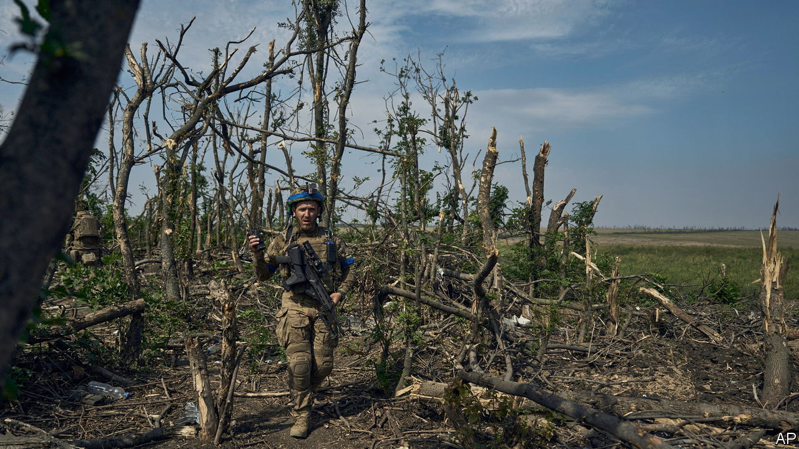

###### The third line

# How the Pentagon assesses Ukraine’s progress 

##### A rare interview with America’s Defence Intelligence Agency 

 

> Sep 6th 2023 


AFTER THREE months of achingly slow progress, Ukraine’s counter-offensive is gaining . Near the southern village of Robotyne, Ukrainian troops have pierced the first of Russia’s three defensive lines. They are now attacking the second. “Had we had this conversation two weeks ago, I would have been slightly more pessimistic,” says Trent Maul, the director of analysis for America’s Defence Intelligence Agency (DIA). “Their breakthrough on that second defensive belt…is actually pretty considerable.” Can Ukraine breach it, and the third line beyond, before shells become scarce and winter beckons?

Mr Maul, whose DIA office on the Potomac river periodically shakes as , the presidential helicopter, shuttles to and fro from its heliport next door, is charged with answering such questions. The job of his agency, which is less well known than the CIA, is to take the military measure of America’s foes. That often requires quantitative judgments: the range of an Iranian missile or the . An annual DIA report, “Soviet Military Power”, was read avidly during the cold war. But intangibles are just as important. Mr Maul singles out the will to fight—and candidly acknowledges that his agency got it wrong in Iraq in 2014 and Afghanistan in 2021, where American-built armies .

“We thought the Afghans would fight until the end of the calendar year and try to have a heroic defence of Kabul,” says Mr Maul. Instead, “they basically folded pretty quickly.” That experience, along with the evaporation of the Iraqi army in the face of the Islamic State group, led DIA to “over-correct” when judging how Ukraine would fare when Russia invaded last year. “We had a similar thought that they were just overwhelmed on paper.” It has proved a teachable moment. Mr Maul brandishes a 40-page “tradecraft note”, published this January, which re-examines how the agency measures a country’s will to fight. 

The paper emphasises how national factors—for instance, Volodymyr Zelensky’s insistence on staying in Kyiv, compared with Ashraf Ghani’s decision to flee Kabul—can affect the battlefield. It points to the importance of leadership on the front lines, an army’s esprit de corps, the strength of its command and control, and whether it enjoys sustained logistical and medical support. Such things were neglected because of the presumption that Ukraine’s leadership would be outmatched and defeated quickly. It is to guard against that sort of error that DIA analysts now fill out a detailed worksheet to help them think through these factors and how they can interact in unexpected ways. 

This methodology is crucial when it comes to assessing the coming weeks in Ukraine. Mr Maul says that the DIA will be watching for signs that Russia can keep up the flow of artillery ammunition to the front lines and maintain leadership at the local level. He concedes that American and Ukrainian officials failed to appreciate the depth of Russia’s defences and how difficult it would be for Ukraine to “smash through” them with armour. Ukrainian generals have told the  newspaper that 80% of Russia’s effort went into building its first and second lines. But Mr Maul cautions that the bulk of Russia’s reinforcements remain at the third. 

In recent weeks American officials have privately sniped at Ukrainian commanders over their military strategy—in particular the decision to deploy experienced units in the east around Bakhmut rather than on the key axis in the south. Mr Maul is more tactful. “It’s open to debate whether the Ukrainians have deployed the sort of tactics that you would hope would have made more aggressive gains in a shorter time,” he offers. More important are two critical variables: Ukraine’s stockpile of ammunition, vital for sustaining the artillery barrages that enable progress, and the weather, which becomes wetter in the autumn.

One Biden administration official says that Ukraine has around six to seven weeks of combat left before its offensive culminates. There are private disagreements over how much progress can be made in that time. Some reckon that Ukraine’s army, having thrown in most of its reserves prior to breaking the second line, and taking heavy casualties attempting to breach it, is unlikely to get far. “If you look at the battlefield in five years’ time, it could look broadly similar,” says a senior American intelligence official, emphasising that the quality of both Russian and Ukrainian forces is declining over time.

Mr Maul is somewhat less gloomy. He notes that Sergei Surovikin, the Russian general who built the defensive lines, and Yevgeny Prigozhin, whose Wagner Group mercenaries achieved Russia’s most tangible gains of the past year, are both off the battlefield—the former sacked and the latter dead in a plane crash. Mr Maul, choosing his words with care, says that Ukraine’s recent successes are “significant” and give its forces a “realistic possibility”—intel-speak for 40-50% probability—of breaking the remaining Russian lines by the end of the year. But he warns that limited ammunition and worsening weather will make this “very difficult”.

Attention is already turning to the next fighting season. Even without a breakthrough this year, the dia is moderately confident that if Ukraine can widen the salient around Robotyne, hold its positions and keep ammo flowing in, it will be well placed for a fresh push in 2024. ■


