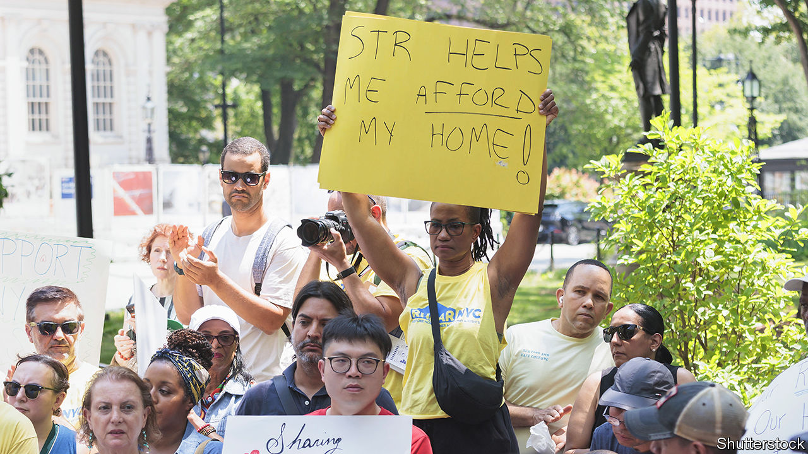

###### Blocked bookings

# New York City is restricting Airbnb 

##### It won’t do much to bring down housing costs 

 

> Sep 7th 2023 

“IT’S MY HOUSE,” says Gia Sharp, a host on Airbnb, a rental platform. “I’ve worked really hard to buy it. So the thought that someone else can tell me what I can do with my house is a little crazy.” But a law which went into effect on September 5th caused Ms Sharp’s Brooklyn listing, and thousands more, to disappear from Airbnb and other short-term rental platforms. 

“It took a long time for New York City to get its hands around Airbnb,” says Sean Hennessey, of New York University’s Jonathan Tisch Centre of Hospitality. Years after many cities (including Boston, Paris, San Francisco and Sydney) began implementing laws limiting rental days and slapping fines on violators, the Big Apple is following suit. A new municipal law requires hosts of short-term rentals of less than 30 days to register with New York City. 

The city also requires that hosts be present during the stay and guests must have full access to the entire home. Lisa Grossman, a former short-term-rental host in Hell’s Kitchen, a Manhattan neighbourhood, calls the new law a “roommate set-up”, where neither the guest nor the host has privacy. “There’s no way I’m letting somebody into my home,” she says. “I walk around in my underwear.” 

Hosts say the rules are stringent (Paris’s regulations stretch to 120-day rentals) and the registration process onerous. According to Skift, a travel news site, only 3,800 (roughly 16% of previously active listings) have applied as of September 4th and only 290 have been approved. Some are worried they will lose their homes without the added income from short-term renters. 

Airbnb, which filed an unsuccessful legal challenge, calls the law a “de facto ban”. It says New York City’s new rules are an outlier and a contrast with the approach in places like San Diego and Seattle. Airbnb has weathered restrictions before. New regulations removed 10,000 listings from Amsterdam in 2021. After new rules were enforced in 2021, Sydney lost 6,000 listings. Tokyo saw 14,000 listings removed starting in 2018. Around 80% of its top 200 markets by revenues globally have some sort of regulation in place, the firm says.

The law’s proponents say it will stamp out illegal rentals, which contribute to the city’s shortage of affordable housing. Murray Cox of Inside Airbnb, an Airbnb watchdog, argues that short-term lets are “potentially displacing the people that used to live there. Sometimes people were evicted.” Others argue that they make neighbourhoods worse. Vijay Dandapani, of the Hotel Association of New York City (which has an interest in squishing Airbnb), said “I live in a condo. I can tell you I don’t want people coming in at 1am.” 

Yet Airbnb may not be the neighbourhood killer some claim. Culling Airbnb has not stopped rent increases in the cities that have done it so far. AirDNA, a data firm not affiliated with Airbnb, suspects the relationship between growth in supply of short-term rentals and housing prices is overstated. New York will have to look for other ways to fix its housing problems.■


