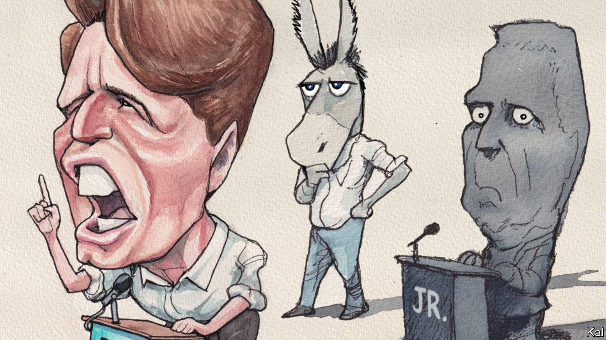

###### Lexington

# What Democrats can learn from Bobby Kennedy 

##### The father—not the son—was the party’s last great populist 

 

> Sep 7th 2023 

Of all the what-ifs of post-war American politics, none is more haunting than the vision in which an assassin did not shoot down Robert Kennedy while he was running for president in 1968. Had Kennedy lived, runs this counterfactual history, he would have become president, and America would have left Vietnam years earlier. There would have been no Nixon administration, no Watergate scandal to sharpen cynicism and no successful Republican “southern strategy” to deepen racial division. The Democrats would have become the party of the multiracial working class, rather than of the multiracial professional elite. 

Now, as his father challenged President Lyndon Johnson for the Democratic nomination, Robert Kennedy junior is challenging President Joe Biden. You might hear echoes of the father’s politics, as when the son inveighs against “the warfare machine that is bankrupting our country” or against the Democratic Party for “inviting Wall Street to strip-mine the American public”.

But unlike his father, this Kennedy has little chance of the nomination. Rather than falling in love with him, leftish journalists are tearing him apart for his opposition to vaccination and his yen for conspiracy theories, including about the murders of his father and his uncle, John Kennedy. Having supplied the tragedy in 1968, history is offering up the farce.

And yet an unflattering comparison could also be made with most other modern Democratic campaigns, even allowing for mythmaking: they all seem a bit pallid beside Kennedy’s blazing, tragic 82-day race. A mix of idealism and pragmatism led him to try to reassemble the Democrats’ New Deal coalition, fractured by the Vietnam war and the civil-rights movement. He got in late, after the New Hampshire primary. Another Democratic challenger, Eugene McCarthy, a cerebral senator from Minnesota, had claimed the hearts of affluent, educated opponents of the war. 

Kennedy set out to build on his support among black voters by showing working-class white Americans they had common interests. His policies were heterodox, aimed at holding families and communities together, to nurture civic pride and a spirit of mutual obligation. For decades liberals had linked the growth of the federal government to the expansion of rights and freedom, but Kennedy sensed Americans felt they were losing control to a distant government with giant, one-size-fits-all programmes. He argued that people wanted the dignity of work rather than welfare, and he favoured local, public-private jobs schemes. “He sensed and managed to articulate that feeling of disempowerment experienced by ordinary Americans, including the white working class, black and Hispanic voters and other groups excluded from the mainstream of American prosperity and respect,” says Michael Sandel, a political philosopher and author of “Democracy’s Discontent”.

As riots tore inner cities apart, Kennedy called for “law and order”, courting the disdain of some liberals who, then as now, heard that as racist code. But he always twinned his call for law enforcement with demands for racial justice, saying white Americans bore responsibility for black violence.

To housewives in Terre Haute, Indiana, he cited Camus, urging empathy with the hopelessness of destitute families. In Indianapolis, on the night Martin Luther King was killed, Kennedy defused the anger in a crowd primed to riot. He quoted Aeschylus on the wisdom that comes with despair and added, “Let us dedicate ourselves to what the Greeks wrote so many years ago: to tame the savageness of man and make gentle the life of this world.”

He often said what voters did not want to hear. “You sit here as white medical students, while black people carry the burden of fighting in Vietnam,” he scolded students at Indiana University, saying he wanted to take their draft deferments away. “He sort of respects our intelligence,” a farmer told a reporter in Nebraska, where Kennedy freely admitted he had no idea how to milk a cow. 

The honesty and intensity of Kennedy’s campaign—along with his decision to visit Native American reservations, where presidential candidates seldom bother to go, to draw attention to their wretchedness—may have resulted in part from the sense of doom suffusing it. Like the reporters covering him, the candidate feared he would eventually be shot.

From George Wallace to Donald Trump

Yet Kennedy insisted on so exposing himself that supporters would make off with his jacket and even his shoes. He ended his campaign in Indiana with a nine-hour ride in an open car inching through black and white communities. The reporter Jules Witcover described an “unbroken display of adulation and support” as he rode through neighbourhoods “that ran smack against one another, and you read their racial or ethnic composition in the faces that looked up at him, in the colour of the hands that stretched out to him, in the accents that shouted out at him”. Kennedy did not succeed with well-off white voters. Instead, he won the Indiana primary by carrying 86% of black voters along with working-class white Democrats, including many who had defected to the segregationist George Wallace four years earlier. 

Kennedy would go on to lose the primary in Oregon, an affluent white state, but he won Nebraska, South Dakota and California. There, after his victory speech at the Ambassador Hotel, he broke one of his own rules. Instead of wading through the crowd he left through the kitchen, where his assassin waited.

It is impossible to know what Kennedy might have achieved. Yet it is also hard to believe Donald Trump would have achieved so much had the Democrats modelled themselves less on McCarthy and more on Kennedy. He was, in short, the last great Democratic populist. Kennedy loved to paraphrase George Bernard Shaw: “Some people see things as they are and say, ‘Why?’ I dream of things that never were and say, ‘Why not?’” These days both questions seem worth asking. ■


