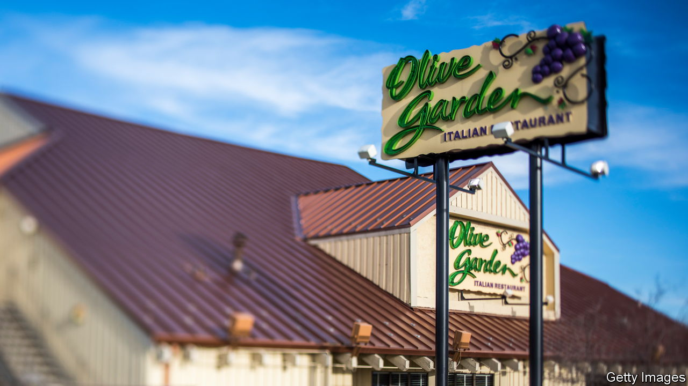
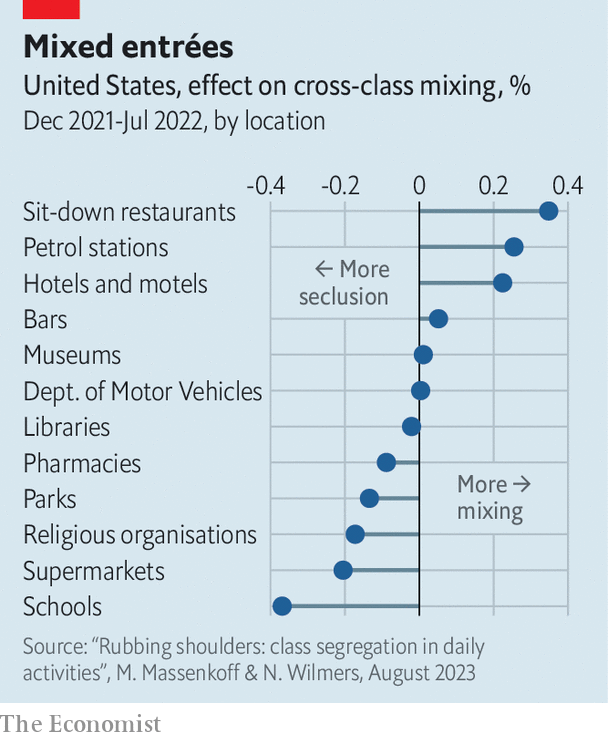

###### Chicken Tocqueville

# Where do Americans mingle? 

##### Sit-down chain restaurants foster more cross-class mixing than any other institution 

 

> Sep 7th 2023 

TO TIME travel back to the 1960s simply step into an Olive Garden. Booths at the chain restaurant, known for its surfeit of breadsticks, are lined with spotted upholstery. The sound of Frank Sinatra playing from old-school speakers evokes thoughts of salesmen in Chevrolets coming home to their darlings in the suburbs for supper. But look carefully and you’ll find that the patrons more closely resemble today’s America. A nurse in scrubs scarfs down a post-shift meal behind a tattooed African-American duo on a date. A family of a dozen—the women in hijabs, the men in dress shirts—debates desserts as a lady with a gap in her front teeth fills up on unlimited salad and packs her pasta for tomorrow. 

 


The woefully inauthentic Tuscan joint is an all-American favourite. New research shows that its 1,800 branches also serve a social purpose. Maxim Massenkoff of the Naval Postgraduate School and Nathan Wilmers of MIT Sloan School of Management used mobile data to track where millions of Americans spend their time. By matching people’s movements to socioeconomic data on where they live, they were able to see where rich and poor mingle. Sit-down chain restaurants, like Olive Garden, Chili’s and Applebee’s, top the list. They bring Americans together more than any other private or public institution—eclipsing bars, churches, petrol stations, libraries, parks and schools (see chart).

As America has become more unequal and less religious, rich and poor have become ever stranger to each other. In 1980 roughly 12% of the population lived in places that were especially rich or especially poor. By 2013, one-third did. That made local schools less of a melting pot. Meanwhile colleges became a sorting machine for adults. Low and high-wage workers rarely work in the same sectors. And though some high-paid men used to marry their secretaries, they now wed fellow executives whose paychecks resemble their own. An American in the top income quintile might come across people from different backgrounds at the post office or Starbucks, but they are unlikely to encounter an American from the poorest fifth. 

In his book, “Coming Apart”, Charles Murray, a political scientist, argued that over the past several decades, upper- and lower-class white people “have diverged so far in core behaviours and values that they barely recognise their underlying American kinship”. That does not bode well for the worse-off. Drawing on a data set of 70m Facebook accounts, Raj Chetty, an economist at Harvard, and his research team found that people who had friends across the economic strata were more likely to finish high school and earn a better salary; girls were less likely to get pregnant as teens. Those inter-class bonds, they found, are far more predictive of a youngster’s chances of escaping poverty than being a member of a civic organisation or volunteering, which previous research identified as drivers of upward mobility. 

In theory, Americans ought to encounter each other in public institutions. That a restaurant offering something called “family-style Italian dining” should do a better job might have surprised Andrew Carnegie, who funded 1,700 “palaces for the people” (as he called public libraries) in America, or Frederick Law Olmsted, who designed New York City’s Central Park as a space for rich and poor to congregate.

Americans drive nearly twice as far to go to an Olive Garden as they do to attend church. Yet eating the same chicken alfredo pasta in adjoining booths does not necessarily bring about the kind of kumbaya interactions that make cultural inroads. To test whether any mixing does occur in and around the restaurants, Messrs Massenkoff and Wilmers compare the encounters in their data set with the geography of Mr Chetty’s cross-class friendships. They find that they are indeed highly correlated. Put simply, if a zip code has an Olive Garden it is also more likely to be a place where people in suits and people in landscaping uniforms know one another. 

If chain restaurants are class levellers, you might expect policymakers to embrace them. But as municipal governments push back on gentrification, they tend to try to prevent places like Olive Garden from moving in. San Francisco went out of its way to make it harder for chains to grow and get retail permits. As the council of a small city in California’s Napa Valley wrote, chains like Olive Garden “do not reflect the unique character of the community and the desired aesthetic ambience of the commercial areas of the city”. 

Nonetheless Americans are fuelling their success one entrée at a time. The stock price of Darden Restaurants, which owns Olive Garden, reached an all-time high in July. Those most concerned about the fraying of American society ought to cheer chain restaurants on.■


