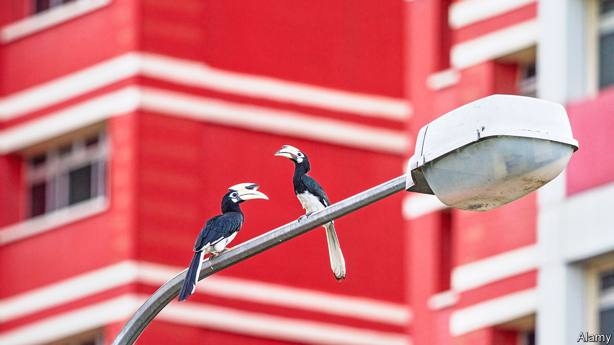

###### Otterly loriculus

# Hornbills, otters and even a tapir: Singapore is rewilding 

##### Once-lost species are coming back to the densely built-up city-state 

 

> Sep 14th 2023 

THE SINGAPOREAN grandee is livid. The otters have got at his prized Koi carp again. They swim up the canal, slither over his fence and plunge into his pond. Taking just a bite out of every fish, they leave a trail of devastation. The grandee’s loss represents a remarkable gain for the world’s second-most densely populated country (after Monaco). The smooth-coated otter of South and South-East Asia is a threatened species that had disappeared from Singapore by the 1970s, when fast economic growth was prioritised over all else and Singapore’s waterways were clogged with waste. 

But efforts to clean the water channels paid off. Fish returned, and, in 1998, so did the otters. At first they stuck to the shores of Singapore’s relatively undeveloped northern side. Then they spread. In 2016 one otter family that turned up at the heart of the downtown tourist area was voted by Singaporeans as that year’s national emblem. Today you can meet otters in the city-state’s famous botanic gardens, by the Clarke Quay bars and along the east coast.

Other successes are rightly sources of pride, especially two stunning birds. The blue-crowned hanging parrot was once endangered but has now returned in numbers. The oriental pied hornbill (pictured), with its extraordinary ivory casque, had been locally extinct for a century. Now pairs of hornbills feed outside this correspondent’s window.

In a metropolis of 5.6m people, says Lim Liang Jim, head of biodiversity at the National Parks Board, the priority has been conserving or recreating natural habitats, as well as connecting natural spaces with corridors to let species move and spread. The renaturalisation of river banks that were previously concreted over helped the otters. A former railway to Malaysia is now a “green corridor” whose damp verges are full of insects, frogs and waterhens. The planted sides and central verges of highways allow smaller animals to move more safely.

Recent successes, however, sit against a backdrop of over a century of sharp species decline and habitat loss. And headaches arise as wild species bump up against humans. On September 10th a Malayan tapir—an endangered herbivore that can weigh up to 560kg—swam over to Singapore and thundered past alarmed cyclists and early-morning walkers. Singapore wants wildness, but not always on the animals’ terms.■

