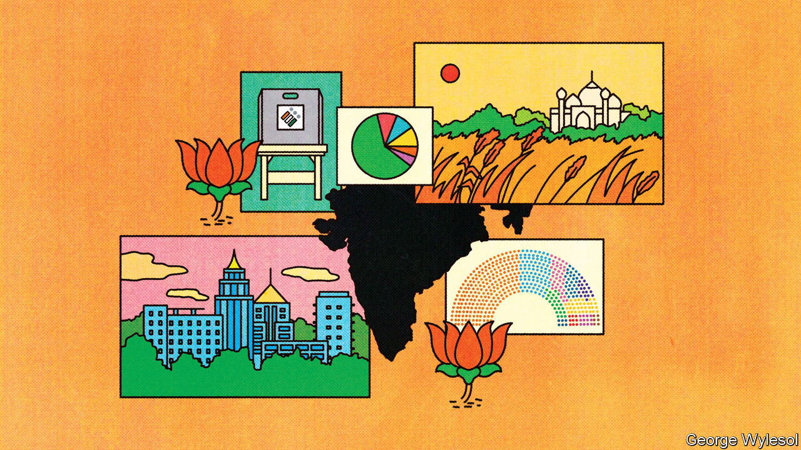
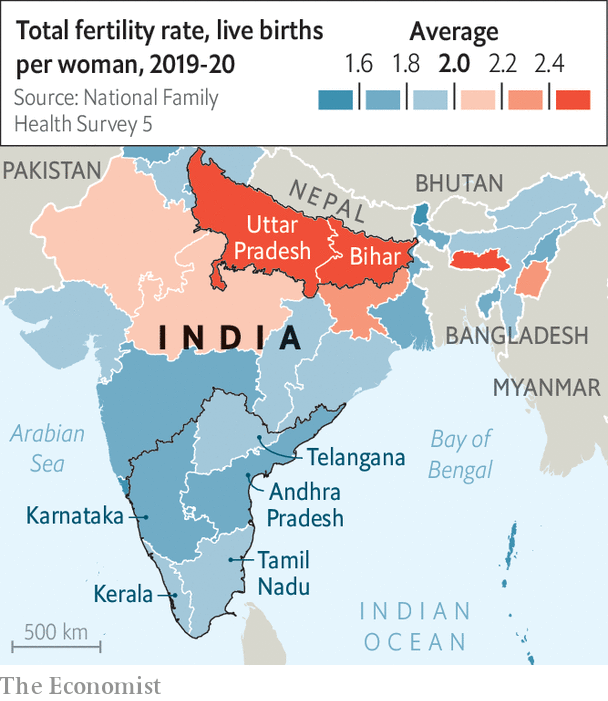
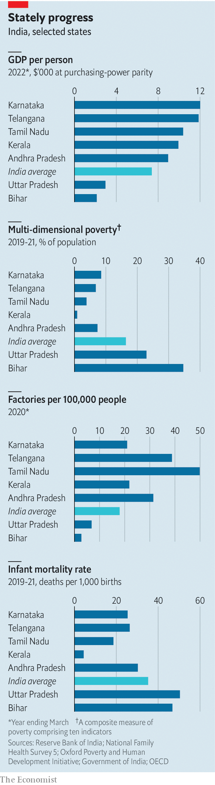

###### One nation under Modi

# Narendra Modi is widening India’s fierce regional divides 

##### The southern states feel increasingly oppressed 

 

> Sep 13th 2023 

NARENDRA MODI likes to pull rabbits out of hats. One evening in 2016 the Indian prime minister declared that 500- and 1,000-rupee notes—representing 86% of cash by value—would cease to be legal tender by the end of the night. In 2020 he locked down the country at only a few hours’ notice. So it is hardly surprising that speculation has been running rampant since Mr Modi’s government announced that it is to convene a “special session” of Parliament from September 18th to 22nd. What trick does he have up his sleeve now?

 


A feeble agenda released on September 14th convinced few watchers. For the moment the guessing game has settled on two possibilities. One is that Mr Modi and his Hindu-nationalist Bharatiya Janata Party (BJP) will change the country’s name in English from India to Bharat (which is already the name in Hindi). The nameplate Mr Modi sat behind as he  at a summit over the weekend has added fuel to that theory. The other guess is that Mr Modi intends to reorganise the electoral calendar, so that India’s never-ending carnival of state and federal elections henceforth takes place all at the same time, once every five years. A new committee to “examine and make recommendations for holding simultaneous elections”, appointed by the government and headed by an ex-president, will probably hold its first meeting next week. In either case the change would serve a project Mr Modi has been pushing from the start: trying to centralise and homogenise a staggeringly vast and diverse country. 

 


Since coming to power in 2014, the BJP has set about transforming India into something more like a European nation-state. That vision involves both strengthening the central government and promoting a pan-Indian, Hindu-nationalist identity. The government routinely emphasises that India is “one nation”, implementing policies such as “one nation, one ration card” (for subsidised grain) and proposing many more, such as “one nation, one uniform” (for the police). The idea of synchronising polls has been on the BJP’s manifesto since 2014. It is known as “one nation, one election”.

In economic matters, the government’s centralising tendencies are mostly welcome. In 2017 Mr Modi introduced a national goods-and-services tax (“one nation, one tax”, better known as GST) seeking to deepen the country’s common market. It seems to be paying off. Between the fiscal years 2017-18 and 2020-21 the value of interstate trade increased by 44%, more than double the growth in GDP during the same period, according to a study in the , a journal. Its authors attribute the increase to the introduction of GST and greater economic integration.

Moreover, the government is , commissioning new airports and launching zippy train services to knit Indians closer. The roll-out, over the past decade, of a national digital identity system and of  has assuaged problems that sometimes caused headaches for Indians who travelled outside their own regions. It is getting easier to build businesses that span the country. 

It is plainly in India’s interests to forge a more sophisticated single market. Yet the government’s strident “one nation” rhetoric is causing some other ties to fray. The chief divide in India is between the industrialised, richer south, and the agrarian, impoverished north. The south is made up of five states: Andhra Pradesh, Karnataka, Kerala, Tamil Nadu and Telangana (see map). The north is home to two of the poorest ones, Uttar Pradesh (UP) and Bihar. The south is richer, safer, healthier, better educated, and less awful to women and Dalits than the north (see chart). 

At the time of the last census in 2011 UP and Bihar had 25% of India’s population, compared with 21% in the south. The gap has grown. The latest official estimates suggest that in 2022 UP and Bihar had 26% of India’s people, while the south’s share had declined to 19.5%. Their economies have also diverged. GDP per person in the south is 4.2 times greater than in UP and Bihar, up from 3.3 in 2011-12. The southern states contribute a quarter of India’s corporate- and income-tax revenues, compared with just 3% for UP and Bihar. 

Southern alarm bells

Politically, too, the north and south are different countries. No state in the south is ruled by a BJP government, which is seen as a party of the Hindi-speaking north. Karnataka, the only southern state where the BJP had made inroads, voted out Mr Modi’s party in elections earlier this year.

Regional differences are now causing tensions on three fronts: cultural, fiscal and political. Start with culture. The south has long resented what it sees as the imposition of values and language from the north. In 2019 Amit Shah, India’s home minister, tweeted that “if one language can do the work of uniting the country, then it is the most spoken language, Hindi.” In response protests broke out across the south, and even the BJP’s allies in the region distanced themselves from his comments. It is not just about words, explains R. Srinivasan of the Tamil Nadu state planning commission. Southern defenders of language also believe they are protecting a broader political identity, one that supports social justice, women’s equality and emancipation from caste prejudice.

Complaints about India’s fiscal compact are growing, too. Though the central government rakes in revenue, states do much of the spending, particularly in crucial spheres such as education, health and welfare. The introduction of the GST weakened states’ revenue-raising powers. In 2021-22, spending by states accounted for 64% of public expenditure, but they raised only 38% of revenues. As a result, states now depend more than ever on transfers from the centre. How much they get is decided every five years by the Finance Commission, a constitutional body. 

What each state receives varies depending on measures such as its population and level of development. As a result, southern states receive far less from the centre than they contribute. Redistribution across states is a feature of any federal system, a moral duty and, in India, a constitutional obligation. But it is becoming more controversial as state economies diverge. Concerns will probably redouble later this year, when the next finance commission starts working out how it will share revenues for the period 2027-32.

The third and potentially most dangerous set of tensions relates to political representation. The constitution requires that seats in Parliament be allocated according to population, with a roughly equal number of voters in each constituency and redistricting carried out after every census. But in 1976 the Congress government froze India’s electoral boundaries for 25 years to avoid penalising states that succeeded with family-planning policies. In 2002 a BJP government extended the moratorium until 2026. The south’s share of India’s population has dropped by five percentage points since the 1970s, while that of UP and Bihar has grown by three points.

The result is a misallocation of seats. Going by the 2011 census, the south should have 18 fewer MPs in India’s 545-seat lower house than its current 129. UP and Bihar ought to gain 14 over their existing 120, according to calculations by Milan Vaishnav and Jamie Hintson of the Carnegie Endowment for International Peace, a think-tank in Washington. On average, an MP in Uttar Pradesh represents nearly 3m people; his counterpart in Tamil Nadu a mere 1.8m. 

The constitutional and moral arguments in favour of redistricting are plain. But the practical ramifications for southern states would be large. If the centre goes ahead with it, warns a prominent figure in the south, “that is the beginning of the end of India as a country…In my children’s lifetime this will not be one country any more.” In May Mr Modi inaugurated a new Parliament building, capable of seating 888 lawmakers, lending credence to the idea that his party intends to reallocate seats while also expanding the house in order to soften the blow for states that lose out. 

The idea of synchronising India’s many elections is also causing worry. The government’s critics insist that holding all polls at the same time would reinforce the advantages that national parties enjoy over regional ones (such as those that run most of the southern states). Regional parties, which have limited resources, would struggle to fight both national and state-level campaigns at the same time. The BJP says that the current system, under which a handful of states go to the polls every year, is broken. It paralyses policymaking, forces political parties into non-stop campaign mode and costs a fortune for parties and the exchequer. Having simultaneous elections would be cheaper and lead to better governance, say supporters.

Analyses of past elections have produced conflicting answers about whether harmonising polls will change how people vote. Any new policy would have to make provisions for state governments losing the support of their legislatures and collapsing in the middle of electoral cycles. And it is unclear whether Mr Modi would be able to push through the constitutional amendments this plan would require. 

Since coming to power nine years ago, Mr Modi and his party have fulfilled many elements of their agenda, from turbocharging infrastructure upgrades and raising the country’s global profile to revoking the special constitutional status of the Muslim-majority state of Jammu &amp; Kashmir and building a temple to the Lord Ram in the northern city of Ayodhya. The extraordinary session of Parliament next week may be about simultaneous elections (an old pledge), about changing India’s name (a newish obsession), or about something else entirely. Whatever the agenda, the great magician must be careful not to saw the nation in half.■

