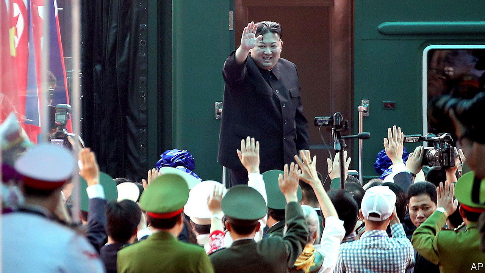

###### Desperate despots

# Why is Vladimir Putin looking to North Korea for arms? 

##### A deal would boost his war effort and bolster Kim Jong Un’s weapons programme 

 

> Sep 13th 2023 

VOSTOCHNY COSMODROME is an apt location for a meeting of despots. The mega-project located in Russia’s far east has a long history of waste and corruption. On September 13th Kim Jong Un, North Korea’s leader, alighted at a nearby station from his armoured train and drove up in a limo, which he had brought along with him from Pyongyang, to meet his Russian counterpart, Vladimir Putin, at the spaceport. After they spoke, Mr Kim promised to support Russia’s “sacred fight against the West”, declaring relations between the two countries his “top priority”. 

What exactly the two leaders discussed in their two-hour conclave remains unknown. A Kremlin spokesperson said that no statement would be forthcoming. But days before either country had confirmed the meeting, American officials had publicised the intent: to seal an arms deal. 

American claims about North Korea supplying weapons to Russia are nothing new. Officials said Mr Kim’s regime was sending artillery shells as early as September last year, offering grainy satellite images of train carriages as evidence. In the run-up to this meeting, however, the Americans have warned repeatedly of a deal. They also let it be known that there would be consequences. Jake Sullivan, America’s national security adviser, said North Korea would “pay a price for this”. 

Such warnings mean little to North Korea. Years of nagging, threats and sanctions have failed to stop its weapons programmes, and there is a limit to what further punishment America could possibly mete out. Unilateral sanctions have had meagre effect. Multilateral ones may be about to get weaker, too. Mr Putin indicated a willingness to help North Korea put a satellite in orbit, potentially in violation of UN sanctions. That suggests Russian co-operation with the sanctions regime may be coming to an end.

North Korean arms, mostly based on Soviet designs, would boost Mr Putin’s war effort. Russia needs spare parts as it reactivates old tanks and legacy systems it had previously retired. The hermit kingdom is thought to have a large stockpile of munitions, especially artillery shells and rockets, compatible with Russian weapons. Russia may even be keen to buy some of the ballistic missiles North Korea has  over the past two years. Perhaps as a display of efficacy, North Korea launched a pair on the day of the meeting. 

For North Korea, the benefits could include food, energy and hard cash. Russia may also invite more North Korean labourers to work in construction and logging, also in violation of UN sanctions. The governor of the region bordering North Korea, whom Mr Kim met on his way to the spaceport, said that the two countries would soon start joint projects on tourism, agriculture and construction. 

A bigger prize would be the transfer of technology. Russia may agree to send North Korea advanced arms or share military know-how, accelerating Mr Kim’s weapons programmes. It may also help with projects that have so far proved tricky, such as building nuclear submarines. 

Despite the inevitable international condemnation, the two leaders went to great lengths to publicise their meeting. The encounter helps Mr Kim convey that North Korean arms are not just powerful, but in demand, and to show his luckless people his prowess as a statesman. Mr Putin’s message to America is clear: Russia can still make trouble for it in East Asia. 

South Korea, too, is listening closely. The meeting is being interpreted in Seoul, its capital, as a warning that Russia will throw its weight behind Mr Kim should the South send lethal weapons to Ukraine, as America and NATO have urged. South Korea’s government appears unmoved by such threats. Even as Mr Kim and Mr Putin met in Russia, South Korea’s president, Yoon Suk-yeol, nominated a new defence minister who has previously called for sending arms to Ukraine. Such calls may get louder. What is clear is that Russia is running out of cards to play. That makes it all the more dangerous. ■

