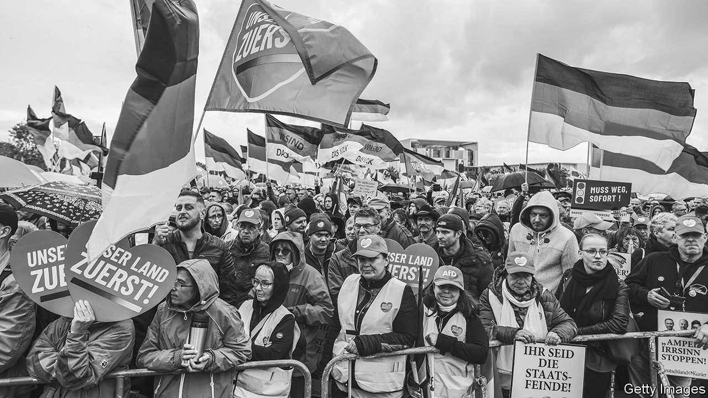
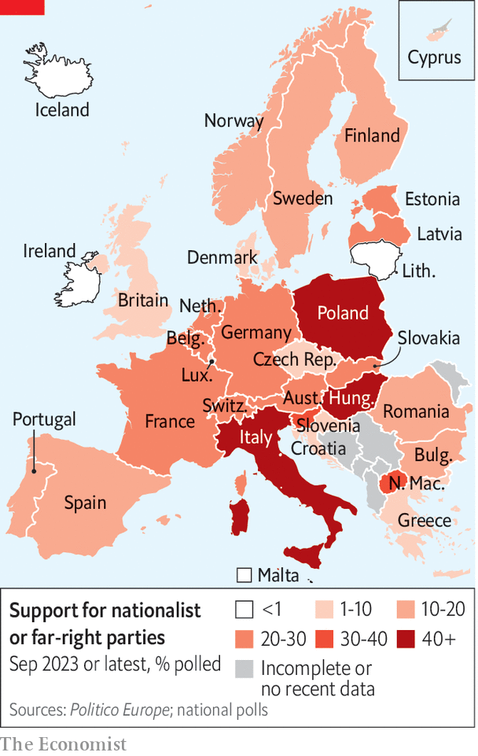
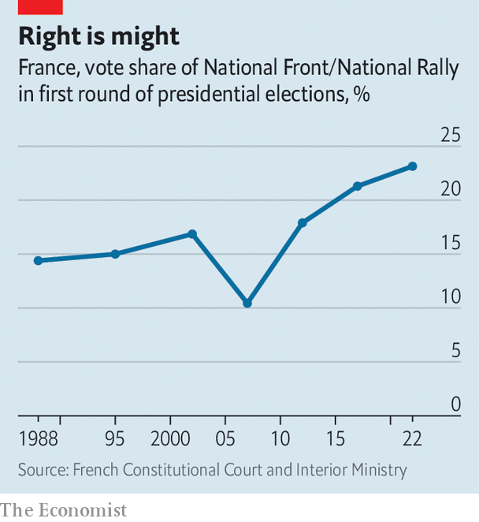
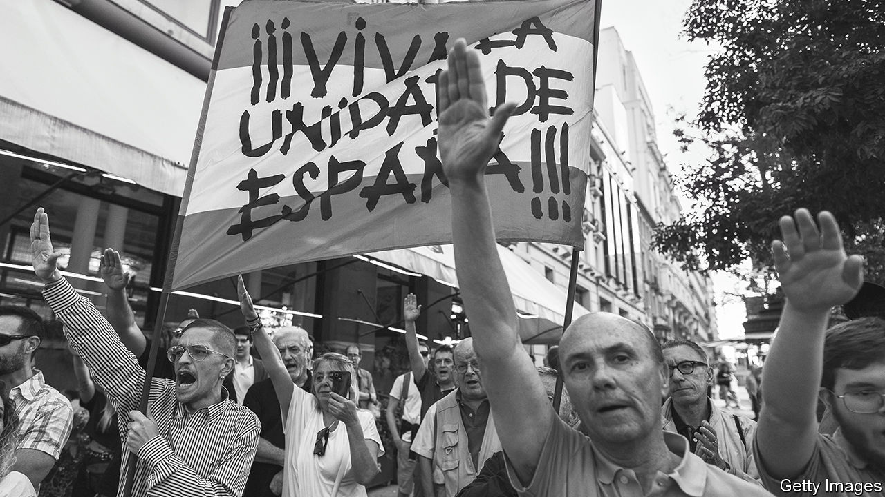

###### Swell of pride

# The hard right is getting closer to power all over Europe 

##### It does not need to join governments to affect policymaking 

 

> Sep 14th 2023 

IN SINT-GENESIUS-RODE, a well-to-do commuter town in the hills south of Brussels, a crowd of 50 or so gathered on September 2nd in a parish hall to drink champagne and promote the dismemberment of Belgium. The meeting was organised by Vlaams Belang (Flemish Interest), a right-wing party that rails against such threats to the Flemish way of life as Islam, immigration and—most pernicious of all—the French language. The town is in Flanders (the Dutch-speaking half of Belgium), but French-speakers have been moving in for decades and are now the majority. The only way to stop the rot, explains Klaas Slootmans, a member of the Flemish regional parliament from Vlaams Belang, is for Flanders to declare independence.

It may sound parochial, chauvinist and disruptive if not delusional, but it goes down well. People have a right “to be the boss in their own country”, Mr Slootmans proclaims; the crowd applauds. Vlaams Belang is Belgium’s most popular party, with an average of 22% support in recent polling. Barring a sudden reversal, it should triumph in simultaneous elections next year for the national, European and regional parliaments. Other Belgian parties have hitherto declared it too extreme to do business with, and refused to include it in coalitions. But this so-called  may have to be abandoned if the party wins a fifth or more of parliamentary seats. Anyway, the ostracism may in fact be helping Vlaams Belang. Its support has tripled over the past five years.

The right moment

It is a common pattern. Across much of Europe, populist right-wing parties like Vlaams Belang, once relegated to the fringe, are going from strength to strength. In Hungary, Italy and Poland they hold power. In Finland, Sweden and Switzerland they have a share of it. In Germany polls put the  (AfD) party at 22%, up from 10% in the election in 2021. In France the National Rally (RN), the biggest hard-right party, has 24% support. Add in 5% for Reconquest, another anti-immigrant party, and the hard right becomes the biggest voting block in the country. In the Netherlands, too, a smattering of right-wing populists claim a quarter or more of the vote. Even newish democracies that for decades lacked big nationalist parties—Portugal, Romania and Spain—now have them.

The advance of the hard right is neither uniform nor one-way. Support for populist nationalists has recently slumped in Denmark and Spain, for instance. Nor are all these parties the same: some are eager Atlanticists, others pro-Russian; some are libertarian, others want a more generous welfare state, albeit only for people of native stock. What is more, hard-right groups tend to mellow the closer they get to power, or to splinter, or both. The government of Italy, for one, although led by the Brothers of Italy (FdI), a party with links to fascism, has proved much more moderate than many had feared. 

 


Nonetheless, the trend is alarming, for three reasons. First, it is remarkably broad. Four of the five most populous countries in the European Union have hard-right parties either in government or polling above 20% (see map). Second, the current circumstances are especially propitious for populist parties, with immigration rising after a hiatus during the pandemic, inflation high and the growing cost of climate policy creating a potent new focus for popular ire. Third, and most important, the hard right does not need to win power to have a baleful impact on politics. Simply by attracting a big share of voters, it is already skewing the debate, and so making it harder for European governments to adopt sensible policies on pressing problems, such as the war in Ukraine, immigration and climate change. 

Freedom fighters

When the Freedom Party, Austria’s main hard-right outfit, joined a coalition government in 2000, other EU governments were so horrified that they reduced contact with Austria’s to the bare minimum in protest. To no avail: the hard right has since broken through barrier after barrier. It first led a government in 2010, when Fidesz, a once-centrist outfit that had taken a populist turn, swept to power in Hungary. Those who said the same thing could never happen in mature democracies in western Europe were proved wrong last year when FdI took power in Italy. 

 


More milestones loom. Hard-right parties are expected to do well in next year’s European elections. Giorgia Meloni, the leader of FdI and prime minister of Italy, is trying to persuade the centre-right alliance in the European Parliament, the European People’s Party (EPP), to join forces with the hard-right European Conservatives and Reformists (ECR), which she heads. That would move the legislature of all of the EU in a populist direction. In France, meanwhile, the hard right’s performance is improving at each presidential election (see chart). It is possible that Marine Le Pen, the runner-up at the past two contests, may win the next one, in 2027. 

A series of external factors are helping to propel support for the hard right. Illegal immigration, which spurred support for populist parties when it surged in 2015, is growing again after a lull during the pandemic. There have already been more than 165,000 unauthorised arrivals in Europe this year, as many as in all of last year, although still well below the level of 2015. Populists also tend to do well in times of economic upheaval, and so are benefiting from the high inflation that has plagued Europe for the past two years, and especially from soaring energy prices. 

Expensive petrol, heating and electricity have helped foment a backlash against policies to fight climate change, which the hard right has seized on. This began in France with the  movement in late 2018, initially a protest against a carbon-tax hike on motor fuel. The AfD’s rise this year was touched off by a proposed government ban on oil and gas boilers in homes. In the Netherlands the Farmer-Citizen Movement (BBB), a new populist party, began as a farmers’ protest against nitrogen-emission limits. It won an astounding 20% of the vote in regional elections in March.

There has also been a broader slide in trust in government in many European countries, after a brief resurgence during the pandemic, to the benefit of the hard right. American-style culture wars are becoming fiercer, too, which, again, helps the populists. Maximilian Krah, the AfD’s lead candidate in the European elections, went viral over the summer with dating advice posted on TikTok: “Real men are right-wing. Don’t watch porn.” In other videos Mr Krah argues that “multicultural means multi-criminal”, bemoans rainbow flags and warns that BlackRock, an investment firm, wants to replace Germans with “minorities and immigrants”. 

The European politician most adept at exploiting such ideas to win and hold power is Viktor Orban, Fidesz’s leader and the prime minister of Hungary since 2010. He readily bashes migrants, gay people and the EU as at odds with homespun Hungarian values. He has used the parliamentary majorities he has won with such talk to pack the courts with loyalists and gerrymander the electoral system. Cronies have bought up critical media outlets. In addition to undermining democracy at home, Mr Orban’s rule has scrambled policymaking at NATO and in the EU, owing to his friendliness with both China and Russia.

But harnessing right-wing populism to take control of a state is not easy. When Poland’s Law and Justice (PiS) party came to power in 2015, it followed Mr Orban’s script. It turned the state media into a propaganda bureau and tried to pack the courts. But PiS’s efforts have not got as far as Fidesz’s. Many judges have fought back, and the EU has withheld billions of euros in aid to force PiS to reverse some of its court-packing. The media have not been cowed. The opposition remain competitive, even though PiS is favoured in next month’s election.

Other right-wing populists using Mr Orban’s template have also had mixed results. Janez Jansa, a former prime minister of Slovenia nicknamed “Marshal Tweeto” for a social-media style reminiscent of Donald Trump, lost power in 2022. Estonia’s far-right EKRE party tried to go after the media while in government in 2019, but that coalition collapsed and the party did poorly in an election this year.

Even where it has been electorally successful, the hard right has struggled to put in place radical policies such as ending political asylum or scrapping measures to reduce greenhouse-gas emissions. Take Sweden, where the Sweden Democrats, long shunned by other parties because of their roots in the neo-Nazi movement, took 21% of the vote in 2022. They signed a confidence-and-supply deal to back a centre-right minority government, giving them direct influence over policy on immigration and crime. But in a speech in August Jimmie Akesson, the party’s leader, had to make excuses for the government’s slow progress implementing the deal.

Ms Meloni is the first leader in western Europe with the parliamentary clout to enact a hard-right agenda. Yet so far, she has run a fairly conventional government. Her only populist measures have been to introduce a misconceived tax on banks, limit some airline fares and prevent same-sex parents from registering their partner’s child as their own. In part, she is constrained by European fiscal rules. But the FdI is also simply less extreme than it once was. ”This is a pragmatic centre-right government with, now and again, some identitarian [culture-war] policies,” argues Giovanni Orsina of the LUISS school in Rome.

On the question of Europe, in particular, many hard-right parties have softened. A few of the edgiest populists want to dismantle the union they sneeringly refer to as the “EUSSR”. But FdI abandoned the idea of leaving the euro and restructuring the EU before coming to power. Ms Meloni instead wants the EU to do more to help Italy, by keeping out the migrants that flood Italy’s shores. This summer she went to Tunisia with Ursula von der Leyen, the European Commission’s president, to negotiate a migration deal. She also wants the bloc to relax its fiscal rules so that her government can spend more. She even cultivates Europhiles by praising the union as the guardian of European peace and civilisation.

The RN, in similar fashion, no longer calls for France to leave the EU and the euro. Its rhetoric remains anti-European, but with few specifics. This retreat from more radical policies was presumably intended precisely to broaden the RN’s appeal and so help it win power. And even if Ms Le Pen were to become president, she might still struggle to implement her policies, despite the immense formal powers of the office. After all, reforms to state pensions championed by Emmanuel Macron, the incumbent, met ferocious opposition even though he clearly advertised them during his re-election campaign last year.

Far-right parties, which are often young, full of zealous ideologues and dependent on charismatic leaders, are prone to schisms. The Finns Party’s first stint in government, in 2015, split it in two. Its second, which began in May, has already been marred by scandals and resignations. In Poland, PiS’s generous benefits policies have alienated fiscal conservatives, some of whom have defected to a libertarian party called Confederation. Ms Le Pen, having softened her radical image, now faces competition on the right from Reconquest, whose lead candidate in the European election is her niece, Marion Maréchal.

The most vivid illustration of such chaos is in the Netherlands, which since 2002 has seen a series of right-wing populist parties rocket to prominence only to implode. In provincial elections in 2019 Forum for Democracy, a party led by Thierry Baudet, a dandyish Eurosceptic, finished first with 17%. Within months it had split into three. Mr Baudet now hawks conspiracy theories about covid-19 and immigration; his rump of the party is polling at 3%. Earlier this year the BBB had a brief moment as the standard-bearer of the right, but it has already slumped to 11% in the polls. It has been losing votes to yet another new party on the right with populist overtones, New Social Contract, which was launched by an MP famous for investigating abuses by the tax authority.

What all these parties have in common is a vague sense that they stand with ordinary people against the elite. Their positions on hot-button issues can be hazy, as with the RN’s new stance on Europe. At a local level their candidates are often pragmatic. In June the rural town of Raguhn-Jessnitz in Saxony became the first to elect an AfD mayor. Hannes Loth is an energetic 42-year-old former vegetable farmer (“cabbage, sweetcorn, onions—all kinds of onions”). During the pandemic, when locals had trouble getting travel permits because of the lack of a covid-testing centre, Mr Loth opened one himself.

Mr Loth’s main concerns are run-down streets and fire stations and the town’s budget deficit, which was €1.5m ($1.6m) last year. That is partly because high energy prices sent heating bills for the  (town hall) through the roof. Mr Loth, toeing the afd’s line, says the solution is to restart the nuclear plants the government has closed and negotiate peace in Ukraine so gas pipelines to Russia can reopen.

The disconnect between genuine problems and far-fetched solutions encapsulates something important about hard-right populist parties. Mr Loth is acutely sensitive to his constituents’ suffering from high energy costs. But the AfD’s response is in part a fantasy: whatever it might wish, cheap Russian gas will not be an option for the foreseeable future. 

 


Similarly, the worries of the voters at the meeting in Sint-Genesius-Rode are natural. They have seen their town change its language around them; they have trouble finding good Dutch-language schools for their kids. But Vlaams Belang’s solutions are illusory. Flemish independence is unlikely. Even if it happened, there is no way to force Sint-Genesius-Rode to speak mostly Dutch again. It has become French-speaking not because of a bureaucratic conspiracy, but because immigrants are more interested in learning French (a widely spoken language) than Dutch (a relatively obscure one).

The changes Europe’s populist parties rail against tend to be inexorable or at least not easily reversed: demography, sexual liberation, gender equality, the shift away from fossil fuels. As with Vlaams Belang, the policies they propose to set the world to rights tend to be incoherent or unachievable. For populists, unrealistic programmes are no bad thing: candidates cannot thunder indignantly at election rallies about problems that have been solved.

Moreover, simply by railing and attracting support, far-right parties help to shift the debate. All across the continent, centre-right parties have toughened their immigration policies and heightened their culture-war rhetoric to stop voters defecting to the populists. The most glaring example of this was in Britain, where Brexit was set in train by the Conservative Party’s decision to support a referendum on Brexit in an effort to diminish the appeal of the insurgents of the UK Independence Party.

This is probably the biggest risk of the rising vote share of Europe’s far-right parties. Certainly, they tend to be associated with bigotry and misogyny, and to undermine the rule of law. Occasionally they may win enough power to damage democracy, as in Hungary and Poland. But more often, big populist-right blocs simply impede countries from getting to grips with their most pressing problems by offering illusory solutions. 

That is the last thing the EU needs. The next European Parliament must make grave decisions regarding institutional reform in the EU, energy security, climate, support for Ukraine and more. If a quarter of its members refuse to wrestle seriously with such problems, they are unlikely to be solved. The hard right does not need to seize control of the levers of power to gum them up. ■


