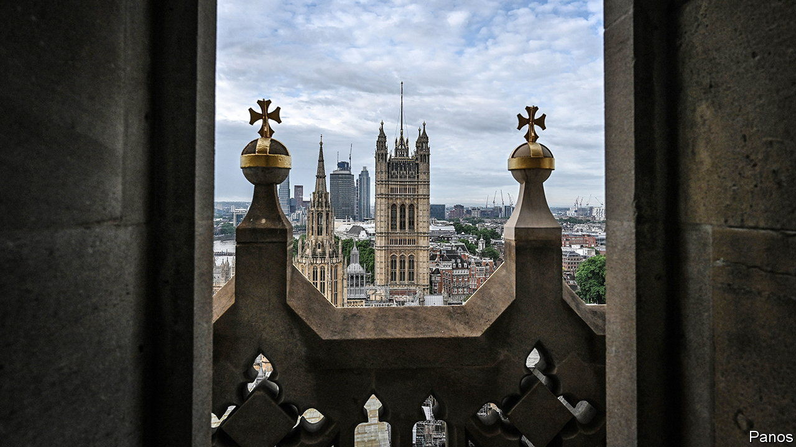

###### Britain and China

# A spy for China in Britain’s Parliament? 

##### Politicians’ attitudes towards China are only likely to harden 

 

> Sep 12th 2023 

THE NEWS that a parliamentary researcher had been arrested on suspicion of spying for China seemed like a throwback to the cold war when the Soviet Union would recruit young men and women as agents. The , which broke the story, said the aide previously had access to MPs including Tom Tugendhat, the security minister, and Alicia Kearns, who heads the foreign-affairs select committee. Both are known for hawkish stances on China. Though the suspect denied all, the case focused attention on how Britain should engage with the Chinese Communist Party (CCP).

China has made nefarious attempts to influence decision-makers before. In 2022 it emerged that a Labour MP took donations from Christine Lee, a solicitor whom the security agencies said spent years cultivating links to politicians on behalf of the CCP. This case is different: it involved a British national, possibly recruited when he was in China; unlike Ms Lee, who was openly pro-CCP, the suspect does not seem to have expressed such views.

A report by the House of Commons Intelligence and Security Committee (ISC) in July slammed the response to Chinese intelligence services that, it said, were targeting Britain “prolifically and aggressively”. Elsewhere it has taken a scandal like the one besetting Westminster to shift policy: Australia and New Zealand toughened laws and changed political priorities after revelations of Chinese interference.

The British aide was arrested in March, as was another man, but sparse details were made public only on September 10th. Some Conservative MPs called for Rishi Sunak, the prime minister, to designate China as a formal “threat” rather than merely a “systemic competitor”. The government has hardened its stance on China since the period under David Cameron when commercial interests dominated.

In July a new National Security Law updated the Official Secrets Act to include a wider range of espionage work, notably “political influence activity”—undisclosed attempts to change how people behave. Designating China as a threat would mean anyone in Britain who works for China’s government, or a body with links to it, having to be recorded under a planned Foreign Influence Registration Scheme. This will come into force next year. 

Much of the fuss over branding, however, belies the fact that Britain lacks a clear policy on China. James Cleverly, the foreign secretary, just paid the first visit to Beijing by a high-level official since 2018. After the suspected-spy revelations Mr Sunak told China’s prime minister, Li Qiang, that efforts to undermine British democracy were “completely unacceptable”.

The government lacks the means to prevent malign influence by China. A report on September 13th by researchers at King’s College London, notes universities’ dependence on collaborations with Chinese ones. Yet the ISC observed that such institutions are ill-equipped to assess the potential risks from doing so. Official efforts to protect critical infrastructure from Chinese meddling do exist, as do attempts to stop Chinese firms from buying sensitive British ones. But those efforts are poorly co-ordinated.

Martin Thorley of the Global Initiative against Transnational Organised Crime, an NGO, says the incident is potentially embarrassing for the government, but at least the arrest (and steps taken against Ms Lee) may show authorities’ willingness to confront Chinese efforts. Parliament will remain vulnerable, however. MPs have to scrutinise foreign policy, but have tiny budgets for staff. They rely, typically, on help from poorly paid young graduates who are usually recruited with little formal process. The system remains susceptible to further meddling. Those grabbed by the drama should expect a sequel.■


