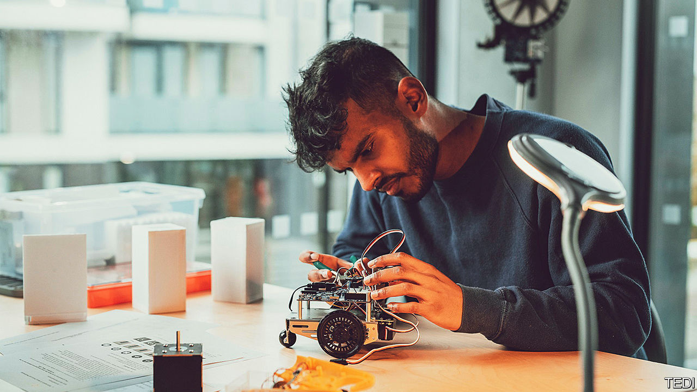

###### New universities

# Britain’s surprising, upstart universities 

##### A handful of new institutions are set on upending higher education 

 

> Sep 11th 2023 

SIR JAMES DYSON, a designer of whizzy home appliances who became a billionaire, has long complained that Britain pumps out too few engineers. So a few years ago he set out to mint graduates of his own. A mini-university he created at his company’s glassy research facility in Wiltshire now has about 160 youngsters enrolled, all in engineering. They spend two days a week in lessons and the rest working on real products, for which they earn a salary. They pay no fees and incur no loans. Instead of residential halls, newcomers live in timber “pods” stacked near Dyson’s labs; on a sunny September afternoon they stand ready for incoming freshers. Two undergraduates say they turned down Cambridge for the chance to attend.

The Dyson Institute in Malmesbury, one of a clutch of universities that have opened in recent years, saw its first students graduate in 2021. In the past it was almost impossible for such outfits to hand out degrees unless they first partnered with an existing institution. Now upstarts may apply to operate independently from day one—a consequence of rule changes the government introduced in 2017. Having lifted caps that limited how many people could attend university, policymakers hoped that new providers would keep incumbents on their toes and encourage innovation in higher education. The result, so far, is a handful of energetic new institutions. But the campaign for their expansion needs another shove.

So far seven new bodies have received “degree awarding powers”, though they are not yet supposed to use the term “university”, which remains a tightly protected title. Most teach only one or two degrees, usually in technical subjects whose graduates are in the most demand from employers. In Hereford the New Model Institute for Technology and Engineering (NMITE) offers bachelor’s degrees that can be finished in two years—and upgraded to a master’s degree with one additional year. That saves students money; NMITE’s classes run daily from nine to five, and pause only briefly in the summer.

There are no lectures at The Engineering &amp; Design Institute (TEDI-London), which operates from a waterside campus in east London that is packed with 3D printers. Its students spend 85% of their time doing practical projects, says Judy Raper, its boss. TEDI-London expects applicants to its engineering courses to have decent grades, but does not insist they have A-levels in both maths and physics, as is standard elsewhere. That helps to attract clever candidates, including girls, who might otherwise overlook the discipline.


Perhaps the most novel degrees are offered by the London Interdisciplinary School (LIS) in Whitechapel, whose first cohort of polymaths graduate next year. Each term its students examine a different thorny issue: inequality, say, or sustainability. Rather than pick one subject, they study things as diverse as philosophy and data science; eventually they earn a degree in “interdisciplinary” studies. Ed Fidoe, a LIS founder, says that nurturing broad thinkers is crucial to solving big problems.

If these new outfits are zingy, for the moment they are all still very small. There are also fewer of them than reformers a few years ago had hoped. It takes uncommon gumption to get a new university off the ground. “There’s no guidebook,” says James Newby of NMITE. Before creating LIS, Mr Fidoe set up a London secondary school; he says that breaking into higher education has been a lot tougher. New entrants have to battle big incumbents, including some with the “oldest brands in the world”.

The bigger challenge is that, despite promises, regulation continues to hamper the new providers. Though upstarts are no longer forced into partnerships with their competitors, they must convince the Office for Students (OfS), Britain’s newish universities regulator, that they are made of the right stuff. That process has sometimes taken years. Jo Johnson, a former universities minister whose reforms helped to create the OfS, says that in too many cases the regulator has saddled new providers with “endless delays, mindless bureaucracy, and unreasonable demands”. Innovators say the box-ticking has been hardest for outfits unwilling to promise they will do things the same way as everyone else.

The pandemic slowed things. Worst of all are failures in government, reckons Nick Hillman of HEPI, a think-tank. Conservatives once championed “challenger” institutions, but no longer talk about them much. Ruling politicians have been preoccupied with a crackdown on “rip-off university degrees”. This rouses their base, but hardly encourages the regulator to welcome new entrants. It doesn’t help that ministers have given the OfS lots of new tasks, such as policing academic freedom and monitoring policies on harassment. That limits the time and resources it can use for working with startups.

The zeal for “challenger” universities deserves to be rediscovered (it may be easier once employment data for their graduates show that they create a successful pathway to well-paid jobs). After a baby boom early this century, the number of 18-year-olds in Britain is rising swiftly. By 2030 there will be 25% more of them than at the start of this decade. With the right policies, this demographic bulge could be used to plant universities in cities that presently go without one, and increase competition everywhere else. ■


