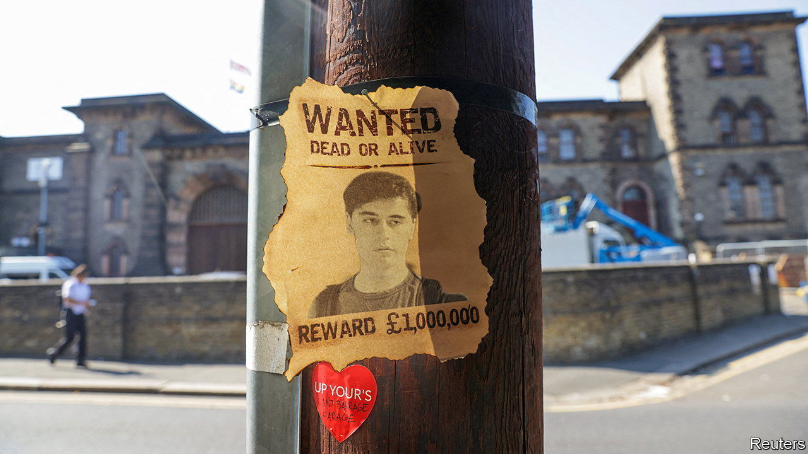
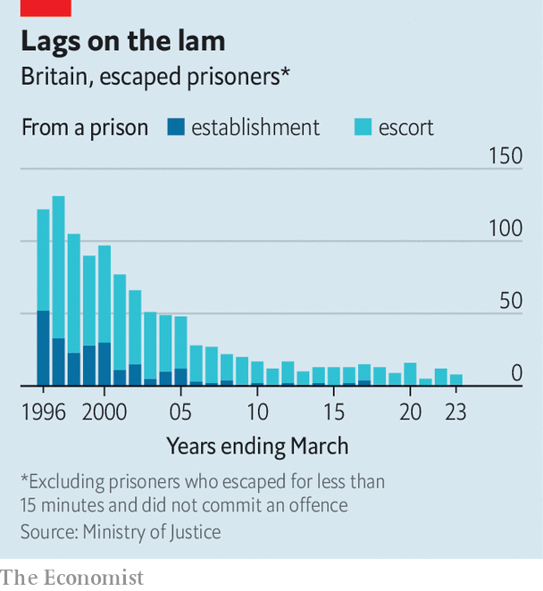

###### Prisons in Britain

# The (not so) great escape 

##### Getting out of jail is harder than ever 

 

> Sep 14th 2023 

Daniel Khalife, a suspected terrorist, enjoyed about 75 hours of freedom after escaping from hmp Wandsworth, in south-west London, on September 6th. Three days later a police officer yanked him off a bike in north-west London. On September 11th he was charged with escaping custody. The court was told that Mr Khalife may have used bedsheets to tie himself to the undercarriage of a food-supply van that had made a delivery.

Such prison breaks are now remarkably rare: numbers have fallen precipitously since the 1990s. (Oddly, official data exclude escapees who manage to stay on the lam for less than 15 minutes and who fail to commit a crime.) This is largely the result of technology, such as scanners at gates, and cameras covering every corner of the prison estate, whose displays are permanently monitored from central control rooms. Probable candidates for escape bids are made to wear blue and yellow harlequin-style outfits. 

 


It is not clear if Mr Khalife had any direct help. But he does seem to have been aided by his circumstances. As a terror suspect he should have been in hmp Belmarsh, with higher security than Wandsworth, where many prisoners awaiting trial in London are held. He was also allowed to work in the prison kitchens, where frequent deliveries from the outside world are received. That suggests he was not seen as a flight risk.

Prison authorities get wiser with each attempted escape. But they are hampered by the age of their estate and staff shortages. The 172-year-old hmp Wandsworth holds some 1,600 prisoners but staff absences are high. Inspectors have said this is the source of many problems at the “crumbling” and overstuffed prison. Of the 85,000 men and women locked up in Britain, 23% are in overcrowded cells.

Alex Chalk, the justice secretary, has said that the relevant security positions were staffed on the day of Mr Khalife’s escape. The issue, therefore, is whether proper procedures were followed. An investigation will follow. Still, few escapees stay away for long. Not counting his foray, of 146 prisoners who have escaped since 2012, just 23 remained at large after 30 days. Mr Khalife managed not even four.■


