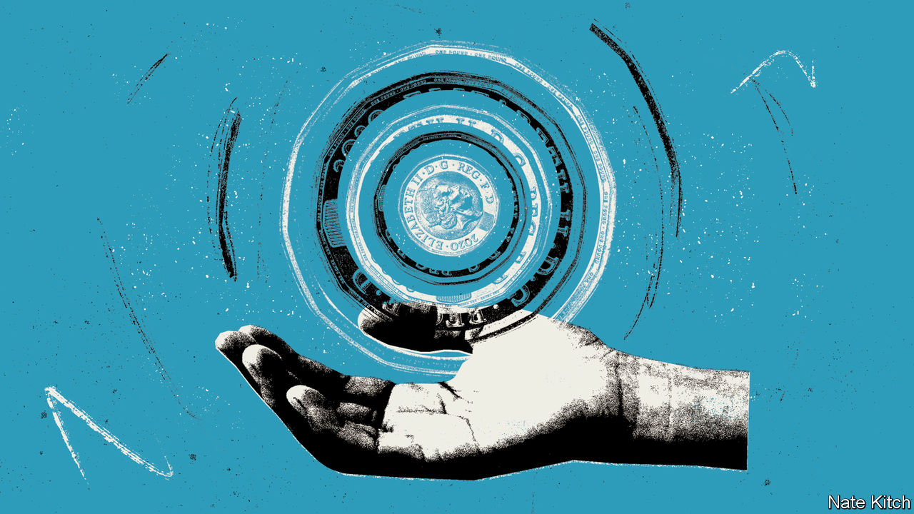
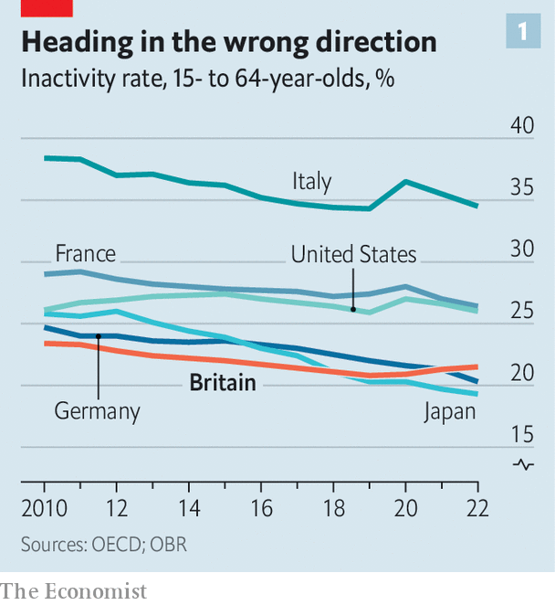
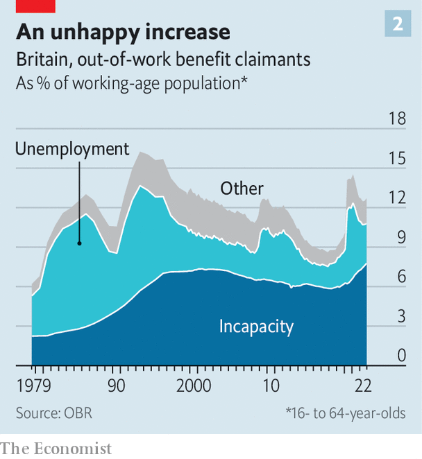

###### Welfare

# Why Britain has a unique problem with economic inactivity 

##### A series of policy blunders is to blame 

 

> Sep 14th 2023 

FEW SUBJECTS whip up the tabloids as much as welfare claimants—supposedly an army of shirkers is out to cheat honest taxpayers. A recent academic study of the popular press, from the late 1990s to the 2010s, found coverage of welfare had been almost universally negative. Not coincidentally, politicians have long understood that talk of “crackdowns” on welfare, though not on the state pension, may be a vote winner. Conservative strategists often sought to make benefit terms a defining issue, putting Labour on the wrong side of public opinion.

Until recently, however, that popular discussion looked odd to anyone who studied the economic data. In contrast to most other rich countries, benefits for those of working age were rather stingy. Meanwhile, rates of labour-force participation were admirably high. The inactivity rate—the proportion of working-age people not working or actively seeking a job—was among the lowest internationally and on a downward path from the mid-1990s until 2019. In the past few years, though, the story has changed. Various decisions, taken in response to short-term political pressures and the pandemic, have combined to create an economic problem. 

 


Data released on September 12th showed that 2.6m people—equivalent to more than the entire adult population of Wales—are listed as economically inactive because they are sick. That’s a record: the tally is up by 476,000 since the first quarter of 2020. A rise in long-term sickness after a pandemic might not appear particularly surprising. But other rich countries have seen no similar trend. Inactivity rates fell elsewhere in 2021; only in Britain they have continued to rise (see chart 1).

Suspicion had first pointed at the NHS, which struggles with its own labour squeeze and pandemic-related backlog of cases. The waiting list for elective treatments has risen from 4.6m in February 2020 to 7.6m. It was plausible to think that delayed care explained the increase in long-term sickness. But analysis of the data has cast doubt on the idea. For a start, more than half of those on the waiting list at any moment are not of working age. The Office for Budget Responsibility (OBR), the fiscal watchdog, also estimates that only around one quarter of the long-term sick are awaiting treatment. Nor does the composition of those on the waiting lists by “treatment function” tally well with the health complaints of the inactive. Problems in the NHS may be behind some of the rise in inactivity, but they are not the predominant cause. 

 


Look instead at the perennial tabloid favourite: the welfare system, in particular incapacity benefits for those deemed unfit for work. Take-up rates for these benefits started to grow in the early 1990s (see chart 2). Then, from the mid-2000s on, policymakers toughened up, making it harder to get them. Under pressure to lower welfare bills (other than for pensions) rules became significantly tighter in the 2010s.

Charities for the disabled, welfare campaigners and doctors eventually argued that the system had been tightened too much. Ministers had to respond to prominent cases in which a potential claimant had been assessed as fit for work only to die from their underlying condition months later. In August 2019, Philippa Day, a 27-year-old single mother with severe mental-health problems, took her own life. The coroner concluded that the welfare system was “the predominant factor and the only acute factor” behind her suicide.

The system is no longer too tough. Britain has swung back to a regime which appears, by accident not design, to be behind a large rise in economic inactivity at a time of labour shortages. 

One problem was a decision, that took effect in 2017, to save money by doing away with additional payments made to applicants for benefits who were judged to have “limited capacity for work”. These were claimants considered to be only temporarily unfit to be in the workforce. In the past, the short-term unwell were given benefits at a slightly higher rate than the unemployed. After that distinction was done away with, claimants who really had only short-term problems were, in effect, given an incentive to seek the status of being long-term sick instead.

That was followed by another step. Bowing to pressure from campaigners, ministers then eased the overall assessment criteria for incapacity benefits. In the financial year ending in March 2020 over 80% of claims for incapacity benefits succeeded, compared with a 35% success rate a decade earlier.

Taken together, these two decisions created a situation whereby long-term incapacity benefits became more attractive than previously (and more than unemployment benefits) and more easily available. When the pandemic hit, the wider benefit system became swamped and claims for incapacity were waved through with almost no rejections. The OBR, in its annual fiscal risks report, noted that if the approval rate had remained constant at 2016-17 levels there would have been 670,000 fewer approved claims since.

The result is a high stock of incapacity claimants that will be hard to reduce. The government has promised a shake-up, with measures announced on September 5th. Supposedly there will be new thinking by welfare staff on home working, which could allow more people to find some form of remote employment. But such measures would only come into effect in 2025 and, crucially, only apply to new claimants. Talk of crackdowns sounds simple, but genuine reform is not. ■


