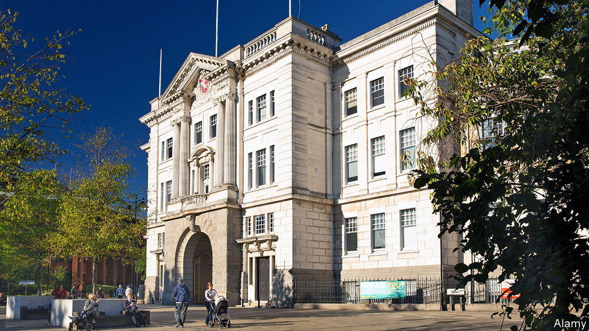
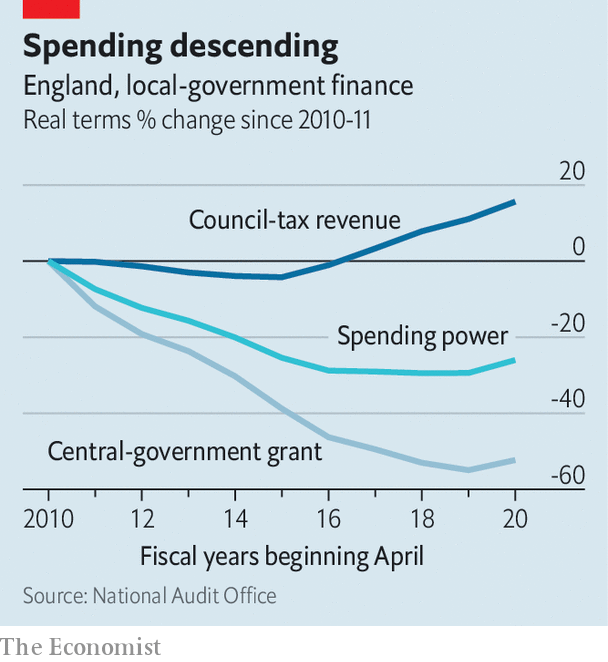

###### Local government crisis

# Why more English councils will go bust 

##### Central, not local, mismanagement is mostly to blame 

 

> Sep 14th 2023 

COUNTY HALL in Maidstone was built in grand style, all stone and tall sash windows. Home to the county council since the 19th century, part of it was designed by Robert Smirke, the architect of the British Museum. But it has become costly and impractical. Anyway, Kent needs to find £86m (or $107m) in savings this financial year, around 15% of its budget. If not, bankruptcy may loom. Selling the hall is one option. “We are open to offers,” says Peter Oakford, the council’s deputy leader. 

Going bust used to be rare. Unlike most public bodies, councils are legally bound to balance their books, so the issuing of a section 114 notice is a last resort, once assets are sold, reserves depleted and other options exhausted. It is typically followed by sharp cuts to services and tax rises; often Whitehall parachutes in new managers. Five years ago few had heard of this niche device. From 2001 until 2018, no council issued one. Nine have been issued since, four in the past year. The latest council to do so, on September 5th, was Birmingham, Britain’s second city. At least 25 English councils, of 318 in all, warn they could follow within two years (councils in Northern Ireland, Scotland and Wales are managed separately).

 


The strain on local finances has grown steadily. Between 2010 and 2021 ministers more than halved grants for local authorities in real terms (see chart). Councils introduced cuts and efficiencies, and tried to make up for lost revenues by raising taxes. Their core spending power still fell by more than a quarter. That was despite a 6% increase in population and rising demand. In the past two years, inflation has added to costs and made it harder to provide services such as social care. 

Still, the councils that have struggled worst since 2018 have each shared some of the blame. Some, like Woking, which issued its 114 notice this summer, made reckless commercial investments. Northamptonshire had wasted money on empty care-home beds. Thurrock lent millions to a fast-living solar tycoon. Poor governance was common, too. Birmingham’s particular problems are over its historic failure to pay women and men in the same sorts of jobs equally. It must find at least £650m (or $810m) to pay out compensation. It is not the only council at fault on this, but lawyers call it an outlier for “burying its head in the sand”. 

What is looming, however, is the prospect of well run councils also going broke. Many of those now issuing warnings have simply run out of services to cut. City and county councils—such as Stoke, Coventry, Somerset and Devon—are struggling with the costs of social care and children’s services. In Kent, England’s largest authority, social care now accounts for 70% of the budget. Funding has not kept up with rising costs, says Mr Oakford. 

Demand for services, including in leafier areas, has risen. Parents of children with special educational needs and disabilities (known as SEND) understandably ask for help. When councils try to limit their statutory spending on the vulnerable they are often hit with expensive legal challenges. Smaller councils can be overwhelmed by other problems. The council in Hastings, a Kent town of 90,000, says over 1,000 people there are homeless. 

Not every council is at risk. Some in wealthy areas are fine. Inner city boroughs in London, especially, have done well from a 2013 change that lets them keep half of the value of business rates they collect. Wealthier residents may also object less to increases in council tax. Partly as a result, funding for local government is now badly mismatched with local need, says the Institute for Fiscal Studies, a think-tank.

More than 3m people in England are covered by councils that have gone bankrupt. More will join them; the only question is when. Councils are supposed to submit an audit of accounts each September, but only 12% filed them on time in 2021-22. In Thurrock the public realm has grown more tatty as rubbish piles up and streets go uncleaned. Kent has already burned through most of its reserves and sold off much of its public estate, including land, libraries and youth centres. 

Will ministers grapple with the broken system of local-government finance? No chance. That would mean reforming hugely regressive council tax, which is still based on property valuations from 1991. Deciding who pays for social care and children’s services would need to be re-examined, too. A fair funding review launched in 2018 has been kicked beyond the next election. Instead MPs trade barbs about mistakes made by councils run by “the party opposite”.

“The government’s position could become very difficult” if a wave of 114s were issued, says Tony Travers of the London School of Economics. Short-term wheezes should be expected. Councils have been allowed to leave their rising spending on SEND off their balance sheets, for example. Rather than end that as planned in 2025, it may be extended. Some that go bust may be quietly bailed out. Just don’t expect long-term reform ■


