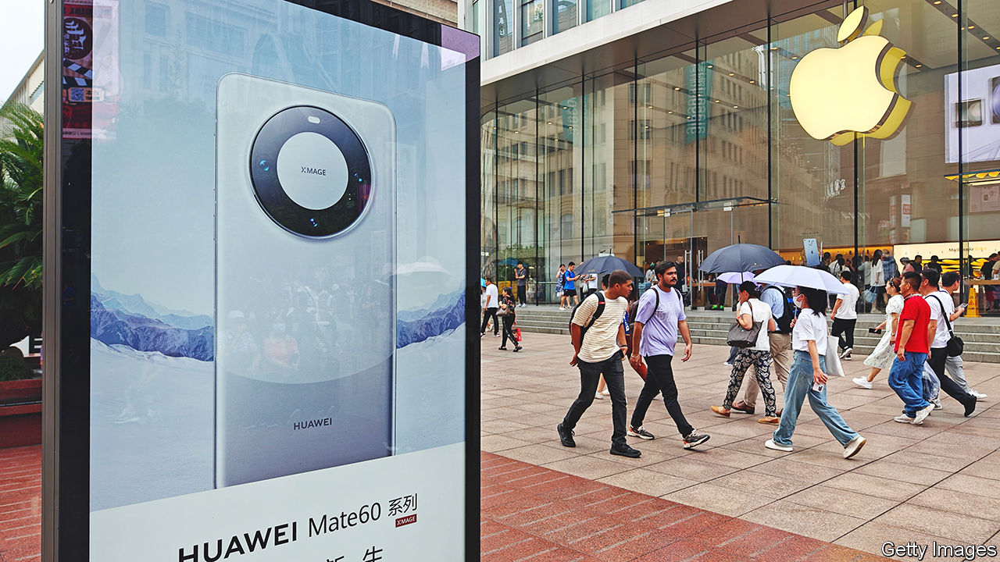

###### New battlegrounds

# Apple is only the latest casualty of the Sino-American tech war 

##### The conflict also has some surprising winners 

 

> Sep 14th 2023 

Few events in the tech calendar create as much buzz as the release of the latest iPhone. On September 12th Tim Cook, Apple’s boss, unveiled what he called “truly incredible” new devices. Yet it was an earlier, quieter launch of a rival gadget that left the tech world gobsmacked. In late August, with no forewarning, Huawei showed off the Mate 60 Pro. As the first fully Chinese-made smartphone that can tap into 5G networks, it was an instant hit. The processors inside it were made by SMIC, China’s chipmaking champion. It is exactly this type of technology that America has been trying to stop Huawei and other Chinese companies from getting their hands on. 

If being upstaged by a Chinese rival was not enough to sour Apple’s mood, days later news broke that some Chinese government departments and state-owned firms may be banning iPhones. The American giant’s share price fell by 6%, wiping around $200bn from its market value. 

A ban’s direct impact on Apple would be minimal. A tiny fraction of China’s 7m or so public servants can afford iPhones, reckons Jefferies, an investment bank. Still, the rumours—and they are still that—signal that not even Apple, whose relations with China have long been cosy, is invulnerable to geopolitics. What is more, China’s targeting of America’s most valuable company, combined with SMIC’s newfound chipmaking prowess, may provoke hawks in Washington to tighten anti-Chinese controls. The Chinese may respond, and so on up the escalation ladder. No wonder investors are spooked.

So far the tit-for-tat has rocked semiconductor firms the most. Last year America restricted exports to China of advanced chips and the tools to make them. Nvidia, a specialist in processors for artificial intelligence (AI) whose market value surpassed $1trn this year, said that trade controls will cut its quarterly revenue by 6%. Tighter controls could hurt its sales of data-centre AI chips. Between 20% and 25% of these go to China. In August Nvidia said that America’s government was controlling exports of its most advanced AI chips to the Middle East, possibly to prevent Chinese firms from procuring them there. 

The chipmakers have also suffered from Chinese retaliation. In May China barred memory chips made by Micron from certain infrastructure projects. The Idaho-based company said this could cut annual revenue by more than 10%. Talk of the Apple ban has pulled down the share prices of the iPhone-maker’s American chip suppliers, such as Cirrus, Qualcomm and Skyworks. Chinese regulators have also been dragging out the approval of big American acquisitions, points out Stacy Rasgon of Bernstein, a broker. As a result, in early August Intel, another chipmaker, gave up its attempt to buy Tower Semiconductor, an Israeli firm, for $5.4bn.

The situation of American makers of chipmaking tools is more mixed. LAM Research and Applied Materials, two such firms, each warned last year of a $2bn hit to sales in 2023, equivalent to around 10% of revenue. But some of that may be offset by rising sales of equipment used in manufacturing less advanced semiconductors. American companies can keep selling these to China, which is stockpiling them while it still can. According to New Street Research, a firm of analysts, Chinese purchases of such tools have increased roughly four-fold between 2019 and 2023. 

Further escalation may bruise America’s tech giants, and not just Apple. According to the President Joe Biden’s administration is considering curbing China’s access to American cloud computing. That would bring Alphabet, Amazon and Microsoft into the firing line.

The biggest losers were, in American eyes, meant to be Huawei, SMIC and China’s other tech titans. They have certainly suffered. But today they are taking advantage of the techno-nationalism that is a byproduct of the geopolitical strife. Huawei’s share of domestic smartphone sales grew from 7% to 13% in the year to the second quarter of 2023, reckons IDC, a research firm. The new 5G device, which sold out in two days, may boost it further—as would an iPhone ban. Huawei also benefits from SMIC’s efforts to innovate around the American controls. In the week after the Mate 60 Pro’s launch, meanwhile, the chipmaker’s share price jumped by 10%. Not quite what the China hawks in Washington had in mind. ■


