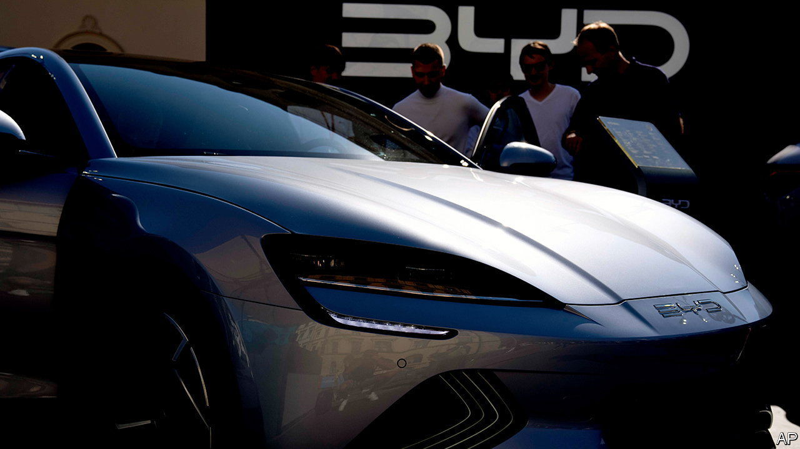
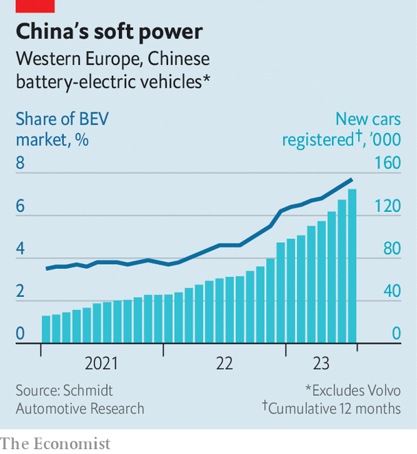

###### Inspecting under the bonnet

# Chinese carmakers are under scrutiny in Europe 

##### The EU launches an anti-dumping investigation 

 

> Sep 14th 2023 

Flashy temporary pavilions in Munich’s city centre displaying the latest models from bmw, Mercedes-Benz and Volkswagen were the public face of iaa Mobility, Germany’s biennial motor show, which ended on September 10th. German automotive might was less in evidence in the show halls a few miles away, where the Chinese electric vehicles (evs) that are making inroads in Europe vied for attention and floor space. The fear of a flood of well-made, decently styled and better-value evs from the east outcompeting those from Europe’s established carmakers has now jolted the eu’s lawmakers into action. 

 


Suspecting foul play, on September 13th the European Commission announced an “anti-subsidy investigation” into Chinese car firms. Those found guilty may be hit with tariffs far above the 10% now levied on Chinese imports. These imports are small but growing fast. In the first seven months of 2023, 189,000 Chinese cars were sold in Europe, equivalent to 2.8% of all car sales. But Chinese pure battery cars made up nearly 8% of sales for this type of vehicle, reckons Schmidt Automotive Research, a consultancy (see chart). These sales have trebled in the past two years, led by Polestar and mg. Brands like Aiways, byd, Nio, Ora and Xpeng are also on sale. Others, like Leapmotor, are poised to join them. ubs, a bank, reckons China’s share of all cars sold in Europe could hit 20% by 2030. All will be electrified.

China’s advance is in part a result of its government’s desire to create a global force in carmaking. A slowdown in ev sales at home as the economy weakens and lots of spare capacity have encouraged Chinese producers to look abroad. With America’s market protected by heftier tariffs and subsidies favouring domestic carmakers, they are eyeing Europe instead. The more compact Chinese models are anyway more suited to European tastes. 

Undoubtedly the Chinese carmakers have benefited from government largesse such as cheap loans. But making anti-dumping charges stick will be tricky. Complaints from a European industry that has long been hooked on all manner of state support look hypocritical. More important, as ubs notes, the 25% cost advantage over European rivals for the byd Seal, a mid-market ev that will go for as little as €45,000 ($48,000), are mostly the result of the firm’s high degree of vertical integration and the low-cost Chinese supply chain, not government handouts. 

Europe’s carmakers are split on the wisdom of the commission’s move. At the top end of the market, where brand loyalty is strong, Chinese firms like Nio are unlikely to challenge Mercedes and bmw, with or without subsidies. But by enraging the government in Beijing, the investigation endangers European companies’ Chinese profits. Half of German car firms’ net profits come from China, according to Bernstein, a broker. By contrast, marques such as Renault, which do not rely on China but face a daunting challenge in the cut-throat mass market, will probably cheer. Swingeing tariffs may spare them from having to cut costs to compete with a Chinese influx. European car buyers, who probably don’t care if China’s government had a hand in keeping down the price of evs, will be the ones to suffer. ■


