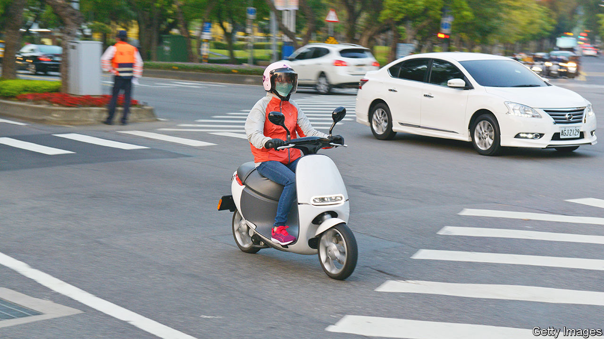

###### Swap teams

# Electric two-wheelers are creating a buzz in Asia 

##### Cross-border tie-ups hope to make battery-swapping mainstream 

 

> Sep 14th 2023 

THE CACOPHONY of small-vehicle engines and horns is one of the most recognisable noises in traffic-choked cities across Asia. Soon that trademark roar may be a thing of the past, even if the horns remain. A wave of cross-border ventures for electric two- and three-wheelers, and the infrastructure required to power them, is rippling across the continent.

The electrification of scooters, motorcycles and auto-rickshaws in poor and middle-income countries is proceeding much more zippily than for larger motors. In China, the biggest market in the world for electric vehicles, about half of two- and three-wheeled machines sold were battery-powered in 2021, compared with 16% of new passenger cars. In India, Indonesia, the Philippines and Vietnam, where two-wheelers outnumber cars by between three and 30 to one, electrifying them can help countries decarbonise and limit air pollution in cities.

That makes the recent flurry of dealmaking a welcome development. On September 6th GoTo Group of Indonesia announced a deal with Selex Motors, a Vietnamese producer of electric bikes and networks of so-called “battery ATMs”. Gojek, GoTo’s ride-hailing arm, will use Selex’s bikes and charging infrastructure in Vietnam. When its electric vehicles run out of juice, drivers can exchange the removable units for fully charged ones at swap stations. In late August Kymco, a large motorcycle-maker from Taiwan, announced a deal with a Thai state-owned energy firm, PTT, to produce new electric two-wheelers and the battery-swapping services to go with them. Around the same time another Taiwanese company, Gogoro, finalised a joint venture with Ayala, a Philippine conglomerate. This would expand what Gogoro claims is already the largest single battery-swapping network in the world, with more than 12,000 racks, carrying between eight and ten batteries apiece, across more than 2,500 locations in Taiwan. 

The biggest prize is India, where the market for electric motorcycles is booming. Despite the phase-out in May of some subsidies for the purchase of e-motorbikes, sales of battery-powered two- and three-wheelers in the world’s most populous country reached 5.5m in the first eight months of 2023, a rise of 53% compared with the same period in 2022. This year Gogoro has already announced two deals with Indian food-delivery companies, Swiggy and Zomato, for battery-swapping and scooter technology. The company also signed an agreement with the government of the state of Maharashtra, home to 126m people and to India’s commercial capital, Mumbai, promising to invest $1.5bn over eight years in what the two sides are humbly calling the “Ultra Mega Project”. 

Although some carmakers, such as Nio of China, are experimenting with battery-swapping, the case for it is most clear-cut for smaller rides. Given that few Asian countries have the deep pockets to encourage adoption of electric vehicles with generous subsidies, sellers and buyers alike need the economics to work. Fortunately, the numbers add up. Research published earlier this year by Arthur D. Little, a consultancy, found that total cost of ownership, which measures how much motorists pay for every mile driven over a vehicle’s lifetime, is lower for two- and three-wheelers with a battery-swapping arrangement than for similar vehicles which are petrol-fuelled or home-charged. 

That is not to say that e-motorcycles with interchangeable batteries will become ubiquitous overnight. Building battery-swapping networks requires a lot of capital spending, which is hard to justify unless people buy the compatible vehicles. And people are unlikely to make such purchases unless they have access to an existing network of charging stations. Solving this chicken-and-egg problem is easier in Taiwan, a densely populated and relatively wealthy nation, than in India, a poor and vast one. Standardisation of battery types will be necessary, too, if needless duplication of infrastructure is to be avoided. EV firms grumble that India’s official battery-swapping policy, which would provide incentives and certainty, seems to be stuck. And as on India’s streets, no amount of honking is likely to speed things along. ■


