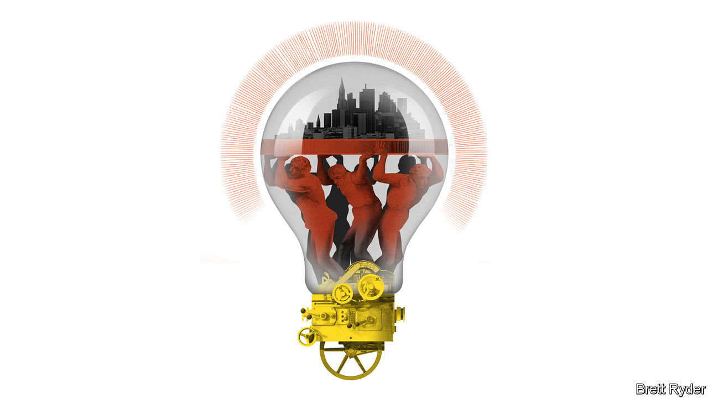

###### Schumpeter

# The Mittelstand will redeem German innovation 

##### Deutschland AG’s bright light bulb 

 

> Sep 14th 2023 

TALK TO GERMAN bosses these days and sooner or later one will bring up “Buddenbrooks”. Thomas Mann’s epic tale of the eponymous clan of grain merchants and their demise is required reading in Germany’s business circles, as well as its schools. Today it serves as a convenient metaphor for the country’s perceived economic decline. GDP may contract this year. Inflation remains stubbornly high. The anti-immigrant Alternative for Germany party is second in some opinion polls, imperilling Germany’s reputation for openness to skilled foreigners. Iconic companies are fleeing abroad. bASF, the world’s largest chemicals firm, is building its $10bn state-of-the-art factory in China. Linde, an industrial-gas group, delisted from the stock exchange in Frankfurt to escape its cumbersome rules but kept its listing in New York. BioNTech, which helped develop one of the world’s first covid-19 vaccines, is setting up its cancer-research operations in Britain. 

Viewed through a tragic Buddenbrookian lens, German decline can seem inevitable. Not to Nicola Leibinger-Kammüller, chief executive of Trumpf, a 100-year-old family company based in Ditzingen, near Stuttgart, which makes industrial tools such as laser cutters and punching machines. In Mrs Leibinger-Kammüller’s reading, the Buddenbrooks’ downfall was not caused by others. They brought it on themselves, by turning their backs on the virtues of thrift and hard work. That leaves a path to redemption. And this, she believes, runs through the , the German economy’s enterprising backbone.

The  is home to some 3.5m small and medium-sized businesses. They are as diverse as their wares, which range from chainsaws to industrial software. Some are large and old: Trumpf has 17,000 employees worldwide and annual revenues of €5.4bn ($5.8bn). Others are small and young, like TeamViewer, an 18-year-old computer-maintenance firm with 1,400 employees, or Marvel Fusion, a nuclear-fusion startup founded in 2019. Despite this diversity, they share two important things in common. They are relentlessly innovative. And, not unrelatedly, their leaders are, like Mrs Leibinger-Kammüller, less gloomy about Germany’s prospects than many of their blue-chip counterparts.

More than 80% of  firms say their situation is stable or good, according to a survey in July by the zGV, an alliance of such businesses. The mood is not rosy, exactly: half reported that sales were down in the second quarter. But it is hopeful. The  continues to hire and invest at home. In July Trumpf announced a €380m investment into its headquarters. “People said we have gone mad,” recounts Mrs Leibinger-Kammüller.

In fact, Trumpf is coldly rational. “The current wave of pessimism is vastly overdone,” says Holger Schmieding, chief economist of Berenberg, a private bank. Germany enjoys record employment and low public debt. Most of all, he says, it has in the  “one of the best search engines for innovation ever invented”. These “hidden champions”, world leaders in their market niche, have coped with painful transitions before, such as the aftermath of German reunification in the 1990s. Now they are adapting again, be it to higher energy prices or to chillier relations with China, which has become a large market for the ’s products but is itself looking economically enfeebled and geopolitically adversarial. 

Trumpf spends 11% of revenue on research and development, almost twice the average for German industry as a whole. It is constantly comparing notes with clients to tailor its products to their changing needs. It has worked with one client to develop a way of using lasers to cut metal more directly from the coil, which uses less of the newly costly energy than the conventional method of cutting it from sheets. Karl Haeusgen, chairman of Hawe, a maker of hydraulic pumps, says that conversations with domestic customers are his firm’s principal source of innovation. “Our Chinese clients will buy what we have, but our German customers challenge our creativity,” he says. 

Oliver Steil, chief executive of TeamViewer, agrees that the  contains some of Germany’s most agile and innovative firms. They benefit from closeness to German industrial titans, to which they often act as suppliers, and from the country’s deep pool of technological and engineering know-how. Most important in times of change, they are risk-takers, says Mr Steil. Undaunted by the old saw that fusion power is 20 years away and always will be, Marvel Fusion is intent on developing commercially viable power generation by smashing atoms together using lasers.

If there is a Buddenbrook in the latest chapter of the  story, it is the German government. Policymakers and bureaucrats have become too set in their ways, sighs Mr Steil. They seem wedded to red tape and high taxes, and uninterested in supporting innovation. This is leading some  firms to sell up or try their luck elsewhere. In April Viessmann, a maker of heat pumps, sold most of its operations to Carrier, an American rival. Even Marvel Fusion recently teamed up with Colorado State University to set up a $150m research site in America.

In search of a novel approach

Heike Freund, Marvel Fusion’s chief operating officer, still hopes eventually to build a power plant in Germany. In March the Federal Agency for Disruptive Innovation pledged €90m to support laser-based fusion in Germany, half of which will go to Marvel. At a recent pow-wow in Schloss Meseberg, a castle near Berlin, the government unveiled a “growth opportunities law”. This includes a €7bn tax-relief package that would benefit the . On September 6th Olaf Scholz, the chancellor, announced a series of measures to digitise public administration, simplify immigration rules for skilled workers and make it easier to start companies, three pet peeves of  bosses. The faster the government can shake off its own Buddenbrookian complacency, the better. ■


