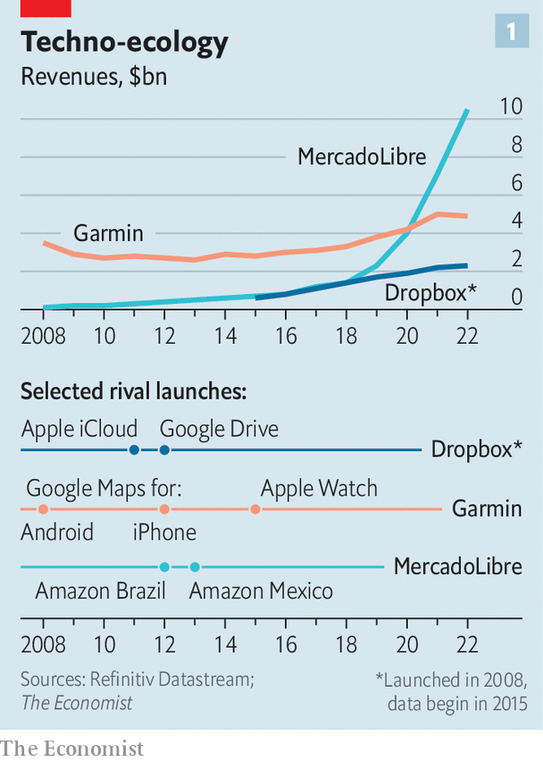
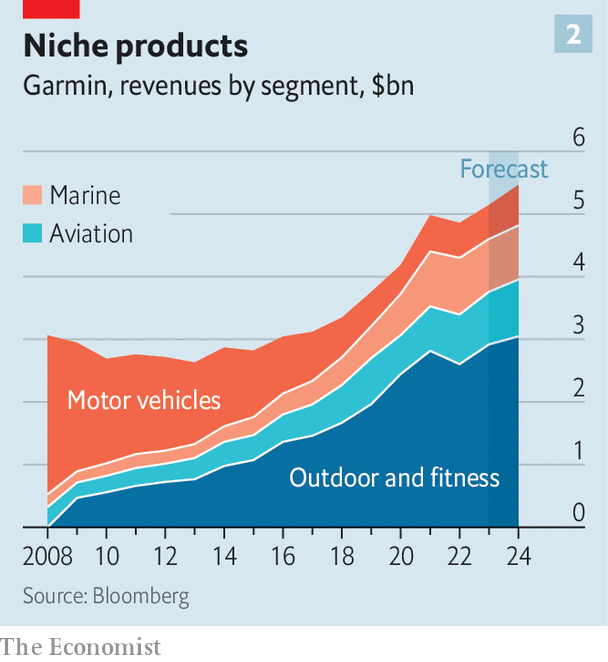

###### Survival guide

# The plucky firms that are beating big tech 

##### Garmin, Dropbox and MercadoLibre show carving out a lucrative niche is possible 

 

> Sep 12th 2023 

BIG TECH keeps getting bigger. So far this year the combined market value of America’s five digital behemoths—Alphabet, Amazon, Apple, Meta and Microsoft—has soared by half, to around $9trn. That is almost a quarter of the total for the S&amp;P 500, an index of America’s largest companies (which has risen by just 17% in the period). The five account for almost 60% of sales, profits and spending on research and development of all the technology firms in the index. They are widely expected to be the main winners from the artificial-intelligence (AI) revolution. 

Governments view this dominance with increasing trepidation. On September 12th America’s Department of Justice began a  with Google and its corporate parent, Alphabet, in the biggest antitrust case in two decades, accusing it of abusing its internet-search monopoly). This month an eU law labelled the big five as digital “gatekeepers”, which bars them from bundling some services and discriminating against third parties on their platforms, among other things. The giants have grown so gigantic, the world’s trustbusters argue, that they suck all the oxygen out of the tech ecosystem, driving challengers to extinction or, at best, making it hard for anyone else to prosper. Just ask Snap, Spotify or Zoom. 

Like natural ecosystems, though, commercial ones present opportunities for newcomers. To keep growing at the blistering rates their investors expect, the big five pay most attention to markets vast enough to make a meaningful difference to their revenues, which collectively touched $1.5trn last year. That means they ignore certain areas that are smaller but potentially still lucrative. The ingenious companies that identify such niches and are able to exploit them don’t just get by, but thrive in the shadow of the giants. 

Take Garmin. Founded in 1989, it pioneered the commercial use of GPS-navigation systems. By 2008 it had nabbed almost a third of the market for portable navigation devices, mostly dashboard-mounted units for cars, which were some 72% of the company’s sales. Then Google released its Google Maps app, first, in 2008, for Android smartphones and then, four years later, for the iPhone. Motorists could simply use their phones to find their way, rather than forking out for a dedicated device. By 2014 Garmin’s revenues from its automotive segment had slumped by half compared with six years earlier, to $1.2bn. 

 


A year later big tech delivered another blow. Apple launched its first smartwatch, which risked undermining Garmin’s growing business of selling devices for fitness and outdoor enthusiasts. This time, however, the smaller company withstood the assault (see chart 1). It focused on high-end watches and fitness trackers, some of which sell for several times the price of the top-end Apple Watch. In doing so it has built a loyal user base of mountaineers, runners and other assorted fitness fanatics; in April Mark Zuckerberg, Meta’s exercise-fanatical boss, posted a photo of his Garmin watch after finishing a 5km run in good time. 

 


George Livadas of Upslope Capital, an investment firm, believes that Garmin is one of the few companies that has created a premium brand in a market with an available Apple alternative. Today its total annual revenues of almost $5bn are roughly twice what they were when the first Apple Watch hit the shelves. Smartwatches and fitness trackers contribute almost 60% of the firm’s sales (with most of the rest coming from professional navigation systems for ships and aircraft, see chart 2). 

Another company to successfully exploit an underserved tech niche is Dropbox. Steve Jobs, Apple’s co-founder, once dismissed the San Francisco-based cloud-storage firm as a “feature, not a product”. Founded in 2008, it has battled Apple, Google and Microsoft (and for a while, Amazon) throughout its life. Its bigger rivals all bundle cloud storage with other services; customers who sign up for Google’s Gmail, for instance, receive some free online storage. But those offerings, though often free, lack Dropbox’s functionality.

According to Rishi Jaluria of the Royal Bank of Canada, early on Dropbox recognised that many users needed more than just a place to stash files. Photographers and other creative types want to store high-resolution files without worrying about file size, for example. These users are often ready to pay for the convenience. By developing features that appeal to them, most recently an AI-powered search tool to find and summarise documents, Dropbox has continued to attract new subscribers. 

An exploitable niche can also be geographic. MercadoLibre, an Argentine e-commerce firm, is a case in point. Its days might have seemed numbered when Amazon entered Brazil and Mexico, its biggest markets, in 2012 and 2013, respectively. Not so. A decade later MercadoLibre accounts for a quarter of all e-commerce trade in Latin America. The closest Amazon has come to challenging the regional shopping giant is in Mexico, but even there its market share is half that of its rival. 

MercadoLibre has succeeded by adapting its business model to local conditions. It quickly identified poor infrastructure, which raised costs for sellers and degraded the buying experience for shoppers, as a hindrance to growth. The firm has invested in its own logistics network, which transports 90% of its parcels. Its payments service, MercadoPago, is a popular option in a region with rampant fraud. Small innovations like offering points towards free delivery have helped it win over price-conscious Latin Americans. The company also plays up its local roots to win over customers. Ariel Szarfsztejn, its head of commerce, describes it as “built by Latin Americans”. In April, as Amazon was slashing its workforce worldwide, MercadoLibre announced plans to hire 13,000 people.

Witness the fitness

Finding a niche is not enough to guarantee success. Garmin, Dropbox and MercadoLibre have other things going for them. All three still have at least one of their founders in executive roles. Winning against big tech requires an obsessive focus on product development and the stomach for long-term investments. It helps to have experienced operators at the helm who aren’t swayed solely by quarterly targets. 

Crucially, the three companies also make money—a big selling point for investors at a time of rising interest rates, which make the promise of tech hopefuls’ future profits less attractive than earnings in the here and now. In 2022 Garmin, Dropbox and MercadoLibre raked in $974m, $553m and $480m, respectively, in net income. That is peanuts next to Alphabet’s $60bn or Apple’s $100bn. But the trio’s operating margins look healthy for smartwatch, cloud and e-commerce businesses. The market capitalisation of Garmin has tripled since 2015, to over $20bn. MercadoLibre’s has quintupled, to $70bn. Dropbox is worth $10bn, not too far off its peak amid the pandemic-era mania for all things digital. Who said anything about extinction? ■


