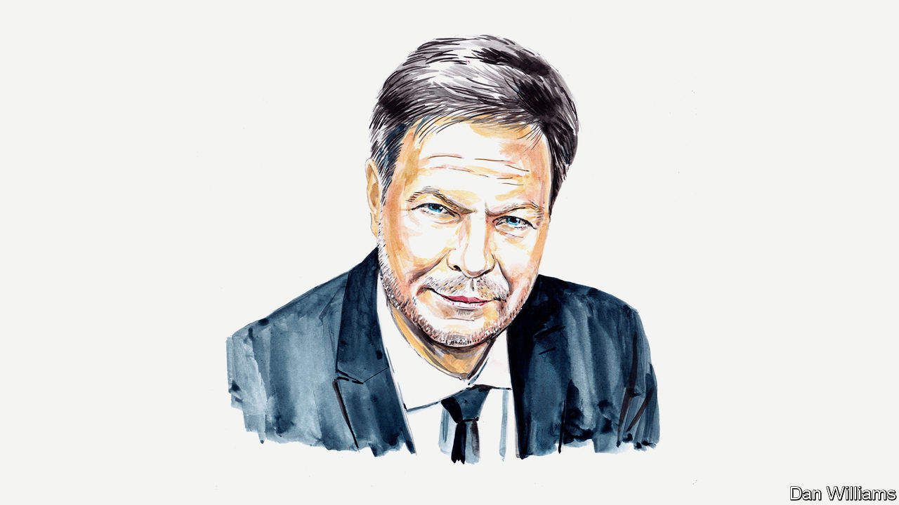

###### Germany’s economy

# Robert Habeck responds to The Economist’s “sick man of Europe” cover 

##### The symptoms are milder than our diagnosis would suggest, says Germany’s economy minister 

 

> Sep 14th 2023 

GERMANY IS ONCE again being talked about as . Whilst —with the courtesy of the British—appended a question mark, some Germans are in full  mode, shouting it in capital letters with exclamation marks.

This doesn’t match reality, and the wailing doesn’t solve anything. A closer look suggests the economy isn’t sick—just slightly off form. There’s no question that Germany is facing structural challenges: the return of geopolitics and geoeconomics, the transition to climate neutrality, demographic change, and a skills shortage. On top of this there are home-made problems, particularly my country’s ability to tie itself up in red tape. And as an exporting nation, we are especially badly hit when supply chains are disrupted and growth in China softens.

At the same time, the German economy retains a host of strengths. The group of mid-sized manufacturers collectively known as the  is innovative and its many “hidden champions” are quiet market leaders. A broad-based industrial sector makes for productive value chains. Our social-market economy maintains its traditions of employer-union co-operation and a powerful welfare state. And sustainable public finances permit the state plenty of options to step in as required.

But what my country did allow itself was a long phase of self-satisfaction, in which we assumed that globalisation would keep delivering to our benefit, and in which we relied on cheap Russian gas—a mistake for which we’ve been paying the price since President Vladimir Putin launched his war of aggression against Ukraine. For too long this lethargy and blindness meant that our politicians failed to enact the necessary changes.

But we’ve understood the problems, and we’ve started getting back in form. Last winter, we saw what Germany is capable of when everyone pulls in the same direction, overcoming our dependence on Russian gas in no time. We built up a new liquefied natural gas infrastructure, at a new  (“Germany speed”). We are transferring these successes to other areas, for example in the expansion of renewable energy and the grids needed for it, the hydrogen economy, and adjustable power plants. Electricity prices in Germany will fall substantially in the coming years, and I am sure that my government will find the means and the will to ensure competitive electricity prices during the transition.

Germany is in the process of recognising the geopolitical realities. Our government is building a new security policy—in particular economic security anchored in the European strategy. We are diversifying our trading and raw-materials relations, and have found our trade-policy voice in the EU and the world again. We have furnished funding within our  to smooth the paths for businesses moving to a climate-neutral future and, after the, , funded our armed forces so that we can finally meet our alliance obligations.

True enough, both military and economic security entail short-term economic costs. But we are willing to shoulder these costs in service to our and our allies’ security interests. As the EU’s largest economy, we bear a special responsibility to balance our needs with the union’s. In fact, this is how our recent work to attract semiconductor-manufacturing capacities should be understood: it serves the EU’s goals of reducing dependencies by building its own capacities and of boosting competitiveness and security of supply. A healthy German industrial sector which forms the starting point for value chains stretching across Europe—supplying basic materials ranging from chemicals to aluminium, steel and glass—is not just in our interest, but foundational for the wider European economy.

People are taking note of all these efforts. That there is confidence in the German economy is demonstrated by the more than two dozen companies planning investments totalling more than €80bn ($85.8bn)—a figure that reflects just the sum of investments which individually exceed €100m.

That is no reason to sit back. Germany still has hard work ahead. We have built up a bureaucracy which has become a barrier to investment. We have started cutting through the jungle of federal legislation, step by step. And all the levels of state must respond to the skills shortage. We have already made progress on attracting skilled workers from abroad, but we need to organise our immigration well and mobilise our domestic pool of potential labour. I therefore believe it makes sense to provide more incentives for older workers to stay in work voluntarily. And we need to provide enough funding for public investment and strategic industrial policy on a long-term basis.

I am confident that Germany will cope with these changes while maintaining its security and stability. We must keep reminding ourselves that one of our greatest competitive advantages is our political culture. Despite all their differences, the parties of the centre, which include the three coalition parties, are willing to work together and make compromises. Maintaining this spirit of balance is a perennial responsibility at a time when populist forces are gaining ground in Germany, in Europe and around the world. Only by working together will Germany find the strength to renew its prosperity—and you can bet your bottom euro that it will.


