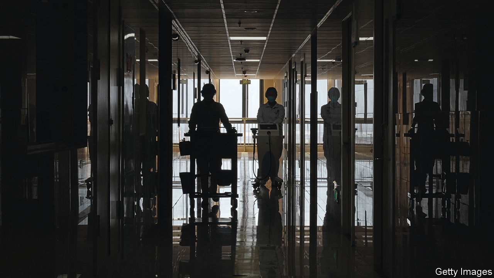

###### Shock and awe

# China’s government launches a campaign against medical corruption 

##### But it may not tackle the roots of the problem 

 

> Sep 14th 2023 

For almost two months the authorities have been cracking down on the blatant corruption that has long plagued China’s health-care system. The Communist Party’s Central Commission for Discipline Inspection, its fearsome graft-busting arm, is among a swathe of agencies leading the charge. Heralding the campaign in late July, officials said it would last a full year. State media have called it “a storm” and an unprecedented exercise in “shock and awe”. The , a newspaper, said that graft-busters were “speeding into the deepwater zone”.

Within days of the official announcement, 176 hospital directors were already being investigated, according to reports. Among the officials detained is Sun Zhigang, who served as party secretary in Guizhou province and as head of the state’s main medical-reform body. Hotlines have been set up for citizens to report offenders.

The campaign is rattling the business world. Stocks in the health-care sector began a swift decline; the share price of one exchange-traded fund tracking the industry in China fell by more than 13% within weeks. Initial public offerings for more than a dozen Chinese pharmaceutical companies have been postponed.

But some experts believe the government’s approach focuses too much on symptoms, while ignoring the causes of corruption. The problem starts with the fact that general practitioners, who could handle scrapes or sniffles, are poorly supported by the government and poorly regarded by ordinary people. Potential patients prefer to go to hospitals for even minor treatments. Many bring a red envelope stuffed with cash, which is meant to ease their way to the front of long queues. 

Most patients get only a few minutes with overworked doctors. Still, they are often prescribed procedures, tests and medicine—many of which are unnecessary. A lack of government funding means public hospitals rely on patients’ fees, so doctors have every incentive to inflate bills.

Corruption also thrives at the administrative and commercial levels. Officials responsible for buying equipment are liable to be offered bribes. In one widely reported case an administrator took a backhander of 16m yuan ($2.2m) for authorising the purchase of machinery worth just 15m yuan. Sales representatives for pharmaceutical firms have been known to bribe doctors to prescribe their products. 

Chinese patients have long been annoyed by such practices. Decades ago, when health-care resources were scarcer and medical standards far lower, the state paid for most of the meagre services on offer. But since the introduction of market reforms in the 1980s, which led to the emergence of a fee-for-service model, consumers have become more demanding. They expect better value for the higher prices they are forced to pay. Some have even become violent in the face of shoddy service or bad outcomes. Security checks are now common at entrances to hospitals.

People have sometimes taken the rare step of publicly demonstrating against the system’s shortcomings. Earlier this year hundreds of people in the cities of Dalian and Wuhan marched in protest against cuts in their medical-insurance benefits.

For all of these reasons, the shock-and-awe campaign is likely to be popular with the public. But it may have “unintended and undesirable consequences”, says Yanzhong Huang of the Council on Foreign Relations, a think-tank in New York. If the government is overzealous, it could disrupt normal, honest activity. Academic meetings and technical training offered by companies selling drugs or equipment do not always lead to corrupt deals. Mr Huang worries that doctors in clinical settings may be reluctant to order necessary procedures for fear that they will be accused of inflating fees. The state, apparently, shares some of these concerns. On September 9th a senior health official said that the hunt for bad apples should not deter the good ones from doing things they need to do. 

A bypass procedure

John Cai, who chairs the CHIP Academy, a health-care think-tank in Shanghai, agrees that a drastic campaign is not likely to solve deep-rooted problems and doubts it will be sustained for a full year. “I don’t think anyone really has the guts to resolve this problem in systematic ways, because it involves important interest groups among government officials,” he says. Already he sees signs that the campaign is losing momentum.

The government, though, may view the campaign as serving a different purpose. The Chinese people are unhappy with the state of the health-care system. Now they have dozens of hospital bosses and pharmaceutical executives to blame. For officials in Beijing, perhaps that passes as a successful operation. ■


