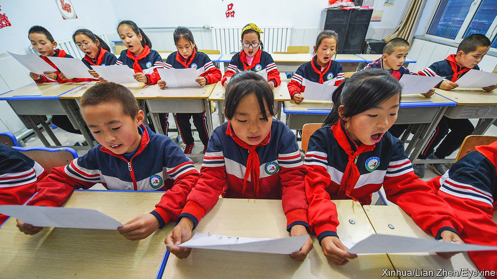
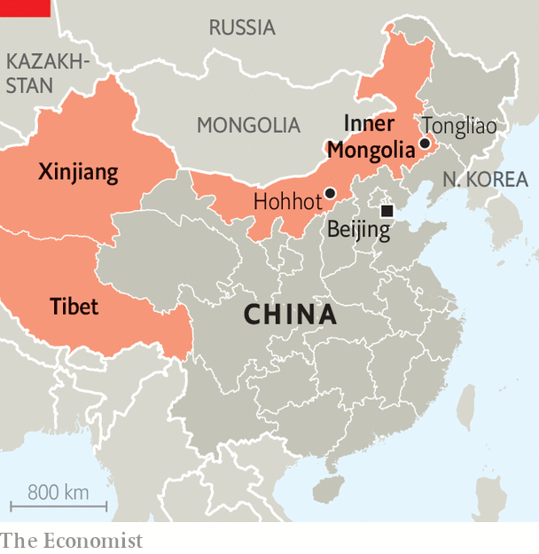

###### Assimilation game

# China’s push to create a single national identity 

##### Inner Mongolia is the latest target 

 

> Sep 14th 2023 

THE STREET signs in Inner Mongolia, a region in northern China, are written in two languages. There are the blocky characters of Mandarin, the mother tongue of most Chinese. Then there is the vertically-written script of Mongolian, which is spoken by many people in the region. The language is not just seen on signs; it is heard in cafés and used in classrooms (such as the one pictured). More Mongols live in Inner Mongolia than in Mongolia, the country next door.

But the Mongolian language is dying in China, say activists, and not of natural causes. Three years ago the central government told schools in Inner Mongolia to replace the language with Mandarin when teaching some subjects. That sparked protests, but a year later China’s legislature went further, annulling regulations that allowed autonomous regions to teach in minority languages. Today, kindergartens in Inner Mongolia are taught entirely in Mandarin and, according to locals, an increasing number of other classes are, too.

The decline of Mongolian is part of a years-long push by the central government to assimilate ethnic minorities across China. Officially, such groups are meant to have equal standing with the Han, the ethnic group that makes up over 90% of the mainland’s population. In practice, the Han (who often speak Mandarin) dominate and other groups are marginalised. “They don’t want minorities to be too distinctive,” says a 25-year-old Mongol in the Inner Mongolian city of Tongliao. “To be blunt, they want to turn us into Han.”

 


When the Communist Party took power in 1949, it inherited an unwieldy, multi-ethnic state with far-flung borders drawn during the Qing dynasty (1644-1912). To manage their vast new country, Communist officials copied the Soviet Union. They gave larger ethnic groups living near China’s borders—Kazakhs, Koreans, Mongols, Tibetans and Uyghurs—their own nominally autonomous areas and allowed them to be educated in their own languages. These groups were also given perks like extra points on the , China’s notoriously gruelling university-entrance exam, and exemptions from the “one-child” policy. Today China has 55 officially recognised ethnic minorities (though it may have hundreds of unofficial ones).

To be sure, minority groups have always faced discrimination in China. Government persecution led to riots in Tibet in 2008. A year later Xinjiang, home of the Uyghurs, erupted. The unrest spooked senior officials in Beijing (most of whom are Han). Haunted by the disintegration of the Soviet Union, they worried that parts of China might become unstable or try to peel off. So the government sought to blur ethnic differences. Under Xi Jinping, who became leader in 2012, this effort has gained steam. Mr Xi often talks of ethnic unity and harmony. He has explicitly called on Inner Mongolia to “safeguard ethnic solidarity”. 

In the past three years, China’s management of minority groups has grown more strict. Local officials deemed at odds with the central government have been removed. Benefits, such as the bonus  points, are being rolled back. Books that dwell on China’s ethnic identities face bans. Such repression was highlighted in 2020, when a museum in France pulled an exhibition about Genghis Khan, the founder of the Mongol empire, that had been planned in collaboration with the Inner Mongolia Museum in Hohhot. The French museum cited interference by the Chinese government, such as demands that the words “Genghis Khan”, “Mongol” and “empire” not be used in exhibition material. 

The government’s treatment of ethnic languages is another example. Before the clampdown in Inner Mongolia, other tongues were targeted. Kazakh, Korean, Tibetan and Uyghur have all been downgraded from mediums of instruction in schools to mere subjects, equivalent to foreign languages. In Tibet three-quarters of children are now taught in Mandarin-language boarding schools, which means they spend less time speaking Tibetan at home, too. The changes strike at the heart of China’s ethnic identities. “If you don’t speak Mongolian how can you be called a Mongol?” asks a woman in Tongliao.

One nation, under the party

Minority groups are still allowed to celebrate aspects of their culture, such as traditional dress and dancing. Officials are fond of pointing out that China’s bank notes feature scripts of minority languages, as well as standard Chinese characters. But all of this is presented as part of a singular national identity, upon which the strongest influence, by far, is Han. The authorities promote this identity using television shows, picture books and exhibitions. One at the Cultural Palace of Nationalities in Beijing showcases relics from the Han and other ethnic groups. It claims that the “grand fusion” of the Chinese nation can be traced back to the Stone Age. 

The government justifies its treatment of ethnic minorities on various grounds. Officials argue that learning Mandarin will help people in these groups to obtain jobs. By inculcating a national identity in the population, officials hope to improve social stability. In some areas, though, this campaign has been accompanied by official brutality. Xinjiang is the prime example. Since 2017 perhaps a million Uyghurs and other ethnic minorities in the region have been forced to spend time in “re-education camps”. This has been necessary in order to stamp out terrorism and separatism, says the government. Critics accuse it of trying to wipe out the Uyghur culture.

There have been ethnic tensions in Inner Mongolia, too. Mongols and Han have tussled over the use of grasslands, for example. But, generally speaking, the region is more stable than Xinjiang or Tibet. The Communist Party has long called Inner Mongolia a model of good ethnic relations. Inter-marriage between groups is common. Many young Mongols speak Mandarin as fluently as they do their native tongue. The region is not heavy on religions that the central government deems suspect, such as Islam. And there is no serious separatist movement. 

So even members of the Han ethnic group have been surprised by the government’s heavy-handed actions in Inner Mongolia. “We have no idea who is giving these orders,” says a Han woman in Tongliao. “What good are they for the common people?” She is proud of the fact that China is culturally diverse. Senior officials in Beijing appear less so. ■


