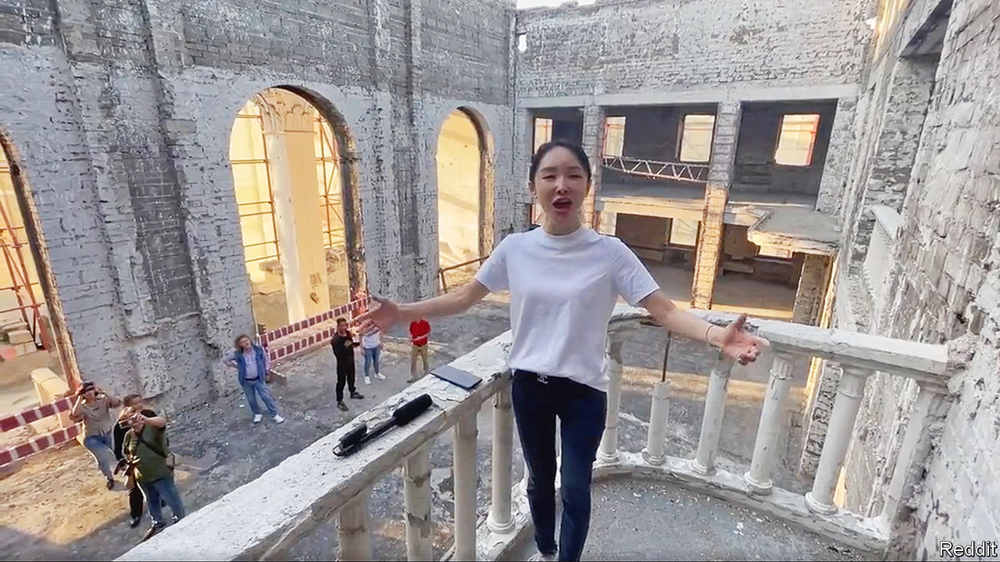

###### Singing in the ruin

# Wang Fang’s performance in Ukraine highlights divisions in China 

##### The opera star sings a Russian ballad—in a bombed-out Ukrainian theatre 

 

> Sep 14th 2023 

It looked like a spontaneous tribute to Russia. Standing in the bombed-out shell of a theatre in the Ukrainian city of Mariupol, a Chinese opera singer, Wang Fang, belted out a Soviet-era ballad (pictured). In March last year many Ukrainian civilians were killed in a Russian attack on the building. So when a video of the 38-year-old’s performance this month circulated online, it sparked a furore. Unlike their government, some Chinese people prefer to side with Ukraine.

To be sure, there are many Chinese who back Russia. News of the latest manifestation of China-Russia friendship—a meeting in Vladivostok between Russia’s leader, Vladimir Putin, and a deputy prime minister from China, Zhang Guoqing—was greeted with typical applause on China’s heavily censored social media. Mr Putin told his guest that relations between the two countries had reached a level “unprecedented” in history. Mr Zhang said political co-operation was “deepening”. 

But supporters of Ukraine still find their voices. At least briefly, before censors began scrubbing references to her singing, Ms Wang’s appearance in Russian-controlled Mariupol gave them an opportunity to speak out. On Weibo, a Twitter-like service, some users were quick to attack her choice of venue for singing such a song. “Katyusha”, as it is known, was used to inspire Soviet troops going to battle with the Germans during the second world war. It conveys a woman’s love for her boyfriend on the front. Russia portrays its invasion of Ukraine as another anti-Nazi campaign. Chinese state media echo this line. 

Some of Ms Wang’s critics have large followings and, therefore, much to lose should their accounts be shut down—a common form of punishment by censors. One is a retired professor living in Xinjiang, a far-western region. He told his 137,000 followers that Ms Wang would “be nailed to the pillar of shame in history”. Another Weibo user, with nearly 1m followers, accused her of being “simply out of her mind”. Similar attacks were levelled at Ms Wang after she defended her visit to Mariupol at a press conference in Moscow alongside her husband, Zhou Xiaoping. Mr Zhou is an adviser to China’s parliament and a prominent nationalist blogger. He was praised in 2014 by China’s leader, Xi Jinping, for spreading “positive energy”. 

Out of tune

Ukraine has reacted angrily, too. On Facebook a spokesman for its foreign ministry called Ms Wang’s singing in the theatre “an example of complete moral degradation”. He said her visit to Mariupol, along with others from China, was “illegal” and all members of the group would be banned from entering Ukraine. He also said he expected an explanation from China about the group’s trip. In contrast, Denis Pushilin, the Russian-backed leader of Donetsk, the province to which Mariupol belongs, met the visitors and described Ms Wang’s singing in the theatre as “touching”. Russia has implausibly accused Ukrainian extremists of blowing up the building, where hundreds were taking shelter. 

China’s foreign ministry is keeping quiet about the incident. For all its cosiness with Mr Putin, China calls itself a neutral observer of the war and wants to earn kudos for helping to end hostilities (though its peace proposal does not demand Russia’s withdrawal from Ukraine). China is even talking to the Vatican, with which it does not have diplomatic relations, about ways to resolve the conflict. The pope has sent a senior envoy on a rare official visit to Beijing to discuss the topic. 

In a post on Weibo, Hu Xijin, a well-known pro-government commentator, reflected what Chinese officials are probably thinking. He told his nearly 25m followers that Ms Wang’s behaviour risked creating a “sense of involvement” in the conflict among Chinese people, which is “not in accordance with reality and not what China needs”. The war in Ukraine is “not China’s war”, said Mr Hu, who is a former editor-in-chief of , a nationalist tabloid in Beijing. For good measure, censors deleted Mr Hu’s post too. Clearly they want to shut down debate entirely. ■


