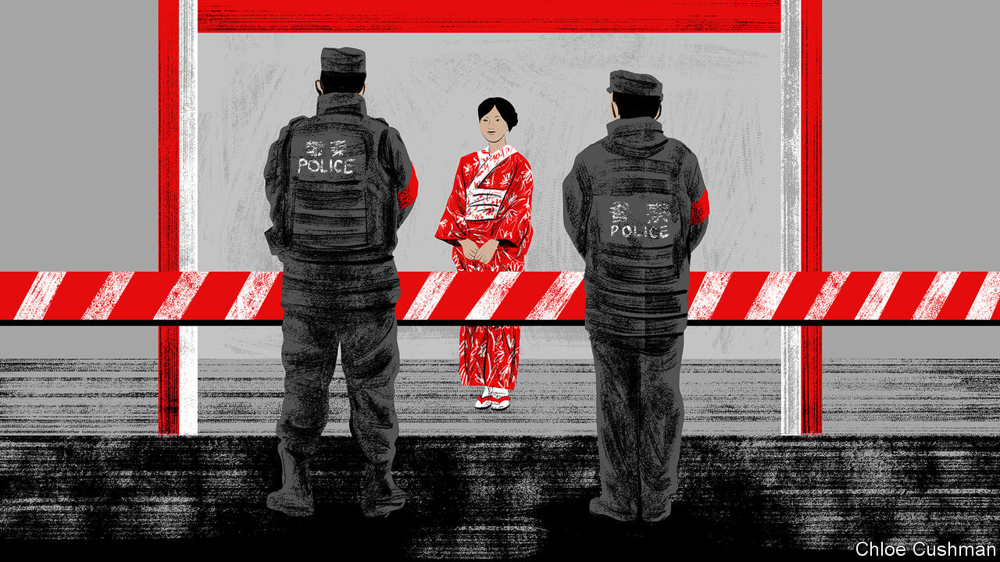

###### Chaguan

# Xi Jinping builds a 21st-century police state 

##### A draft law gives rank-and-file officers new, arbitrary powers 

 

> Sep 14th 2023 

UNDER XI JINPING, the Communist Party is building the most ambitious police state in China’s history, with the legal powers and surveillance tools to bring order and ideological conformity to every corner of daily life.

Special attention is being paid to grassroots law enforcement, notably via China’s system of administrative punishments: a vast array of sanctions, including physical detention, that may be imposed by police without a court hearing or warrant from a judge. The system covers acts that, in more severe forms, would be considered crimes. It has ancient roots. In imperial times, officials could punish “inadvisable behaviour” that fell short of illegality.

A revised version of China’s Public Security Administration Punishments Law was recently opened to public comment on the website of the National People’s Congress (NPC), updating a law enacted 17 years ago. It grants police many new powers. Some are provoking an unusually vocal backlash.

Article 34, for instance, creates a set of administrative-level political misdemeanours. It empowers police to fine or detain people for up to 15 days for words and deeds that “harm the spirit” or “hurt the feelings” of the Chinese people. The article is inspired by laws passed in recent years that created political-thought crimes punishable in court. To widespread public alarm, this proposed administrative-level law allows rank-and-file police to sanction not just unpatriotic acts, but also articles of clothing or symbols that they deem offensive to the public, as well as insults to party-approved heroes and martyrs. 

Should those being punished answer back, they may regret it. Whereas the existing law punishes people whose actions obstruct police work, the draft version creates an offence of merely insulting or verbally abusing the police in the course of their duties. Its Article 120 allows some cases, involving “irrefutable evidence”, to be decided by a single officer. To offset these new powers, the draft law emphasises that enforcers will be subject to internal codes of discipline and supervision by anti-corruption inspectors.

The revised law has a crowd-pleasing feel to it. Several articles respond to news events that triggered public outrage. There are ripped-from-the-headlines clauses about pyramid schemes and those who throw objects from high buildings. One strikingly specific clause sanctions anyone who grabs the steering wheel of a public bus from the driver. That anti-social act has been caught on video—and widely shared—more than once in the past few years. 

That is not the only nod to viral news stories. By adding language about clothing that hurts the public’s feelings, authorities are reopening recent rows about sartorial censorship. In effect, the new clause offers retroactive backing to police who temporarily detained a young woman last year for taking selfies while wearing a Japanese kimono in the eastern city of Suzhou. That heavy-handed response delighted Japan-loathing nationalists, but appalled liberal netizens. Anxiety is spreading. A comment earlier this year on Taobao, an e-commerce platform, pondered the risks of arrest for buying a T-shirt reading: “This is what a feminist looks like”.

The revised law is provoking unusually heated debate. More than 92,000 citizens have submitted comments on it to the NPC website. Many Chinese have not forgotten the petty grassroots tyrants who enforced strict, at times irrational “zero-covid” pandemic controls. Liberal Chinese, an embattled bunch, are not shocked that the measure claims new powers for the state. They long ago understood that the government’s authority is more or less limitless. Instead, critics focus on the discretion that the draft offers law-enforcement officers. Put another way, if a police state worries some Chinese, their main concern is the police.

An article by Shen Kui, a law professor at Peking University, voices concerns that the draft’s vague language makes “arbitrary” law-enforcement more likely. In a commentary later deleted from the , an online publication in Shanghai, Zhao Hong of the China University of Political Science and Law worries that officers may be allowed to decide whether they have been abused while on duty, based on their personal feelings. In that case, he writes, the law may sanction citizens who merely direct heated complaints or “harmless ridicule” at the police. Other scholars note, gloomily, that the draft law allows police to collect biological samples, such as hair or blood, from those charged with even trivial misdemeanours. A court warrant is not needed.

Arbitrary rule, but with paperwork

To an optimist, these careful murmurs of criticism show that China still allows some limited space for debate. Draft laws are opened for comments and legal minds may weigh in. In the first decades of the People’s Republic, Mao-era “revolutionary justice” often amounted to rule by mob, with class enemies hounded to death or sent to labour camps without due process. Under Mr Xi, the party treads a different path. It is horrified by mobs and obsessed with order. Instead, the party promises law-based governance, enforced by professionals whose roles are constrained by written codes. After a decade of brutal anti-corruption drives, that system is now cleaner. Not long ago, Chinese judges openly asked for bribes. Today, they are too scared to try.

To a pessimist, a less corrupt, more professional justice system offers no real shield against tyranny. China’s courts and police are explicitly under the party’s authority, and judicial independence is denounced as a dangerous Western notion. Vaguely-worded laws allow officials to define wrongdoing as they see fit. The administration punishments law is a case in point. In today’s China, rulers publish a stream of new laws to try to legitimise their exercise of power. They eschew state terror. Party critics are not found in the streets of Beijing, at dawn, with a bullet in the head. But the Xi-era police state is remorseless, like a great, steel machine. This China will take dissenters’ freedoms, and offer them a receipt. ■


