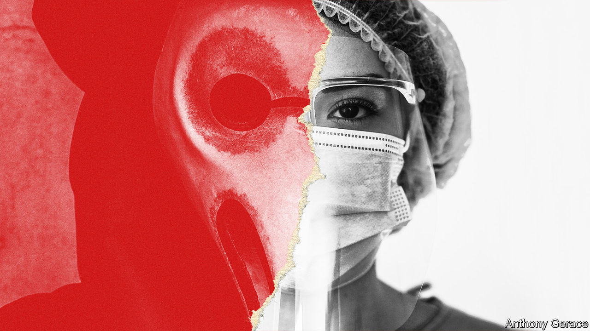

###### Scare-brained

# How fear has shaped human affairs 

##### A new history argues that power depends on frightening people 

 

> Sep 9th 2023 

By Robert Peckham. 

One of the bestselling books of all time was about . It was not a cheerful romp like the Harry Potter novels. Instead, it was a serious instruction manual, explaining how to identify, capture, torture confessions from—and eventually kill—Satan’s handmaidens. Published in 1486, “Malleus Maleficarum” (“Hammer of Witches”) reputedly sold more copies over the next two centuries than any book bar the Bible. 

As Robert Peckham, a fellow at the Royal Historical Society in London, writes in “Fear: An Alternative History of the World”, anxiety about witches sprang from ignorance. Knowing nothing of , people guessed that misfortunes such as disease were caused by magic. Yet their fear could be manipulated for political purposes. Christendom was split in the 16th century, with the pope and various Protestant potentates vying for control. Exterminating witches was a handy way for an earthly ruler to signal which side he was on: God’s, not the Devil’s. 

Fear is a primal, necessary emotion. Mr Peckham calls it “a neurobiological process to keep us alive”. If our ancestors had not feared cliff-edges or sabre-toothed tigers, we might not be here today. The flipside is that, since humans are a communicative, imaginative species, fear can be conjured out of whispers. His book does not quite live up to its ambitious subtitle, but it illuminates the many ways in which fear has shaped human behaviour over the past 700 years, from which readers can draw lessons for the present.

The main one is: “Power depends on fear.” Mr Peckham argues that the turmoil of the Reformation and Counter-Reformation stemmed partly from the Catholic church’s loss of its “monopoly on fear” in western Europe. For a thousand years it had convinced people that it alone held the keys to the afterlife. It could turn people’s fear of eternal torment into cash by selling indulgences. One peddler of these “get-out-of-purgatory” certificates, Johann Tetzel, used to frighten congregations into paying up “by conjuring visions of their dead parents wailing for mercy” while being tortured by demons.

When  rebelled against such abuses, many people were no doubt swayed by his theological arguments. But an additional incentive for the kings who declared their realms Protestant was that they could then shake off the pope’s temporal authority and wield some of his awesome tools to support their own states. 

Much of this book was written during the covid-19 pandemic, so the author naturally ponders the fear of infection—and its manipulation by the powerful. When  struck Europe, rumours spread that unpopular minorities, such as “Jews, Muslims, paupers, lepers and foreigners”, might be “malevolent carriers of contagion”. Horrific persecution followed. 

Terrified of the social unrest stirred up by the plague, the ruling class was happy to direct popular rage towards targets other than themselves. Some had other motives, too. The bishop of Strasbourg, who had 2,000 Jews burned to death one day in 1349, owed huge sums to Jewish moneylenders. (Conspiracy theories about Jews persist today, many of them directed at the ) 

Covid was less awful than the Black Death. Medicine has advanced over the centuries, but human nature has changed rather less. Fear of the coronavirus seeded all manner of conspiracy theories, and many governments took advantage of pandemic panic to suppress civil liberties. While living in Hong Kong, Mr Peckham observed first-hand how the Chinese Communist Party used the virus as an excuse to ban the pro-democracy protests that had rocked the place in 2019-20.

The book explores how easy it is for bold liars to fan terror. As Hermann Göring, Adolf Hitler’s air chief, summarised: “All you have to do is tell [the people] they are being attacked and denounce the pacifists for lack of patriotism and exposing the country to danger. It works the same way in any country.” The Nazis also promoted environmental alarmism, claiming that a looming global food shortage justified invading neighbouring countries. 

One of the best antidotes to fear is humour. Luther used a new form of mass communication—the printing press—to mock the pope. Salacious cartoons depicted Rome as a brothel, cardinals emerging from the Devil’s backside and the pope astride a pig. Laughter can assuage fear and puncture authority. 

Small wonder fearmongers try to kill satirists.  gets only a passing mention but deserves more. In 1988 he published a novel that satirised many figures, including the Ayatollah Khomeini, Iran’s despot. Khomeini urged Muslims to murder the author, citing the book’s allegedly blasphemous depiction of the Prophet Muhammad. Last year a zealot in New York stabbed Sir Salman in the eye.

Khomeini died in 1989, but the terror he stoked lives on. His immediate motive was probably to bolster support for his joyless regime. That seems to have worked: it still misrules Iran. But the  had global consequences, making clear that the anti-blasphemy laws of a reactionary theocracy could be enforced by volunteer assassins anywhere on the planet. 

In liberal countries writers, artists and comedians are now scared to discuss the Prophet, let alone lampoon him. In many Islamic countries, the assassin’s veto hangs over wide areas of intellectual life: freewheeling debate on the role faith plays in politics is almost impossible. Thus one long-bearded, long-buried Iranian fearmonger continues to obstruct the progress of a quarter of humanity. 

There are two compelling reasons to read this book. First, in a depressing number of places, including China, India and Russia, governments are ramping up their use of fear to keep citizens in line. Second, people’s memories of how such tactics have worked in the past are worryingly hazy. In a poll Mr Peckham cites, almost half of young Russians were unaware of Stalin’s reign of terror. Now that’s scary. ■


