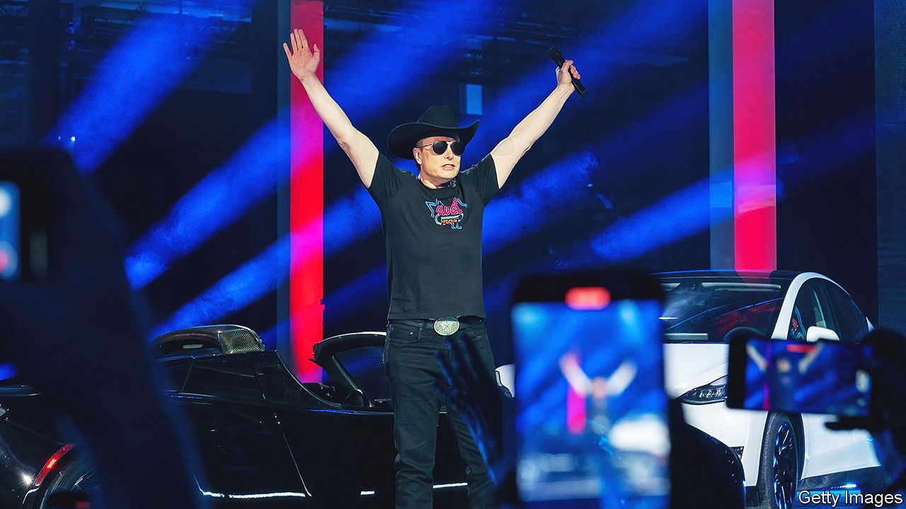

###### Messiah, menace or both?

# Impulsive and self-destructive: Elon Musk as depicted in a new book 

##### The billionaire has a lofty vision for humanity—and is unusually determined to see it through 

 

> Sep 12th 2023 

 By Walter Isaacson. 

WHAT EXACTLY is going on with Elon Musk? This question once preoccupied only techie types. But Mr Musk’s prominence in space-launch services, satellite-internet access, electric cars and social media means that the unpredictable behaviour of the world’s richest man now has global consequences. He controls Donald Trump’s access to Twitter, internet connectivity for Ukraine’s armed forces and America’s ability to send people into space. He has altered the course of multiple industries. And he has a knack for spotting what will be important in the future (so his side bets on brain chips and humanoid robots are probably worth watching). It is no surprise so many people now want to know what makes Mr Musk tick.

Walter Isaacson sets out to answer that question in this intimate biography. Previously a biographer , he shadowed Mr Musk for two years, gaining access to his family and closest confidants, to produce a detailed psychological portrait. 

Born in 1971, Mr Musk had a tumultuous childhood in South Africa. He was brought up partly by a struggling single mother and partly by an abusive father. Violently bullied at school, Mr Musk escaped into daydreams and . As a young man he emigrated, first to Canada, then America. He made his first millions during the dotcom fever of the late 1990s, co-founding an online business directory and then an online bank that, after a merger, . He then set himself the modest goal of turning  into a “multi-planetary species” that could survive extinction on Earth.

It is hard to think of anyone else who has wrought such astounding change in so many different fields of endeavour, notably with SpaceX, his rocket company, and Tesla, a maker of electric cars. Yet Mr Musk is as widely loathed as he is admired, thanks to his pronouncements on politics, his crusade against the “woke mind virus” and his rocky stewardship of Twitter (which for some reason he has renamed X). Mr Isaacson describes a man with a lofty vision for humankind, but who is impulsive, pugnacious and self-destructive.

In Mr Isaacson’s view, Mr Musk is propelled by a conviction that humanity is hurtling towards calamity. Hence his superhuman work ethic (the man barely sleeps) and his tolerance for risk (he has endangered his fortune a number of times and often pushes his engineers to take calculated gambles). Hence, too, his habit of furiously reprimanding or even summarily firing employees whom he deems incompetent or insufficiently committed. 


Mr Musk has faith in his own wisdom. When it comes to artificial intelligence, he believes no one but he can be trusted to protect humans from malevolent machines. He is being drawn into geopolitics, too. Mr Isaacson recounts how, , Mr Musk refused to let Starlink, his satellite-internet service, be used by Ukraine to attack Russian forces occupying Crimea, for fear that an assault on the peninsula might provoke nuclear retaliation. (Ukraine attacked it later, triggering no such response.) 

What transpires is a picture of a driven, talented entrepreneur who has become increasingly unstable and petty even as his influence over global affairs has grown. No doubt other business leaders are capable of unpredictable behaviour—Jobs comes to mind (a comparison the author encourages)—but they have not provided a live feed of their thoughts on Twitter. Lauded as Jobs’s successor, Mr Musk now draws comparisons with a different mercurial billionaire who inspires cult-like loyalty while acting like an aggrieved toddler. 

Has the true Mr Musk emerged, feeling increasingly unconstrained as his wealth and power have grown, or has this behaviour been exacerbated by his use of Twitter? It is probably a bit of both. Mr Isaacson concedes that his subject sometimes behaves foolishly. Mr Musk’s addiction to social media has caused unnecessary spats. He accused a rescue diver in Thailand of being a “pedo guy”, provoking a defamation suit (which Mr Musk won). He declared he had “funding secured” to take Tesla private, when he did not, and had to make a multimillion-dollar settlement with the US Securities and Exchange Commission. As Mr Musk admits: “I’ve shot myself in the foot so often I ought to buy some Kevlar boots.”

In recent years his tweets have lambasted left-wing positions on issues such as gender identity, and flirted with right-wing . This rightward shift can be explained in part, Mr Isaacson says, by a falling-out between Mr Musk and his transgender daughter Jenna, whose Marxist worldview led her to sever ties with her father. Mr Musk’s belief that Twitter had become infected with wokery and was censoring alternative viewpoints was a big factor in his decision to buy it. Mr Isaacson also speculates that the deal gave Mr Musk, scarred by his childhood bullying, a chance to “own the playground”.

All this now risks overshadowing Mr Musk’s positive contributions. Some Tesla drivers tout bumper stickers that read “I bought this car before we all knew Elon was a jerk”. More worryingly, he seems out of his depth in geopolitics. This doorstep-sized book provides a gripping account of Mr Musk’s extraordinary life. But it is hard to escape the feeling that the story of Elon Musk is still only half told. ■


