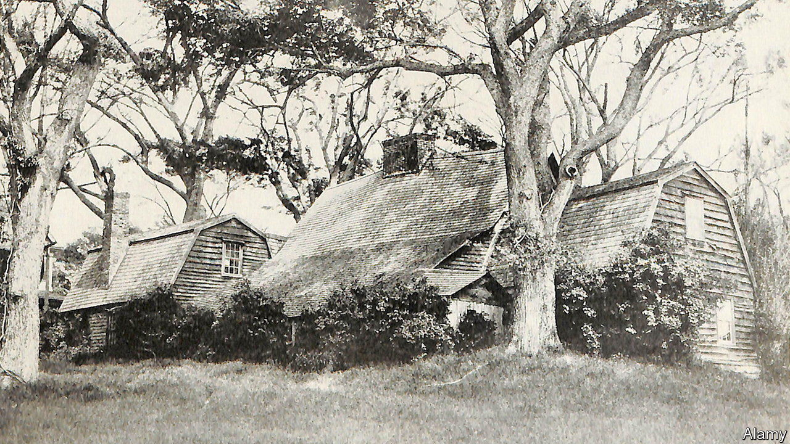

###### Forget me not

# “North Woods”, a new novel, explores the limits of memory 

##### Daniel Mason’s interconnecting stories, set in a single home, span four centuries 

 

> Sep 14th 2023 

 By Daniel Mason. 

Monuments in America are the : people disagree on who should be remembered and how. “North Woods”, an enthralling novel, takes up the issue of what and who are lost to history. Set in a single home, the interconnecting stories span four centuries, tracking generations living in the forests of Massachusetts. 

The book begins with a couple eloping into the “north woods” from a colony in the 1600s. Decades later, a sick woman and her infant captured by Native Americans are brought to the home. The events that immediately follow—which involve poison, axes and guns—evoke a country in conflict. They are the first instances of violence that occur at the home, but not the last. 

Throughout the chapters characters imagine each other but do not understand the people who came before. Only readers have the omniscience to intuit what has occurred across lifetimes. The house is the protagonist, but over the centuries many memorable characters cross its threshold. 

Mr Mason’s previous novel, “A Registry of My Passage upon the Earth”, was a finalist for the Pulitzer prize. In “North Woods” he plays enjoyably with form. Chapters are written as letters, songs, a true-crime story, a lecture to a historical society (echoing the epilogue of Margaret Atwood’s ) and even a real-estate advertisement. 

Having taught psychiatry at Stanford, Mr Mason writes evocatively about mental illness and . He has a naturalist’s eye for detail, such as “the thousand seasons—of frogsong, of thunderheads, of first thaws—that hid within the canonical four”. 

But the bigger point of “North Woods” is how much is forgotten or never known. This resonates at a time when Americans are arguing about what version of history students should be taught. A subplot involves the electric but short-circuited romance of two men, a writer and painter, who are both married to women. Later, their love letters are published and attributed to the writer and his wife—to be remembered as such by future generations. But not by riveted readers. ■


