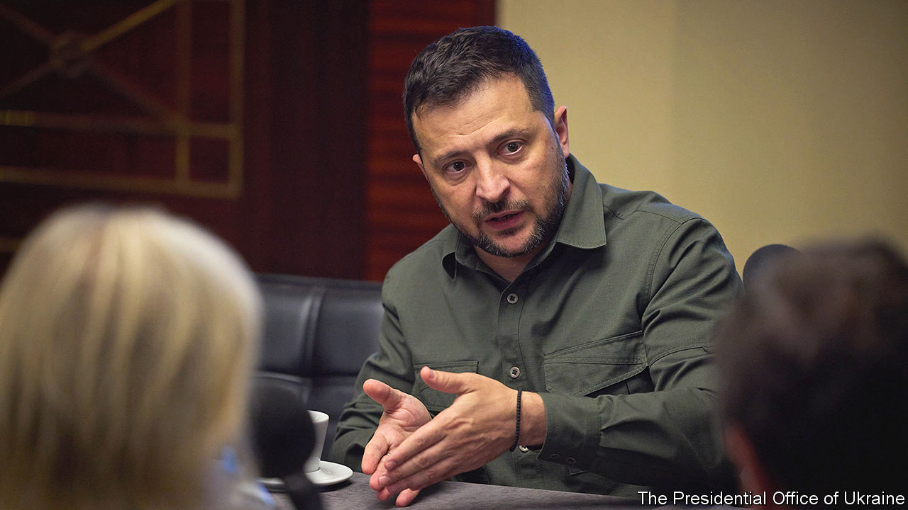
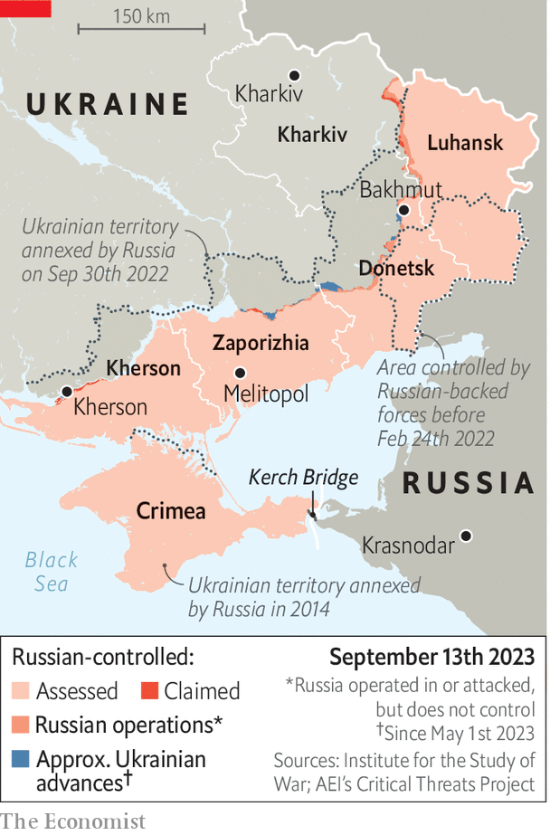

###### Staying the course

# Donald Trump will “never” support Putin, says Volodymyr Zelensky 

##### But Ukraine’s president fears that some of his country’s Western backers are losing faith 

 

> Sep 10th 2023 


VOLODYMYR ZELENSKY does not want to think about a long war, let alone talk about the possibility to Ukrainians, many of whom still dream of winning fast. But that is what he is preparing for. “I have to be ready, my team has to be ready for the long war, and emotionally I am ready,” Ukraine’s president says in an interview with . Speaking on the margins of the YES conference, an international pow-wow in Kyiv, he is composed and sombre. At the same setting a year ago, the mood was euphoric; news of Ukrainian forces’ success in pushing Russia back from the Kharkiv region was pinging on every smartphone in the room. 

This year, the atmosphere is very different. Three months into its counter-offensive, Ukraine has made  along the all-important southern axis in the Zaporizhia region, where it is trying to sever Vladimir Putin’s “land bridge” from Russia to Crimea. The questions of how long that will take, and whether it will succeed, weigh on the minds of Western leaders. They still talk the good talk, pledging that they will stand with Ukraine for “as long as it takes”. But Mr Zelensky, a former TV actor with a keen sense of his audience, has detected a change of mood among some of his partners. “I have this intuition, reading, hearing and seeing their eyes [when they say] ‘we’ll be always with you,’” he says. “But I see that he or she is not here, not with us.” Some partners might see Ukraine’s recent difficulties on the battlefield as a reason to force it into negotiations with Russia. But “this is a bad moment, since Putin sees the same.”

 


Having failed to overwhelm Ukraine quickly, Mr Putin seems determined to exhaust the country and to wear out its partners’ resolve to keep funding and supplying it with arms. He aims to make Ukraine a dysfunctional, depopulated state whose refugees cause problems in Europe. But Mr Zelensky says Russia itself is fragile. Mr Putin “does not understand that in the long war, he will lose. Because it does not matter that 60% or 70% [of Russians] support him. No, his economy will lose.” As Ukraine increases its , Russians will start asking awkward questions about their army’s inability to protect them, “because our drones will land”. 

At the same time, Ukraine’s president is aware of the risks to his country if the West starts to withdraw its economic support. That would damage not just Ukraine’s economy, but its war effort, too. He puts it in stark terms. “If you are not with Ukraine, you are with Russia, and if you are not with Russia, you are with Ukraine. And if partners do not help us, it means they will help Russia to win. That is it.” 

Ukraine’s president has excelled at appealing to Western publics, often over the heads of their politicians. He still believes that the best way “to convince governments, [to make them] believe they are on the right side, is by pushing them via the media. People read, people discuss, people make up their minds and people push,” he says. It was public opinion that drove politicians to increase arms supplies to Ukraine in the early days of the war. Scaling down that help, he argues, may anger not just Ukrainians but Western voters. They will start asking what the whole effort was for. “People will not forgive [their leaders] if they lose Ukraine.” 

If Mr Putin hopes that a win by Donald Trump in America’s presidential election in 2024 would deliver him military victory, he is mistaken. Trump would “never” support Vladimir Putin. “That isn’t what strong Americans do.” He expects Joe Biden will stay the course if he is re-elected. (“Do they want Afghanistan, part two?”) And he hopes that the European Union will not only keep supplying aid, but will open negotiations over the accession process for Ukraine this year. (That is widely expected to happen at a summit in December.) “It will support morale in Ukraine. It will give this energy to people.”

Keeping morale high is crucial. This is why, Mr Zelensky says, even limited progress on the front line is essential. “Now we have movement. It’s important.” After heavy initial losses, and hastily adapted tactics, Ukrainian soldiers have finally pierced the first of Russia’s three main defensive lines in the Zaporizhia region. A big breakthrough can still come, Mr Zelensky insists: “If we push them from the south, they will run.” 

On the counter-offensive’s secondary front, near the eastern town of Bakhmut, Ukrainian forces are also slowly taking back territory. “During the first days of the full-scale war, we kept being pushed back. Each day. They took some cities, hundreds of villages,” he says. Now, Ukrainian forces are crawling forward. But troops face a Herculean task to turn advances along either axis into a strategic breakthrough. 

In answer to Western complaints about the offensive’s slowness, Mr Zelensky says it reflects the extreme level of danger. Winning back territory needs to be balanced with preserving as many lives as possible. Soldiers need to reduce the risks: to carry out reconnaissance, to use drones, to avoid direct clashes. Ukraine would have lost “thousands” had it followed advice to commit many more troops, he says. This is not the sort of war where “the leader of a country says the price doesn’t matter.” That is the difference between him and Vladimir Putin. “For him, life is nothing.” 

After months of building up expectations for the counter-offensive, Mr Zelensky is adjusting his message to reality. Victory will not come “tomorrow or the day after tomorrow”, he says. But it is not some fantastical dream. Ukraine deserves to win, and the West should back it. The Russian army is losing “lots of people’‘ and redeploying its reserves to stop the Ukrainian advance, he says: “It means they lose.”

Tapping loudly on the table, Mr Zelensky rejects outright the idea of compromise with Vladimir Putin. War will continue for “as long as Russia remains on Ukrainian territory”, he says. A negotiated deal would not be permanent. The Russian president has a habit of creating “frozen conflicts” on Russia’s borders (in Georgia, for example), not as ends in themselves but because his goal is to “restore the Soviet Union”. Those who choose to talk to the man in the Kremlin are “tricking themselves”, much like the Western leaders who signed an agreement with Hitler at Munich in 1938 only to watch him invade Czechoslovakia. “The mistake is not diplomacy. The mistake is diplomacy with Putin. He negotiates only with himself.” 

Curtailing aid to Ukraine would only prolong the war, Mr Zelensky argues. And it would create risks for the West in its own backyard. There is no way of predicting how the millions of Ukrainian refugees in European countries would react to their country being abandoned. Ukrainians have generally “behaved well” and are “very grateful” to those who sheltered them. They will not forget that generosity. But it would not be a “good story” for Europe if it were to “drive these people into a corner”. 

Meanwhile, a long war of attrition would mean a fork in the road for Ukraine. The country would lose even more people, on the front lines and to emigration. It would require a “totally militarised economy”. The government would have to put that prospect to its citizens, Mr Zelensky says; a new social contract could not be the decision of one person. Almost 19 months into the war, the president says he is “morally” ready for the switch. But he will only broach the idea with his people if the weakness in the eyes of his Western backers becomes a “trend”. Has that moment come? No, not yet, he says. “Thank God.” ■

