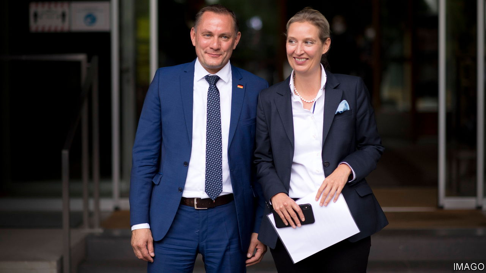
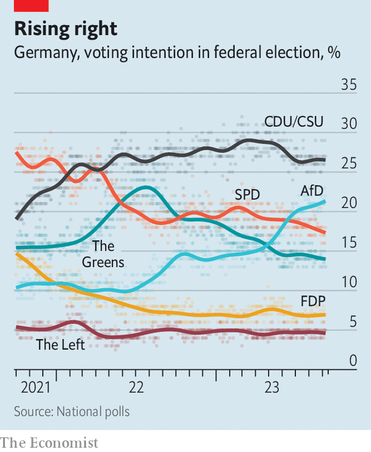

###### Running with wolves

# Germany’s rampant hard-right AfD puts other parties in a fix 

##### Co-operate or shun? 

 

> Sep 14th 2023 

September 10th was a good day for Jörg Prophet, but not a great one. Opinion polls had promised that the trim 61-year-old engineer might win in the first round and romp home as the new mayor of Nordhausen, a quiet town of 42,000 in the lee of the rolling Harz Mountains in eastern Germany. Instead he got 42% of the vote, more than any challenger but short of a majority. Now, in a run-off, Mr Prophet may find all the opposing stripes united to keep his Alternative for Germany (AfD) out.

That would be no surprise to the hard-right party. Founded in 2013, the AfD has struggled to turn the liking of many Germans for its folksy fear-mongering into actual political power. The party’s popularity surged in 2016 as conservatives recoiled against an influx of Syrian refugees. But in the absence of another emotive issue it then plateaued at around 10%, enough to keep AfD deputies in state and national assemblies with proportional representation, but not to win local elections . 

 


Its prospects have brightened since last year. National polls show a doubling of support, to over 21%. That puts the AfD just behind the right-of-centre Christian Democratic Union (CDU) but ahead of all three parties—Social Democrats, liberal Free Democrats and the Greens—in Germany’s ruling coalition. In four of the five states that once made up East Germany, including Thuringia, where Nordhausen lies, the AfD is now number one.

Three of these four states will hold elections next year, and this could put the AfD in power at state level for the first time. Its rising popularity is already bringing results on the ground. The party won its first two local elections this summer. Yet as Mr Prophet now worries, too much success can also hurt. In August the AfD lost another local race precisely because opposing voters united to block its candidate. 

That is no comfort to its rivals, and particularly not to the CDU. The party that put an East German, Angela Merkel, into the chancellor’s office for 16 years has been slowly sinking on her home turf. Its candidate in Nordhausen trailed in 4th place, at 11.2%. The reality is that the CDU now needs coalition partners to remain relevant. Not surprisingly, a growing number of its supporters whisper that it should lower the “firewall” against dealing with the AfD that all of Germany’s mainstream parties have so far voluntarily maintained. At the very least, they suggest, the CDU could start to work out quiet deals to accept the AfD’s support. The alternative, cobbling together alliances with Greens and others that are even more unpopular in the east, would hurt the party more. 

Gunnar Lindemann, one of 17 AfD deputies in Berlin’s 159-member local assembly, knows why the CDU is lagging. Voters have not shifted further right, says the rotund 53-year-old, who hosts a YouTube cookery show in his spare time. It is the mainstream that has shifted left. “The AfD is no different from the CDU in the 60s or 70s,” he says, noting that West German conservatives used to call for restoring Germany’s 1937 borders—that is, for annexing bits of what are now Poland and Russia. Even East Germany’s ruling socialists were more conservative on immigration than today’s CDU, he says approvingly: foreigners could come to study or work, but then had to leave. Mr Lindemann says there have indeed been talks between other parties and the AfD, and thinks it a matter of time before these are out in the open.

He may be right, but there are barriers to be crossed. Mr Lindemann tends to shy away from big issues and focus on local concerns such as schools and public safety. The AfD’s top leaders are not so squeamish. Their language is often Trumpian. Germany is being “wrecked” by “the most idiotic government ever”. A new law to replace gas and oil boilers with electric heat pumps is “green fascism”. The EU is so rotten that it must “die” in order to “save” Europe.

Worse than the fake outrage is the party leadership’s flirtation with Germany’s darker side. A former chairman, Alexander Gauland, revealingly dismissed the Nazi era as “a speck of birdshit on German history”. Alice Weidel, one of its two current heads, recently said that she stayed away from a party at the Russian embassy marking the end of the second world war, unlike the AfD’s Russophile co-leader Tino Chrupalla (pictured, with Ms Weidel), not in solidarity with Ukraine but because it was inappropriate “to celebrate the defeat of one’s own country”. Björn Höcke, the Thuringia party chief, was charged on September 13th with the alleged use of a banned Nazi slogan. Knife-murderers walk while patriots go to court for an out-of-context phrase, he tweeted back, in a well-worn allusion to supposedly violent immigrants. 

Surveys show most Germans would not consider voting for the AfD. Among those who would, loyalty can be flimsy. One recent poll suggests that if Sahra Wagenknecht, a radical-left anti-war activist, formed a party, perhaps a quarter of AfD supporters would switch over to her. Polling also suggests that it is less ideology than noise on hot topics that wins the AfD support. Its numbers shot up by 50% in mid-2022 as the party raised fears of hyperinflation, of a Russian nuclear strike or of an energy crunch that would strangle German industry. Support then flatlined until this spring, when the ill-timed heating bill offered a nice new punch-bag. 

On the tidy streets of Nordhausen, AfD voters tend to shun journalists. A volunteer at a fundraiser for a local theatre is less shy. “People vote for them because they can’t be bothered to do something useful like this,” she says, gesturing at a trestle table heaving with cakes and flyers. “They just sit around and complain to each other, and think they are so smart.” ■

