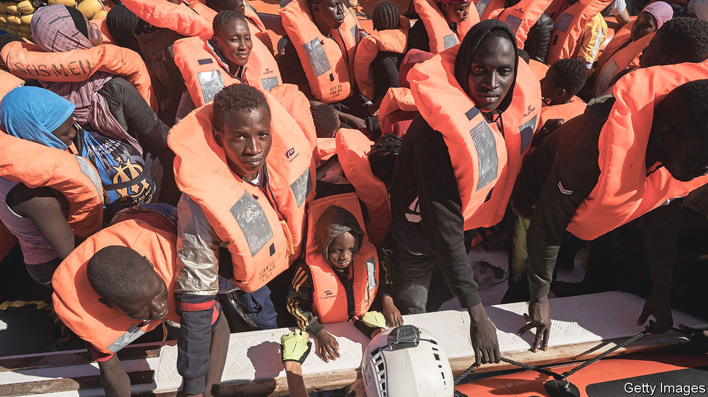

###### Help wanted

# Italy needs more migrants, but has trouble admitting it 

##### Under Giorgia Meloni irregular immigration has increased 

 

> Sep 14th 2023 

Francesco Lollobrigida, Italy’s agriculture minister, is seen as one of the most radical ministers in the hard-right government headed by his sister-in-law, Giorgia Meloni. In April opposition politicians accused him of propagating white supremacism after a speech in which he seemed to endorse a conspiracy theory that claims global capitalists are conniving to replace Europeans with poor immigrants so as to suppress wages. Yet three months later Mr Lollobrigida said something few if any of his more liberal cabinet predecessors have dared to say publicly. “We need immigration,” he told a youth convention.

And how. The number of births In Italy last year, 393,000, was the lowest ever recorded. Already, a big gap has opened up in the labour market: a survey of employers for Italy’s chambers of commerce found they expected to have 531,000 vacancies this month, but thought almost half could remain unfilled, largely because of a lack of applicants. That in turn slows growth. 

Ms Meloni faces two difficulties tackling these challenges. The first is Matteo Salvini, her coalition ally and leader of the League (previously called the Northern League). Struggling to recover the support he has lost to Ms Meloni’s Brothers of Italy party, he has pressed for more drastic measures against irregular immigration like those he adopted, and which earned him great popularity, as interior minister from 2018 to 2019. He had doubtless hoped that, as the minister in the present government responsible for ports, he could impose such measures himself. But last month Ms Meloni handed the entire immigration portfolio to Alfredo Mantovano, a junior minister in the prime minister’s office.

Ms Meloni’s second problem is that she and her followers are caught in a web of their own making. It comprises earlier undertakings and enduring anti-foreigner prejudice. Until last year, the Brothers advocated a naval blockade of North Africa. In July Mr Lollobrigida outlined the party’s way of reconciling this with the realities it now faces: immigration had to be legal, he said, “And the best way to have it is to combat the illegal kind.”

Since 1998, Italy has permitted a trickle of legal immigration from outside the EU. The club’s rules mean movement within the EU is not controlled at all, but neither kind is enough to meet the economy’s needs. On July 19th the cabinet agreed to increase the number of legal arrivals this year by 66%, to 136,000, and to keep boosting the number over the next two years. By 2026 452,000 people will have been given leave to enter Italy by its most conservative government since the second world war. Even so, the number of legal entrants will be barely half the authorities’ estimate of how many are needed. 

That makes the other half of the government’s immigration policy seem contradictory, if not downright cruel. The government has restricted the time NGO ships can spend rescuing migrants in the Mediterranean by forcing them to deliver their human cargoes to ports in the north. It has also collaborated with the EU on a deal whereby Tunisia will get €1bn in return for curbing departures from its shores. Since it was struck, hundreds of sub-Saharan Africans have reportedly been expelled from Tunisia and dumped in the Sahara without food or water in temperatures of more than 40°C (104°F). At least 27 have died.

Yet none of this has made a difference. By the end of August, 114,589 people had reached Italy by sea this year—only slightly fewer than the 115,068 who had arrived at the same point in 2016, the peak year so far. That presents Ms Meloni with yet another headache. She, her allies and the conservative media have for years sought to persuade Italians that migration from Africa (which by no means accounts for all of Italy’s irregular immigration) is a dire threat. The government’s response to rising seaborne arrivals this year was to declare a national state of emergency. The parties of the right have also won power by convincing a large part of the electorate that they alone can hold back the tide. Between now and the European elections next year, Ms Meloni needs to find a way to explain why they cannot. ■

