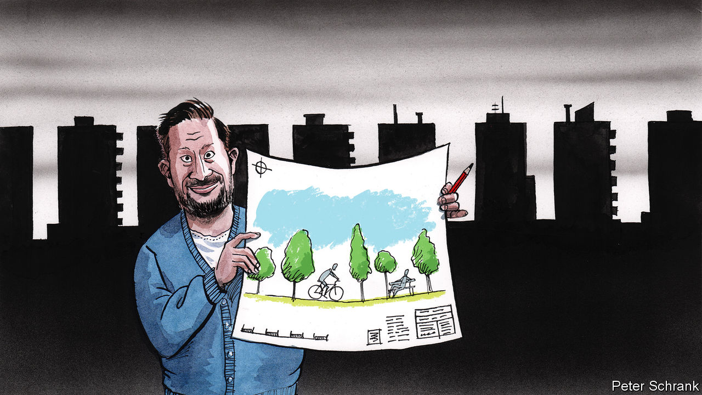

###### Charlemagne

# Meet Matus Vallo, Bratislava’s hipster mayor-architect 

##### Can better public spaces revolutionise the way we live? 

 

> Sep 14th 2023 

In the manner of a child rebuilding an unloved Lego set, Matus Vallo ponders a model of a Bratislava streetscape in a corner of his office. Carefully, he positions a rectangular plate the width of his palm on a section of highway that has run through the capital of Slovakia since the 1970s. Just like that, a park over 200 metres long, suspended above the road, has eradicated a traffic-laden scar in the heart of the city. The transformation seems fanciful, an urban planner’s daydream. To turn it into reality would require the combined talents of an architect, a civic activist and a popular mayor. By some fluke Mr Vallo happens to be all three—and the answer to the question: what happens when an expert in building public spaces gets given the reins of a European capital?

To run a city requires a plethora of political talents, from baby-kissing to haggling with central government for more funding. Mr Vallo brings different skills to the job. In 2018, as an architect with a thriving practice, the self-described “urban activist” rode a wave of political discontent into office (he had previously been more famous as the bass player for a popular rock band). His pitch to the citizens of Bratislava focused on the need to improve the look and feel of the place. “If you design better public spaces, you change the relationship residents have with a city, but also with each other,” he explains. A metropolis where children start walking to school, or locals meet at new outdoor cafés, is one whose fabric changes in untold ways. Mere politicians think residents shape the built environment to suit their lifestyle. It takes an architect to think it is the built environment that shapes its residents.

With his trendy beard, sneakers tied with fluorescent shoelaces and fold-up Brompton bike, the 45-year-old exudes metropolitan hipster idealism. The city needs it. Though blessed with a delightfully pretty Old Town at its centre—including a neoclassical mayoral palace where Mr Vallo works—Bratislava endured decades of communist architectural drabification. After 1989, property developers did their best to make capitalism look even worse; uninspiring office towers went up alongside uniform shopping malls. Indifferent management by mayors using the town hall as one more step on their career paths hardly helped. In time the city was not only missing the cycle lanes and pleasant outdoor spaces found in other European capitals: it had no soul, no sense of itself. 

One design decision at a time, that is being rectified. Some schemes championed by Mr Vallo are hard to miss. The city’s Freedom Square had long been dominated by a forbiddingly monumental fountain, better to take up space the communist authorities feared might one day be filled by protesters. A clever redesign inaugurated this summer turned the fountain into an inviting aquatic playground where kids can splash around. Part of the city’s embankment is being turned over to cyclists. Parking charges have become the norm, annoying car users but giving more public space to wheelchairs and prams (perhaps not coincidentally, Mr Vallo became a dad while in office). A crusade against “visual smog” has resulted in hundreds of garish billboards being cleared.

But the mayor reserves his capacity for excitement—no politician bar Donald Trump uses the word “fantastic” quite so freely—for subtler improvements to his city. As streets get rebuilt, grey asphalt is being replaced by light-hued paving stones featuring patterns commissioned by the town hall. Few guests to Mr Vallo’s office have been spared mayoral tirades extolling this design, your columnist included. There is new street-lighting and hundreds of stylish park benches worthy of further mayoral gushing. In most cities decisions on how such things should look are taken haphazardly. In Bratislava these days a coherent vision is applied from the top. A slew of architectural manuals lying on the mayor’s desk explain to city staff what traffic islands should look like from now on, or the apparently Platonic ideal of a Bratislava flower bed. Street by street, a theme is emerging. 

Mr Vallo has done two clever things. The first was to prepare for the job. For two years before he won office, he led a “collective” of around 70 like-minded creative types to devise “Plan Bratislava”, a sort of blueprint for fixing its problems, now being enacted. The second was simply to pinch what the world’s well-run cities have already done. Some of Mr Vallo’s best ideas are proudly filched: the cycling embankment from Paris, those stylish benches were first seen in Prague, and so on. “You don’t need to experiment if other cities have made the mistakes for you,” he says. Mr Vallo’s stints living in Rome (as the son of a diplomat), London (for work) and New York (a Fulbright scholarship at Columbia) no doubt helped. In New York he fell under the spell of Mike Bloomberg, the three-term mayor. Now Bratislava is tapping the billionaire’s philanthropic arm for advice on how world-class cities are administered. 

Bratislava, mon amour

Mr Vallo is palpably frustrated at the pace of change. Cycle lanes take ages to build; the road-replacing park he toys with in his office remains elusive—though Mr Vallo insists it will happen. Covid slowed down many schemes. No matter: he was re-elected with over 60% of the vote last year. That may prove a political high point. Robert Fico, a Kremlin-loving populist who was swept out as prime minister by the same wave that brought in Mr Vallo five years ago, is leading the polls ahead of national elections on September 30th. That might leave Mr Vallo as an isolated liberal mayor in a country drifting to extremes. Such is the lot of many of his peers these days in illiberal central Europe: the mayors of Bratislava, Budapest, Prague and Warsaw have even formed a “pact of free cities”. The quartet travelled together to Kyiv in January. 

It would take decades of relentless Vallo-ism for Bratislava to turn into Vienna, its stunning neighbour just 55km away. Fans of the city swear it is like Berlin a generation ago, the up-and-coming city then undiscovered by the masses. There is much to do to get there, but nearly as much enthusiasm to keep at it. ■


