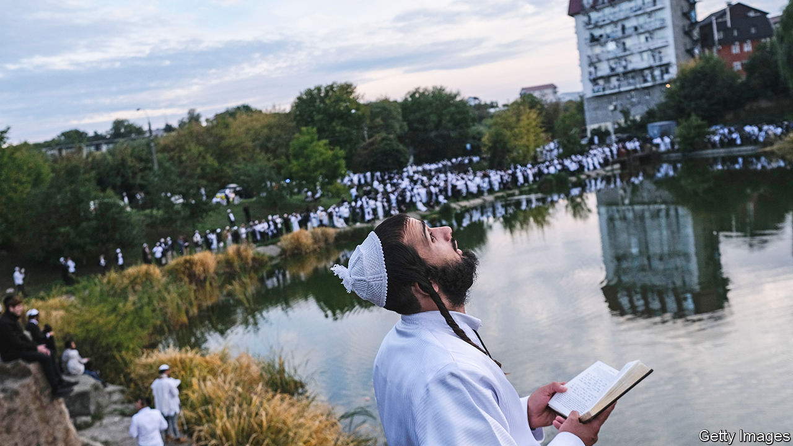

###### Not so Nazi

# Ukraine’s small Jewish community is thriving 

##### After centuries of discrimination Jews are proud to be Ukrainian 

 

> Sep 11th 2023 


NOTHING RUSSIA can throw at them will deter tens of thousands of mostly foreign Jews from making their annual pilgrimage to the Ukrainian town of Uman, 200km south of Kyiv, this week. Rosh Hashanah, the Jewish new year, falls on September 15th-17th, and the visitors will mark it by praying at the grave of Nachman of Breslov, a rabbi who founded an important branch of Hasidism over 200 years ago. Despite the war, Jewish-Ukrainian relations are enjoying something of a golden era.

For a start, Ukraine’s president, Volodymyr Zelensky, is Jewish. That fact is “very disturbing” for the Kremlin, says Rabbi Moshe Azman in Kyiv. It exposes its stated war aim of “de-Nazifying” Ukraine as nonsense. Still, Vladimir Putin persists in repeating it. On September 5th Russia’s president went into full conspiracy mode, saying that Mr Zelensky had been put in his position by his “Western curators” and that this made “the whole situation extremely disgusting, in that an ethnic Jew is covering up the glorification of Nazism.”

Last year, one day before the invasion, Kharkiv’s Jewish school celebrated its 30th anniversary. A few days later it was damaged in a Russian attack; a nearby yeshiva, or religious college, suffered a direct hit. “Our schools aren’t able to function because rockets are hitting them,” says Miriam Moskovitz, director of the school. “It is nothing to do with Nazis.”

Before the second world war, Jews were a large minority in the lands that now comprise Ukraine; 1.5m of them were to perish in the Holocaust. Tens of thousands of Ukrainian auxiliaries helped the Germans commit this crime, though more than 7m fought the Nazis as troops in the Red Army.

For older Jews the name Ukraine is almost synonymous with the word “pogrom”. National heroes of Ukraine like Bohdan Khmelnytsky, a 17th-century Cossack commander, are remembered by Jews as responsible for the deaths of thousands. Today many Ukrainians revere Stepan Bandera, whose followers fought the Red Army after 1944. They know, or choose to know, little about the murder of Poles and Jews at the hands of Bandera’s followers.

In the past Ukrainians often blamed Jews for everything, including the hardships of communism. Now, says Yevhen Hlibovytsky, a founder of pro.mova, a think-tank, anti-Semitism is fading; so is Jewish fear of Ukrainians. “The generation of those who grew up in the Soviet Union reflected a lot of the anti-Semitism that the Soviet Union practised. My generation is much freer of that and the generation of my children treats ethnic and religious diversity as normal.”

The Pew Research Centre, an American institute, has found that Ukrainians are among the least anti-Semitic people in Europe. One of its polls found that just 5% of Ukrainians said they were not prepared to accept Jews as fellow citizens. That compared with 14% in Russia, 18% in Poland and 16% in Greece.

No one knows exactly how many Jews are left in Ukraine, and anyway the numbers depend on who counts as one. In 1989 the “core” Jewish population—those who identify as fully Jewish—was 487,000, according to the London-based Institute for Jewish Policy Research. Most emigrated after the disintegration of the Soviet Union, leaving an estimated 43,000 by 2021. (Tallies that use broader definitions go above 200,000.)

In Dnipro, in central Ukraine, families identifiable as Orthodox by their clothes can be seen in the streets around the Menorah Centre, a building that houses a Jewish museum, kosher hotels, a kosher shop and a synagogue. Men in uniform sporting kippahs smoke outside. Some of Ukraine’s Jewish soldiers were born or brought up in Ukraine before emigrating to Israel. Now they have returned to fight.

An huge change for Ukraine’s Jews in the past three decades has been that of identity. For many years after the second world war most Jews in Ukraine spoke Russian and identified as Soviet Jews. Now, those who remain identify as Ukrainian Jews. Jewish prayer books are being translated into Ukrainian for the first time. 

In Ukraine today, Russians are the enemy. It is increasingly common to hear Israel, a thriving economy surrounded by enemies, cited as a model for Ukraine’s future. Yet although Jews in Ukraine have never been freer from anti-Semitism, one deep-seated fear remains. If things go badly wrong in the war, runs the argument among some, Mr Zelensky’s heritage could become a lightning rod for renewed anti-Semitism, with Jews being blamed for Ukrainian defeats. One more reason for them to pray for victory. ■

