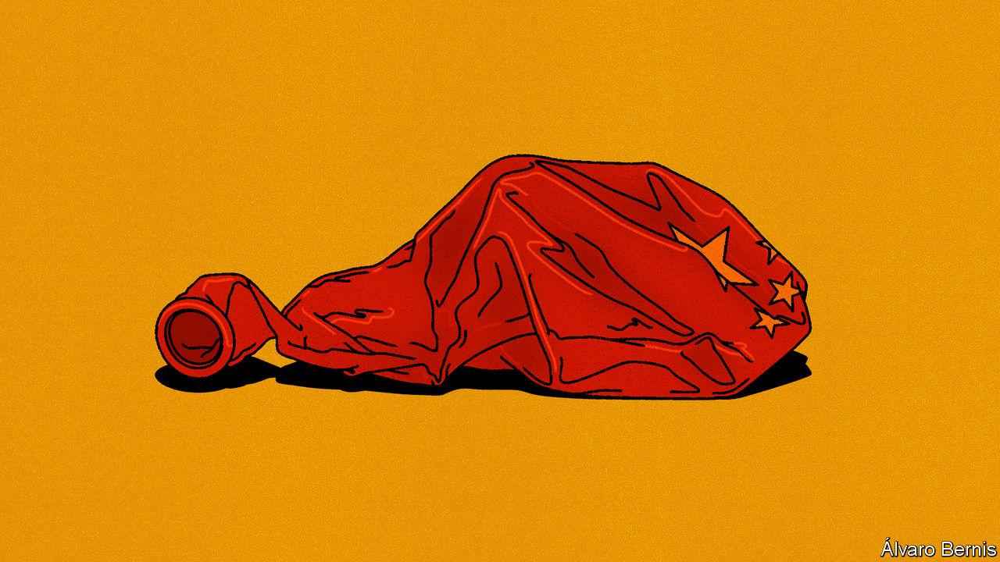

###### Free exchange

# Does China face a lost decade? 

##### Xi Jinping has the tools to escape Japan’s fate. He should use them 

 

> Sep 10th 2023 

“Ever since the Chinese housing bubble burst,” said Richard Koo of the Nomura Research Institute in a recent talk, “I’ve been getting tons of calls from Chinese journalists, economists, investors and sometimes policymakers asking me, ‘Are we going the way of Japan?’”

Mr Koo is a good person to ask: he has devoted his career to studying the aftermath of financial excess. When the American economy’s recovery from the first Gulf war faltered in 1991, his then boss at the New York Federal Reserve, Edward Frydl, began to worry about an overhang of debt and commercial property. This was “feeding a pervasive financial and economic conservatism among businesses and consumers”, Frydl argued. Demand for credit was subdued, because firms were “directing their efforts towards balance-sheet restructuring”. To describe these strains, he coined the term “balance-sheet recession”. 

Mr Koo later realised that Japan was suffering from the same overhangs, only far worse. After its stockmarket bubble burst in 1989, share prices plunged by 60% in less than three years. Property prices in Tokyo fell for over a decade. Deflation, by some measures, persisted even longer. Even the price of golf-club memberships—tradable on organised exchanges in Japan—tumbled by 94%. Many companies, which had borrowed to buy property or shares in other firms, found themselves technically insolvent, with assets worth less than liabilities. But they remained liquid, earning enough revenue to meet ongoing obligations. With survival at stake, they redirected their efforts from maximising profit to minimising debt, as Mr Koo put it. 

In a healthy economy, corporations use funds provided by households and other savers, ploughing the money into expanding their businesses. In post-bubble Japan, things looked different. Instead of raising funds, the corporate sector began to repay debts and accumulate financial claims of its own. Its traditional financial deficit turned to a chronic financial surplus. Corporate inhibition robbed the economy of much-needed demand and entrepreneurial vigour, condemning it to a deflationary decade or two. 

So is China going the way of Japan? Chinese enterprises have accumulated even more debt, relative to the size of the country’s gdp, than Japan’s did in its bubble era. China’s house prices have begun to fall, damaging the balance-sheets of households and property firms. Credit growth has slowed sharply, despite cuts in interest rates. And flow-of-funds statistics show a narrowing in the financial deficit of China’s corporations in recent years. In Mr Koo’s judgment, China is already in a balance-sheet recession. Add to that a declining population and a hostile America and it is easy to be gloomy. Perhaps Japan is a best-case scenario.

Look closer, though, and the case is less conclusive. Much of the debt incurred by China’s corporations is owed by state-owned enterprises that will continue to borrow and spend, with the support of state-owned banks, if required by China’s policymakers. Among private enterprises, debt is concentrated on the books of property developers. They are reducing their liabilities and cutting back on investment in new housing projects. But in the face of falling property prices and weak housing sales, even developers with robust balance-sheets would be doing the same.

The end of China’s property boom has made households less wealthy. This is presumably breeding conservatism in their spending. It is also true that households have repaid mortgages early in recent months, contributing to the sharp slowdown in credit growth. But surveys show that households’ debts are low relative to their assets. Their mortgage prepayments are a rational response to changing interest rates, not a sign of balance-sheet stress. When interest rates fall in China, households cannot easily refinance their mortgages at the lower rates. It therefore makes sense for them to repay old, relatively expensive mortgages, even if that means redeeming investments that now offer lower yields.

What about the switch in corporate behaviour revealed by China’s flow-of-funds statistics, which show the corporate sector moving to a financial surplus? This narrowing is largely driven by the crackdown on shadow banks, point out Xiaoqing Pi and her colleagues at Bank of America. When financial institutions are excluded, the corporate sector is still demanding funds from the rest of the economy. Chinese businesses have not made the collectively self-defeating switch from maximising profits to minimising debts that condemned Japan to a deflationary decade. 

Japanese lessons

These differences show that China is not yet in a recession akin to Japan’s. And Mr Koo is himself keen to emphasise one “huge” difference between the two countries. When Japan was falling into a balance-sheet recession, nobody in the country had a name for the problem or an idea of how to fight it. Today, he says, many Chinese economists are studying his ideas. 

His prescription is straightforward. If households and firms will not borrow and spend even at low interest rates, then the government will have to do so instead. Fiscal deficits must offset the financial surpluses of the private sector until their balance-sheets are fully repaired. If Xi Jinping, China’s ruler, gets the right advice, he can fix the problem in 20 minutes, Mr Koo has quipped.

Unfortunately, Chinese officials have so far been slow to react. The country’s budget deficit, broadly defined to include various kinds of local-government borrowing, has tightened this year, worsening the downturn. The central government has room to borrow more, but seems reluctant to do so, preferring to keep its powder dry. This is a mistake. If the government spends late, it will probably have to spend more. It is ironic that China risks slipping into a prolonged recession not because the private sector is intent on cleaning up its finances, but because the central government is unwilling to get its own balance-sheet dirty enough. ■


