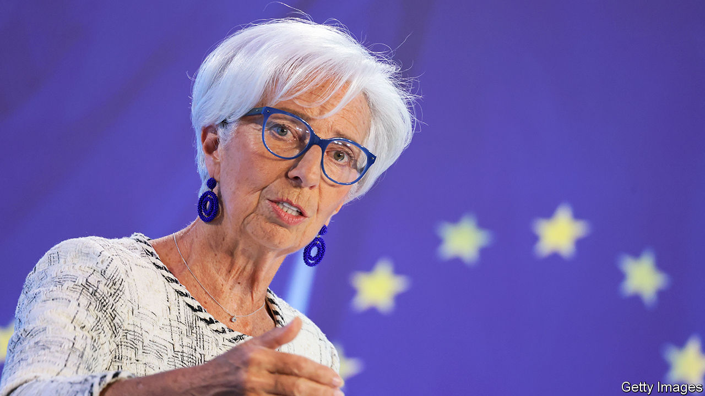

###### Whatever it wants

# Has the European Central Bank become too powerful? 

##### From monetary policy to geopolitics to climate change, its responsibilities are growing 

 

> Sep 13th 2023 

“Nothing is possible without people. Nothing is lasting without institutions,” noted Jean Monnet, one of the European Union’s founding fathers. The growth of the European Central Bank (ecb) from humble beginnings, as the guardian of a nascent currency, to one of the great powers in European politics might have surprised even the master technocrat himself. Having recently turned 25, the institution is so mighty that it now faces a tough question. Does it know when to stop?

The ecb is unique in that it has no political overlord or fiscal counterpart. Its independence is enshrined by treaty, the closest the eu has to a constitution. Its mandate puts price stability front and centre. In a second part policymakers are instructed “to support the general economic policies of the eu”, which include growth and employment, in a manner similar to the dual mandate of the Federal Reserve, but may also be stretched to take in climate policies or “de-risking” relations with China.

Throughout the ecb’s history, its officials have assumed additional responsibilities. In many cases they were forced to do so. In the midst of market turmoil during the sovereign-debt crisis of the early 2010s, Mario Draghi, then the bank’s president, calmed investors by promising to do “whatever it takes” to protect the euro. During covid-19 and under Christine Lagarde, the current president, the ECB bought €1.7trn ($2trn) in public debts to arrest doubts about euro-zone governments’ liquidity. She followed this up by announcing another bond-buying programme last year, when inflation threatened to send interest rates on Italian bonds soaring.

In all but name, then, the ecb has become the lender of last resort to euro-zone governments. The bank is at pains to stress that its bond-buying programmes come with strings attached. Indeed, in order to sidestep the treaty’s ban on financing governments, officials must combine a monetary-policy justification with adherence to the eu’s fiscal rules and the need for sustainable debt. As such, “ecb lawyers have to be among the most innovative in the world,” says Sander Tordoir of the Centre for European Reform, a think-tank. Rather than governments leaning on the central bank to help out, as can happen elsewhere in a crisis, the ecb enforces “macroeconomic reasonability”, as Francesco Papadia, a former ecb official, puts it. 

Geopolitics is now pushing the ecb into a still more sensitive role. Take swap lines. The bank decides whether to set them up. If European banks urgently need dollars, for example, the ecb could swap euros for the currency with the Fed. Of the two large non-euro eu members, Poland benefits from a limited swap line with the ecb; Hungary does not. “Whether Ukraine, for example, gets [one] should be a joint decision with finance ministers, and not the ecb’s alone,” argues Shahin Vallée of the German Council on Foreign Relations, another think-tank. Similarly, the ECB is a powerful voice in a debate about what should happen to Russia’s frozen central-bank assets, preferring to leave them untouched. It also objects, on legal grounds, to attempts to rechannel some imf special-drawing rights, which can be used as foreign-currency reserves, to development banks.

Yet the ecb is not just responding to events. This can be seen in its promotion of the euro—something for which its mandate does not explicitly call. As Ms Lagarde recently told : “If there is more trade in euros, we need to provide the liquidity supporting that trade. An international euro is a force for stability.” One way in which the bank is planning to boost the euro is through a digital currency, which may help facilitate international transactions. It has gone further than the Fed, which is nowhere near to issuing one and is more worried about political approval. 

Climate change is another area where the ecb is playing a role. As the eu’s main banking supervisor, it must assess emerging risks. “It is no longer controversial that the climate crisis translates into financial risk, and is thus squarely within our mandate,” says Frank Elderson of the ecb’s executive board. The results of an ecb climate stress test, published on September 6th, show that a faster energy transition will lower banks’ credit risks in the medium term. Thus green thinking will increasingly inform the ecb’s risk management, bond-buying and collateral policies.

Ms Lagarde argues more could be within the bank’s mandate: “All European bodies, from the European Parliament to member states, are committed to the Paris Agreement’s climate targets.” One policy being debated is a green version of the ecb’s targeted-lending operations. These have been employed so far as monetary-policy tools, encouraging financial institutions to lend to companies and households. Taking green considerations into account when handing out cash would mean the bank conducts outright climate policy, which would go beyond anything the Fed would consider doing. 

The danger in all this is that the ecb does too much. There is no desire among national governments to put the bank on a leash. Indeed, it may offer a way to achieve things that politicians cannot, for fear of public backlash. Perhaps aware of its increasing power, countries are nominating former politicians to the ecb’s governing council. The president herself was previously France’s finance minister; Luis de Guindos, the bank’s vice-president, was Spain’s. Yet the more the ecb ventures into controversial areas, the greater the risk its legitimacy is eroded. For the moment, both politicians and central bankers are happy. Will citizens one day start to object? ■


