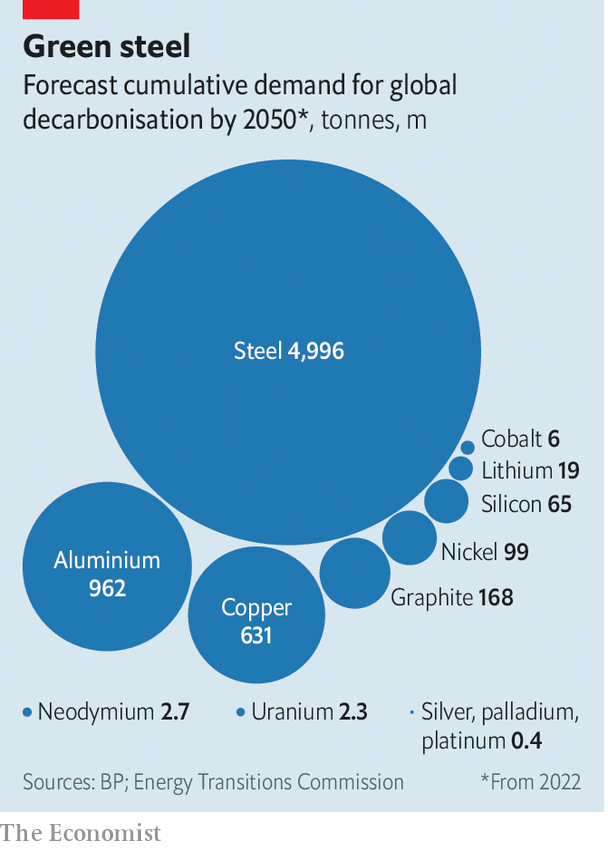

###### Keep digging

# How to avoid a green-metals crunch 

##### With ingenuity, a 6.5bn-tonne problem may be dodged 

 

> Sep 11th 2023 

Everyone wants more metals. In recent months Britain has inked a deal with Zambia, Japan has sealed one with Namibia and the eu has shaken hands with Chile. The bloc’s negotiators also started talks with the Democratic Republic of Congo; America’s, meanwhile, visited Mongolia. This scattershot campaign, which is also targeting the Philippines and Saudi Arabia, has a single aim: obtaining the minerals required for rapid decarbonisation.

Seventy-two countries, accounting for around 80% of global emissions, have committed themselves to net-zero targets. According to the Energy Transitions Commission (etc), a think-tank, hitting them by 2050 will require 15 times today’s wind power, 25 times more solar, a tripling of the grid’s size and a 60-fold increase in the fleet of electric vehicles (evs). By 2030 copper and nickel demand could rise by 50-70%, cobalt and neodymium by 150%, and graphite and lithium six- to seven-fold. All told, a carbon-neutral world in 2050 will need 35m tonnes of green metals a year, predicts the International Energy Agency, an official forecaster. Adding aluminium and , the etc expects demand between now and then to exceed 6.5bn tonnes. 

This is why policymakers fear an almighty supply crunch. The etc expects shortages of market-breaking magnitudes by 2030: some 10-15% for copper and nickel, and 30-45% for other battery metals. When dwindling stocks cause prices to rise, producers will lift output and customers will use scarce materials more efficiently. What demand remains unmet after this will be destroyed, however, as would-be buyers that cannot or will not pay higher prices are forced from the market. Too much of such demand destruction will kill the green transition. The question, then, is simple. Can the crunch be minimised?

Start by considering the metals in question. Three are widely used in industry: aluminium and steel for panels and turbines, and copper for everything from cables to cars. Then come those powering evs: cobalt, lithium and nickel, which make up battery cathodes, and graphite, the main anode element. Except for nickel, which is also an ingredient in stainless steel, all these have only niche applications. The last group features magnetic rare earths like neodymium, found in ev motors and turbine generators. These are required only in minuscule amounts.

 


The search for such metals is made slightly less urgent by a discomforting fact: climate policies are unlikely to restrain global warming to 1.5°C above pre-industrial levels, as assumed by most forecasts. Moreover, many future-gazers also assume that demand for green gear, and , will rise in a linear fashion, even though some countries will no doubt start to sprint only in the final yards. Steel, for which green uses will remain a drop in the ocean, will probably stay abundant. Cobalt, a byproduct of other sought-after metals, may outpace demand for ever.

But difficulties remain. Industry oracles asked by  predict copper-supply gaps of 2m-4m tonnes, or 6-12% of potential demand, by 2030. They also foresee a shortfall of lithium of 50,000-100,000 tonnes, a 2-4% deficit. Nickel and graphite—plentiful in theory—could cause problems because batteries require pure material. There are too few smelters to refine bauxite into aluminium. Outside China, next to no one produces neodymium. 

These will be hard problems to overcome. Yet three levers may lower the pressure. First, producers may extract more supply from existing sources, which can be done straight away but will produce limited quantities. Second, firms may open new mines, which could solve the problem entirely but will take time. The limitations of these two levers make a third the most important, at least over the next decade: finding ways to change what customers want.

Quick wins could come from reusing more material. Such gains will be greatest for aluminium, copper and nickel. All are widely recycled, but higher prices will motivate spending in a fragmented industry. bhp, a big miner, has backed a nickel-recycling upstart in Tanzania. Huw McKay, the firm’s chief economist, reckons that scrap could represent 50% of the total copper supply in a decade, up from 35% now. Rio Tinto, another mining giant, is investing in aluminium-recycling centres. Last year startups focused on battery-metal recycling raised $500m, a record.

More metal could come from restarting mines. Not many are idle: a post-covid surge in demand has already reduced slack. Even if prices double, cost curves for copper and nickel indicate that just a few mines would reopen. But aluminium is an important exception. Since December 2021 soaring energy costs have caused 1.4m tonnes in annual smelting capacity (2% of the world’s) to shut in Europe. A 25% rise in prices would lure much of that back, reckons Graeme Train of Trafigura, a trader.

The greatest hope lies in technologies that squeeze supply from deposits. New firms are developing chemical processes that extract copper from ores with low metal content, making waste exploitable. Using the tech at scale could yield an extra 1m tonnes of copper a year without much cost, says Daniel Malchuk of Jetti Resources, one such firm. Meanwhile, in Indonesia, the world’s largest nickel producer, miners are using “high-pressure acid leaching” to turn low-grade ores into material fit for electric cars. Three billion-dollar plants have been built, and nearly $20bn-worth of projects have been announced. Daria Efanova of Sucden Financial, a broker, reckons that Indonesia could produce 400,000 tonnes more of top-grade nickel by 2025, filling part of the 900,000-tonne supply gap she projects by 2030.

Yet these new techniques are uncertain, and in some cases come with drawbacks such as pollution. Starting new mines, the second lever, would bring larger gains, even if slowly. McKinsey, a consultancy, calculates that if the 382 projects in cobalt, copper, lithium and nickel that have at least commenced a pre-feasibility study were to be finished by 2030, it would keep markets just about balanced. These projects would represent a huge increase in production: there are around 500 cobalt, copper, lithium and nickel mines operating at present. To open on time, they will have to overcome a number of difficulties. 

Full metal racket

The first is a lack of funds. McKinsey estimates that to fill supply gaps by 2030 annual capital expenditure in mining will have to double to $300bn. cru, another consultancy, reckons that spending on copper alone must hit $22bn in 2027, compared with an average of $15bn in 2016-21. Although not yet fast enough, investment by big miners is rising. Customers are entering the fray, too. General Motors, a carmaker, is investing $650m in Lithium Americas, a miner in Nevada. catl, a Chinese battery firm, is spending billions to source cobalt and lithium. Since the start of the year pension and sovereign funds have invested $3.7bn in private mining assets, the most since 2013. And about $21bn in capital raised by private-equity firms since 2010 is also chasing deals. 

 


This will take time to make a difference, however, since digging new mines takes ages—from four to seven years for lithium to an average of 17 for copper—and delays have been worsened by a paucity of permits. Egged on by activists, governments and regulators are increasingly blocking projects on environmental grounds. Between 2017 and 2021 it took an average of 311 days for new mines in Chile to gain approval, compared with 139 in 2002-06. Meanwhile, the metal content of copper ores mined in stable countries is falling, forcing miners to look to dicier locations. Two-thirds of the new supply planned by 2030 sits in countries that in 2020 ranked below 50th in the World Bank’s “ease of doing business” index. Reko Diq, a project led by Barrick Gold, a Canadian firm, containing one of the world’s largest untapped copper deposits, sits between Iran and Pakistan. 

As a result, new supply will be a solution only in the long run, perhaps after a spell of high prices. The lion’s share of adjustment in the next decade will come down to demand—the third lever. This side of the equation, which is more difficult to model than future production, is poorly understood. But it is probably more flexible than is commonly realised. 

Auto- and battery-makers are a type of buyer the metals market has never had before. Fiercely innovative and price-sensitive, such firms tackle issues at the first sign of a supply squeeze. They have already achieved a lot by “thrifting”, or discovering small ways to use less metal. The typical electric-car battery now contains just 69kg of copper, down from 80kg in 2020. Simon Morris of cru reckons that the next generation may need just 21-50kg, saving up to 2m tonnes of copper a year by 2035. 

More can be achieved through substitution. Nickel-manganese-cobalt chemistries that contain as much cobalt as nickel, known as nmc 111, are being phased out in favour of nmc 721 and 811, which contain more nickel. These account for a quarter of ev-battery cathodes, up from zero in 2017. Meanwhile, a cheaper but less energy-dense lithium-iron phosphate (lfp) mix is conquering the booming Chinese market, where city-dwellers are less concerned by a shorter driving range. Indeed, lfp now represents 30% of ev cathodes worldwide. 

Graphite anodes are also being doped with silicon, which is hyperabundant. In March Tesla, an ev-maker, said it would build a motor that did not need rare earths. Sodium-ion batteries, which replace lithium with sodium, the sixth-most abundant element on Earth, may in time triumph. Because of their low energy density, they will first be used for stationary storage, where volume is less of a constraint.

Customer preferences will play a part. People like to be able to drive their ev for 600km on a single charge—but few travel such distances often. As lithium runs scarce, carmakers may build short-range vehicles that can be boosted by a portable battery, slimming the standard pack. At the right price, adoption could be fast. 

Copper, which cannot easily be engineered out of grids, is the chief problem. But here, too, consumption shifts could help. cru estimates that green demand as a share of total copper demand will rise from 7% to 21% in 2030. That is a big chunk, but leaves lots of supply that could move to green applications when shortages emerge. As the cost of metal rises, sales of phones and washing machines, which also contain copper, will probably decline sooner than those of wires and solar panels, especially if the clean-tech market is propped up by governments. 

By the late 2030s there will probably be enough new mines and recycling. The question is how big the disruption will be in the interim. Things will surely be tight. Since supply will be concentrated, local unrest, geopolitical conflict or bad weather could hit markets. Simulations by Liberum Capital, a bank, suggest a miners’ strike in Peru, or three months of drought in Indonesia, could tip the copper or nickel markets in 2028 into 5-15% supply deficits. But with nimble buyers, steadfast governments and luck, the green-metal bump need not cause an electric-car crash. ■


