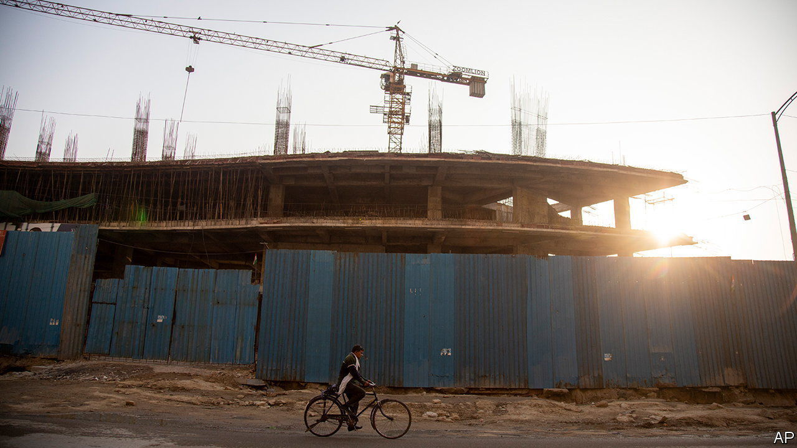

###### Upwards

# India’s property market is ready for take-off 

##### A clean-up by Narendra Modi’s government shows signs of success 

 

> Sep 14th 2023 

A visitor does not have to look far for signs of India’s property resurgence. Cranes dot the skylines of Delhi, Hyderabad and other cities. In Bandra, a swish suburb of Mumbai, more than 100 buildings are being redeveloped. Across the country, the number of new projects has hit a level last seen in 2012. Pre-sales by big developers are rising at double-digit rates.

Behind the increasingly frenetic activity are all the catalysts you would expect in India: demand from the country’s growing population of well-to-do people, insufficient supply and deterioration of existing buildings in the harsh climate. But if the catalysts have not changed, the underlying structure of the market very much has. Attempts by Narendra Modi’s administration to clean up after a property crash in the mid-2010s seem to be paying off.

Before the crash, India’s property industry had a rakish edge. An army of small developers had emerged who were known for sharp suits, Bollywood ties and, beneath their glitz, lots of grit. Stories spread of money derived from padded construction bills and dodgy bankers, along with complicated land purchases routed via family members. Later, court cases provided evidence that such tales might not have been fanciful. As a result of corruption, projects were derailed, people waited years for flats and demand for properties fell.

Among the changes introduced by Mr Modi’s government in 2016 were requirements for developers to pay above-market interest rates on deposits for flats in delayed projects, creating an incentive for completion. Diverting deposits for different projects was banned. Financial institutions were pressed to tighten lending and monitoring. The clean-up is far from complete: in the state of Maharashtra, home to Mumbai, officials recently noted that 308 projects involving 60 firms are in some stage of insolvency. But slowly bankruptcies are becoming less common. 

After a period of stagnation, developers with plausible claims to fulfil projects have seen their valuations soar over the past three years: Delhi Land &amp; Finance from $5.1bn to $15.8bn, Godrej Properties from $3bn to $5.5bn and Oberoi Realty from $2bn to $5bn. Confidence is returning to the broader market, too. Data tracked by Morgan Stanley, a bank, and jll Research, a consultancy, indicate that purchases in the most recent quarter were a fifth higher than the average over the previous year. Activity has been especially strong in Bangalore, Hyderabad, Mumbai and Pune. 

In the same way a depressed residential market can have a broader impact on a country’s economy—as is supremely evident in China at the moment—the opposite is true as well. The current healthy housing market in India helps explain why growth has remained strong, and the stockmarket registered large gains, despite a slowdown in exports and crucial industries, not least technology. Construction in India employs more than 50m people and comprises 7% of gdp. The property industry is a big customer for cement, steel, glass and white goods, along with credit. Past problems may have rightfully cast the sector in a negative light. Now, much like Mumbai’s towers, it is on the up. ■


